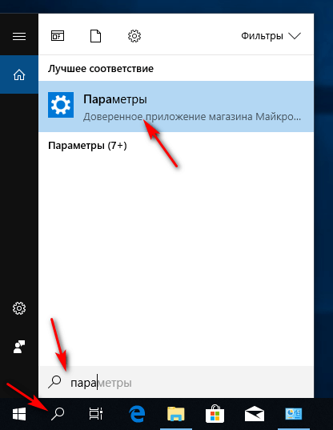
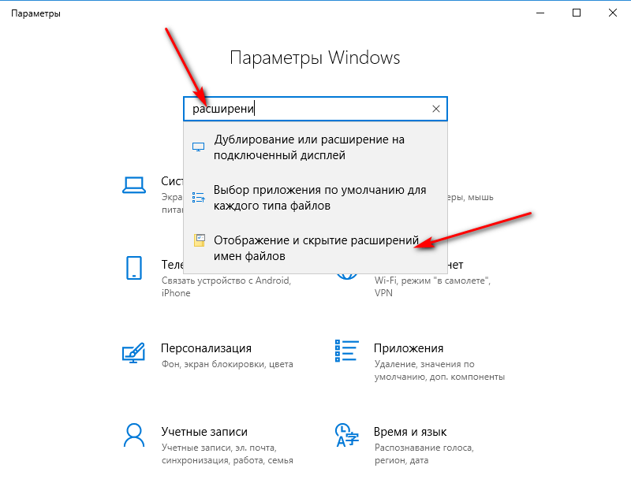

# Как сделать видимыми расширения файлов в Windows

При установке Windows первоначально расширения у зарегистрированных типов файлов не показываются. В статье показывается, как это исправить на примере Windows 10.

## Параметры Проводника

Первоначально нужно попасть в `Параметры Проводника`:

### I способ

Заходим в классическую `Панель управления`, и там заходим в `Параметры Проводника`:

### II способ

В новом приложении `Параметры` вводим `расширений` и открываем `Параметры Проводника`:

### III способ

Просто в проводнике идём `Вид` → `Параметры`:

## Настройка

Теперь в вкладке `Вид` находим `Скрывать расширения для зарегистрированных типов файлов` и снимаем галочку:

Всё. Теперь все файлы в проводнике будут иметь свои расширения.

Было:

Стало:

