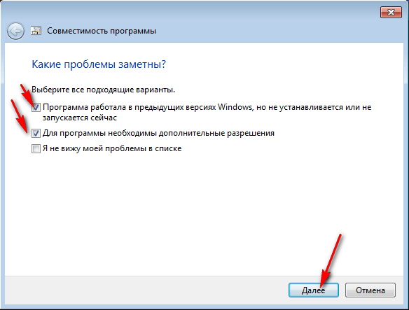
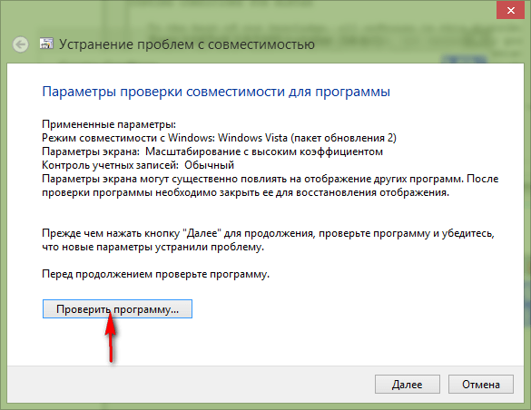
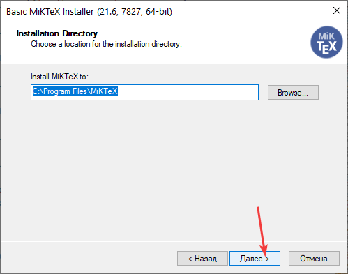
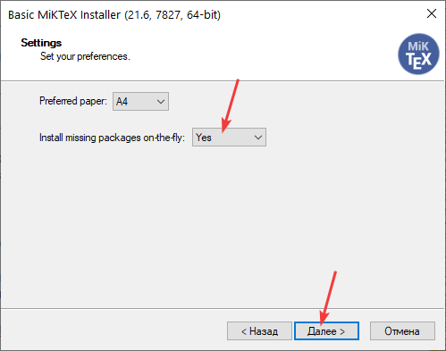
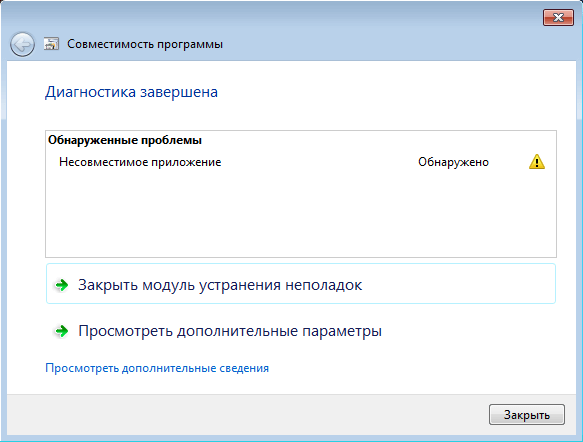
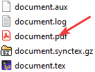
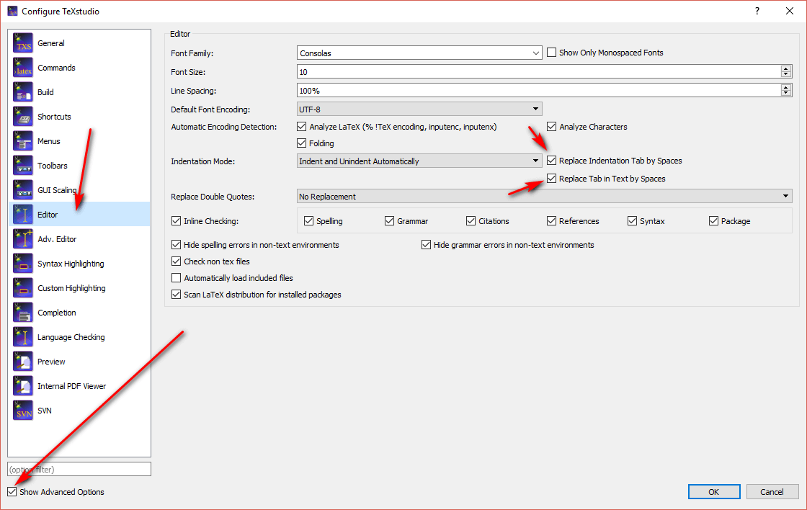
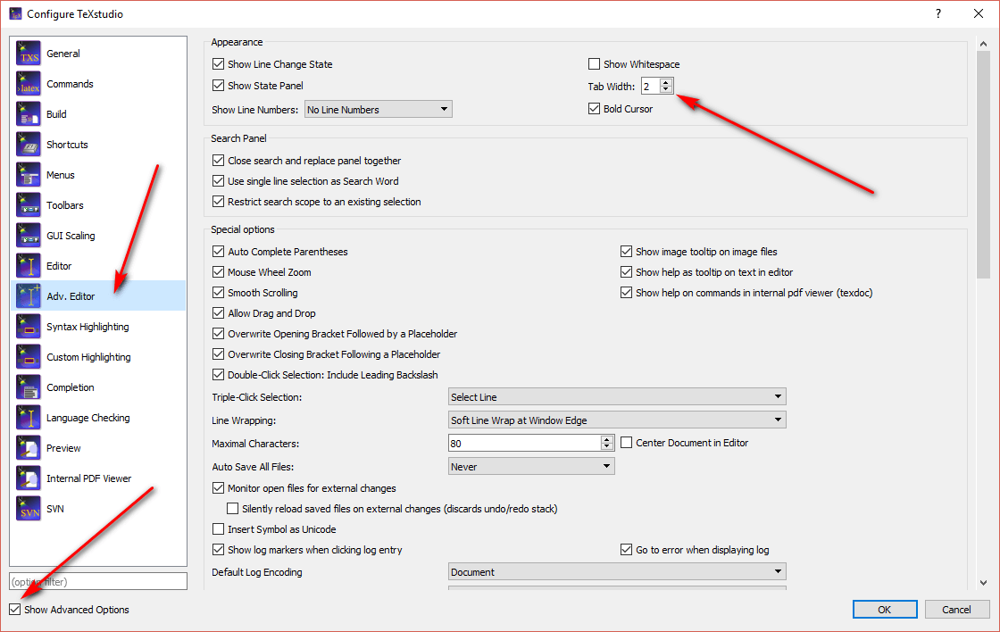

# Установка и настройка программ для редактирования LaTeX файлов

В данной инструкции даются подробные указания для установки связки MiKTeX + TeXstudio + pscyr на примере чистой системы Windows 7 64 bit (и замечаниями под Windows 8.1). После установки вы получите полноценную систему для редактирования и компиляции LaTeX файлов расширения `*.tex`.

Статья обновлена и переписана в 2021 со статьи 2013 года.

## Общие сведения

`MiKTeX` — программа для компилирования `*.tex` с целью превращения их в PDF файлы. После ее установки вы ее касаться не будете. Все действия будут выполняться через TeXstudio.

`TeXstudio` — редактор `*.tex` файлов. Через нее вы и будете работать почти всё время.

`pscyr` — пакет, с помощью которого подключаются некоторые русские шрифты. В поставке MiKTeX его нет, но бывает крайне полезен. После установки вы также можете про него забыть. Об его установке можно прочитать в статье «[Установка PSCyr для LaTeX](https://github.com/Harrix/harrix.dev-blog-2018/blob/main/2018-08-03-pscyr/2018-08-03-pscyr.md)».

## Установка MiKTeX

Переходим на сайт <http://www.miktex.org/download>.

И скачиваем установочный файл. Обратите внимание, что он должен быть под нужную «битность» системы. Я скачиваю себе версию для 64 бит:


А теперь немного про установку. Можно запустить установку с параметрами по умолчанию и наслаждаться процессом установки.

Но иногда при установке (как минимум на прошлых версиях MiKTeX) вылетает ошибка `The thread function could not be started` на **Windows 7** и **Windows 8.1**. Поэтому в спойлере описан один из способов решения проблемы, который у меня не вызывал такую ошибку, а стандартная установка вызывала.

---

**Если у вас ошибка при установке на примере Windows 7** <!-- !details -->

Щелкните правой кнопкой по файлу установщика и выберете пункт `Исправление неполадок совместимости`:


Появится вот это окно:


Отметьте следующие проблемы:



Скажите, что в Windows Vista все запускалось хорошо:


В следующем окне запустите программу для начала установки:


---

---

**Если у вас ошибка при установке на примере Windows 8.1** <!-- !details -->

Щелкните правой кнопкой по файлу установщика и выберете пункт `Исправление неполадок совместимости`:


Появится вот это окно:


Отметьте следующие проблемы:


Скажите, что в Windows Vista все запускалось хорошо:


В следующем окне запустите программу для начала установки:



---

Согласитесь с соглашением:


Программа может быть использована кем угодно:


Путь к программе можете оставить по умолчанию:



Рекомендую включить автоматическую подзагрузку недостающих пакетов:



После этого начинайте основной процесс установки:


Если все прошло хорошо, то установка завершится этим окном:


Пусть MiKTeX проверит наличие обновлений пакетов и себя:


Этот пункт нужен, если исправляли ошибку под спойлерами выше. После этого надо довершить процесс работы по устранению несовместимостей:

---

**Если у вас ошибка при установке, то сюда** <!-- !details -->

Если пользовались решениями, которые описаны выше спойлерами, тот тут два скриншота экранов, которые у вас появятся после установки:




---

Перезагрузите комп на всякий случай.

## Установка TeXstudio

Переходим на сайт <https://www.texstudio.org/>.

Нажимаем на кнопку скачивания:


Проблем с установкой не должно возникнуть:


После установки запустите программу:


Создайте новый файл:


Вставьте в окно редактирования следующий код:

```tex
\documentclass{article}
\begin{document}
Hello world!
\end{document}
```


Сохраните файл под каким-нибудь именем:


Скомпилируйте файл:


Справа появилось окно с отображением скомпилированного файла:


Теперь в папке, где был сохранен `tex` файл, появилось еще несколько файлов. Один из них это конечный PDF файл. Откройте его:



Если в нем есть все что нужно, то, значит, процесс установки прошел успешно:


## Установка pscyr

Процесс установки `pscyr` долгий и сложный. Подробное описание процесса изложено в другой статье, а именно «[Установка PSCyr для LaTeX](https://github.com/Harrix/harrix.dev-blog-2018/blob/main/2018-08-03-pscyr/2018-08-03-pscyr.md)».

## Настройка установленных программ

Осталось немного настроить программы. Дело в том, что если работать при текущих настройках, то при рисовании графиков через пакет `pgfplots` памяти, выделяемой для компиляции, будет не хватать.

Например, данный документ не скомпилируется. Как с раскомментированными двумя строчками, так и без:

```tex
\documentclass[a4paper,12pt]{report}

\usepackage{geometry}
\usepackage{cmap}
\usepackage[utf8]{inputenc}
\usepackage[english, russian]{babel}
\usepackage{pgfplots}

\geometry{a4paper,top=2cm,bottom=2cm,left=2.5cm,right=1cm}

%\usepgfplotslibrary{external}
%\tikzexternalize[prefix=TikzPictures/]

\begin{document}

  \begin{tikzpicture}
  \begin{axis}[view/h=70]
  \addplot3[
  surf,
  shader=flat,
  samples=60,
  domain=-3:3,y domain=-2:2]
  {sin(deg(x+y^2))};
  \end{axis}
  \end{tikzpicture}

  \begin{tikzpicture}
  \begin{axis}[view/h=70]
  \addplot3[
  surf,
  shader=flat,
  samples=60,
  domain=-3:3,y domain=-2:2]
  {sin(deg(x+y^2))};
  \end{axis}
  \end{tikzpicture}

  \begin{tikzpicture}
  \begin{axis}[view/h=70]
  \addplot3[
  surf,
  shader=flat,
  samples=60,
  domain=-3:3,y domain=-2:2]
  {sin(deg(x+y^2))};
  \end{axis}
  \end{tikzpicture}

\end{document}
```

Вы будете видеть при компиляции подобные ошибки:


Поэтому надо произвести некоторые манипуляции.

Вначале увеличим объем памяти для компиляции отдельного графика.

Нажимаем `Пуск` → `Выполнить`:


Вводим там следующее:

```console
initexmf --edit-config-file=pdflatex
```


После нажатия на `Ok` мелькнет черное окно и откроется пустой файл `pdflatex.ini`.

Вводим следующий текст и сохраняем, закрываем, сохраняя:

```console
main_memory=30000000
```

Обратите внимание, что вы здесь можете ввести свой объем памяти, нужный для генерации одного графика. Раньше я вводил в три раза меньше `main_memory=10000000`.

Аналогично вводим команду:

```console
initexmf --dump=pdflatex
```


Появится черное окно, в котором начнет идти список файлов. Ничего не делаем и ждем, когда окно само закроется.

Всё. Теперь памяти для компиляции выделено гораздо больше.

Теперь сделаем так, чтобы каждый график компилировался отдельно:

Открываем `TeXstudio`.

Идем в настройки `Options` → `Configure TeXstudio…`:


Идем в настройки `Commands`. И там находим строчку `PdfLaTeX`:


Меняем содержимое строчки:

```console
pdflatex.exe -synctex=1 -interaction=nonstopmode %.tex
```

Измененная строчка:

```console
pdflatex -shell-escape -interaction=nonstopmode %.tex
```

И нажмите на `Ok`.

Всё. Теперь при компиляции следующего документа мы не получим сообщение об ошибке:

```tex
\documentclass[a4paper,12pt]{report}

\usepackage{geometry}
\usepackage{cmap}
\usepackage[utf8]{inputenc}
\usepackage[english, russian]{babel}
\usepackage{pgfplots}

\geometry{a4paper,top=2cm,bottom=2cm,left=2.5cm,right=1cm}

\usepgfplotslibrary{external}
\tikzexternalize[prefix=TikzPictures/]

\begin{document}

  \begin{tikzpicture}
  \begin{axis}[view/h=70]
  \addplot3[
  surf,
  shader=flat,
  samples=60,
  domain=-3:3,y domain=-2:2]
  {sin(deg(x+y^2))};
  \end{axis}
  \end{tikzpicture}

  \begin{tikzpicture}
  \begin{axis}[view/h=70]
  \addplot3[
  surf,
  shader=flat,
  samples=60,
  domain=-3:3,y domain=-2:2]
  {sin(deg(x+y^2))};
  \end{axis}
  \end{tikzpicture}

  \begin{tikzpicture}
  \begin{axis}[view/h=70]
  \addplot3[
  surf,
  shader=flat,
  samples=60,
  domain=-3:3,y domain=-2:2]
  {sin(deg(x+y^2))};
  \end{axis}
  \end{tikzpicture}

\end{document}
```


Это достигается тем, что при таких настройках каждый рисунок компилируется отдельно, а потом добавляется в итоговый PDF файл.

Обратите внимание, что разделение на отдельные файлы достигается не только изменением настроек программы, но и строчками:

```tex
\usepgfplotslibrary{external}
\tikzexternalize[prefix=TikzPictures/]
```

На всякий случай перезагрузите компьютер.

## Настройка сборки библиографии

Если вы будете использовать для библиографии `Biber`, а не `BibTeX` (например, в [Russian-Phd-LaTeX-Dissertation-Template](https://github.com/AndreyAkinshin/Russian-Phd-LaTeX-Dissertation-Template)), то поменяйте систему сборки библиографии в настройках:


## Дополнительно

В статье [Проверка орфографии в TeXstudio](https://github.com/Harrix/harrix.dev-blog-2013/blob/main/2013-04-04-spell-check-in-texstudio/2013-04-04-spell-check-in-texstudio.md) рассказано как настроить проверку орфографии.

Еще по умолчанию в качестве отступа используется знак табуляции, которым в приличном обществе стараются не пользоваться. На скриншотах показано, как их поменять на 2 пробела (кто хочет, может оставить 4 пробела):





Вроде всё. После такой вот непростой установки у нас есть полноценная связка для работы с LaTeX файлами.

Если вдруг что-то не получается, то попробуйте снова всё переустановить, не забывая перезагружать компьютер. Например, когда я переписывал эту статью с варианта 2013 года, то по недосмотру допустил ошибку по собственной инструкции и долго её искал и пытался понять, почему ничего не компилируется.
