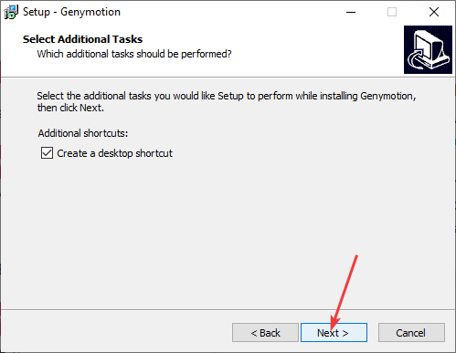
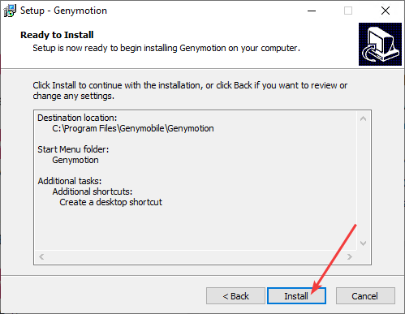
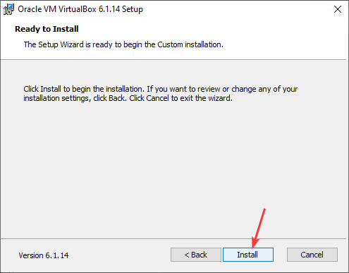
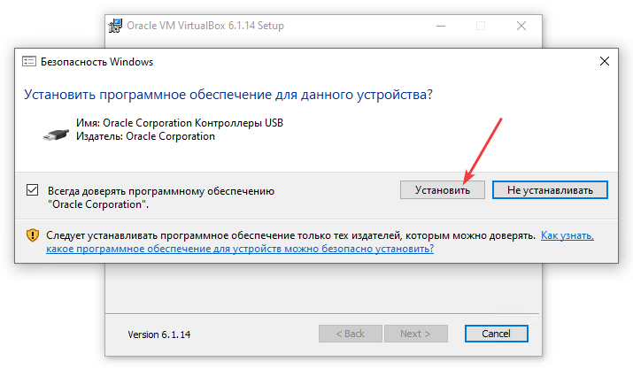
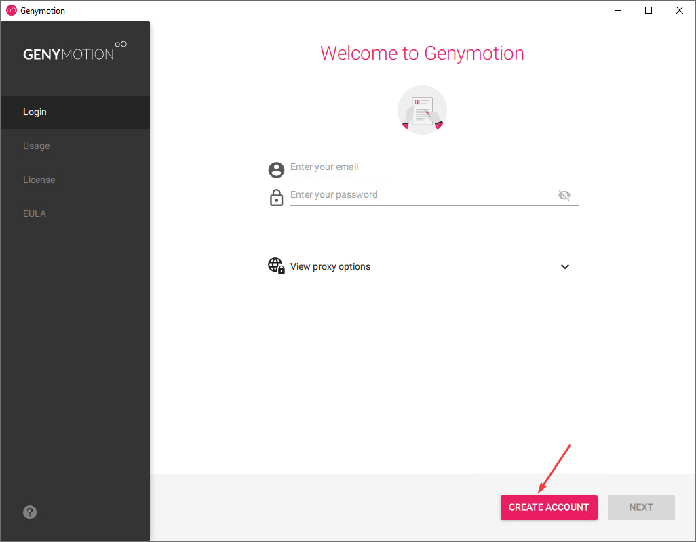

# Эмулятор Genymotion для Android Studio

В статье рассказывается, как подключить Genymotion эмулятор к Android Studio для запуска своих разрабатываемых приложений.

Стандартный эмулятор в Android Studio довольно прожорливое и капризное существо. И нормально работает на хороших компьютерах с Intel процессорами. Так что обладателям AMD процессоров вкупе со слабыми машинами приходится плохо. На помощь приходят сторонние эмуляторы. Genymotion — один из них.

Главное отличие Genymotion от других альтернативных эмуляторов в том, что он предназначен для тестирования программ, и в нем можно поднимать образы разных версий Android.

## Скачивание

Бесплатная версия эмулятора хитро спрятана на сайте, чтобы люди покупали платную версию. Так что возможно, что, когда вы будете читать эту статью, то алгоритм нахождения эмулятора изменится.

На сайте <https://www.genymotion.com/fun-zone/> пытаемся скачать установщик:

Но нам придется вначале зарегистрироваться:

После этого нужно зайти себе на почту и подтвердить email. В итоге мы попадем на страницу загрузки. Но там нужно выбрать незаметную ссылку внизу:

И мы опять попадаем на страницу, откуда всё начинали:

Но теперь клик по кнопке ведет нас на страницу скачивания файла. Там два файла, но так как маловероятно, что у вас стоит Virtual Box, то выбираем версию с Virtual Box:

## Установка

Установка проста:

Это окно у меня вылезло, так как у меня уже стоит Virtual Box и менять его не хочу:

И конец установки:

## Настройка эмулятора

При запуске эмулятора нужно будет ввести свой логин и пароль:

Выбираем режим использования для персональных нужд `Personal Use` (вы же использовать будете только в личных целях эмулятор?):

Соглашаемся на условия:

Эмулятор запустился, но он видит, что виртуальные устройства не созданы:

Выбираем какое устройство с какой версией Android будем создавать:

Скачиваем и устанавливаем образ Android:

Теперь наше виртуальное устройство можно запустить:

Вот и загрузился наш эмулятор:

Теперь в Android Studio появится новое устройство (эмулятор должен быть запущен):

Я столкнулся с проблемой, что при запуске эмулятора в Android Studio видится такая ошибка `Unable to connect to ADB`:

Лично у меня решается так: включаю Android Studio, нажима на `Run app`, но не выбираю устройство, закрываю окно выбора устройства, запускаю эмулятор Genymotion, опять в Android Studio запускаю приложение, но уже с выбором эмулятора.
