# Эмулятор Koplayer для Android Studio

В статье рассказывается, как подключить Koplayer эмулятор к Android Studio для запуска своих разрабатываемых приложений.

Стандартный эмулятор в Android Studio довольно прожорливое и капризное существо. И нормально работает на хороших компьютерах с Intel процессорами. Так что обладателям AMD процессоров вкупе со слабыми машинами приходится плохо. На помощь приходят сторонние эмуляторы. Koplayer — один из них.

## Скачивание и установка

На сайте <http://www.koplayer.com/> скачиваем установщик:

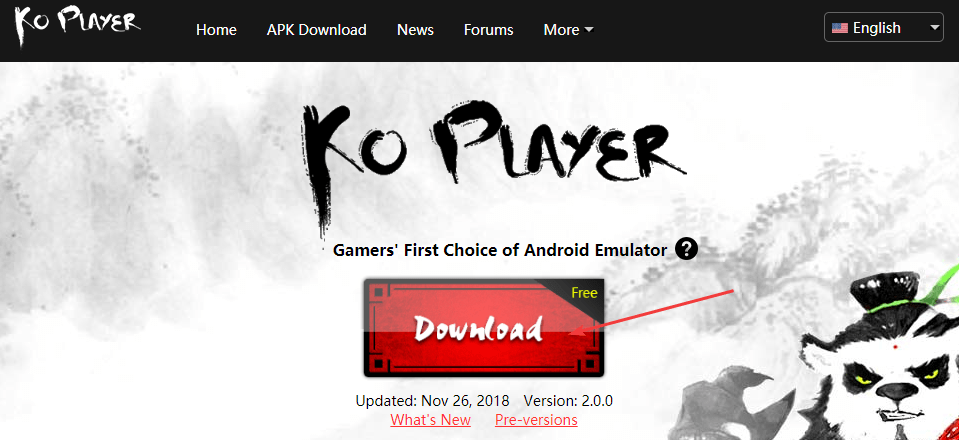

Установка проста:

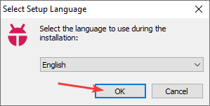

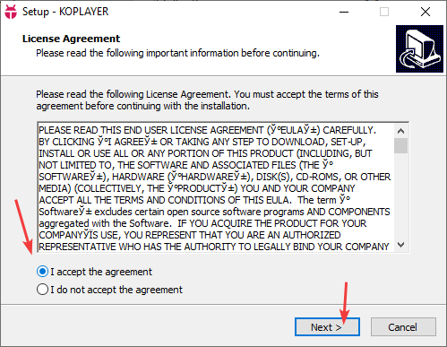

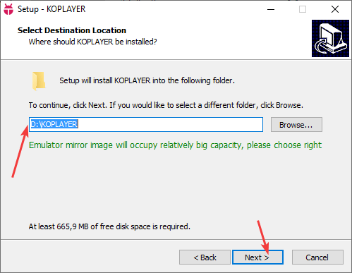

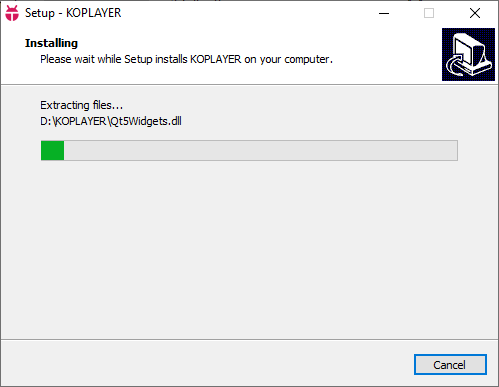

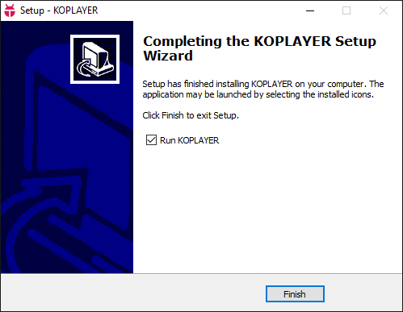

Читаем инструкцию по использованию и подготавливаем эмулятор:

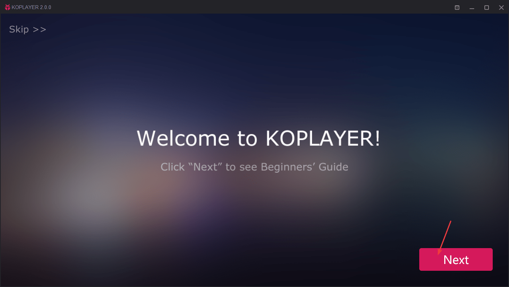

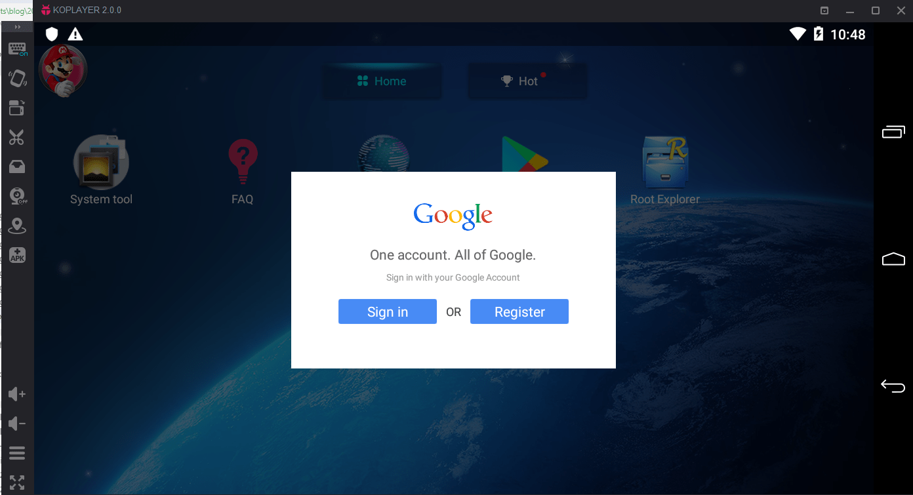

Теперь эмулятор полностью готов к работе:

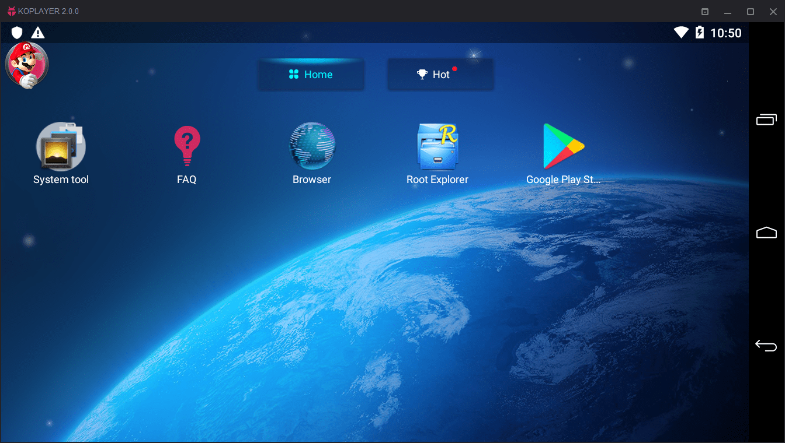

## Настройка для работы в Android Studio

Заходим в настройки Android:

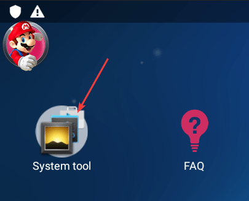

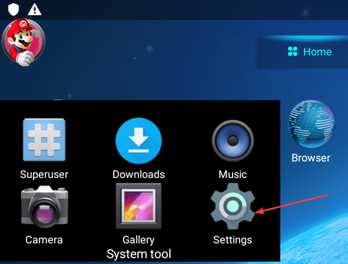

Заходим в пункт `About tablet`:

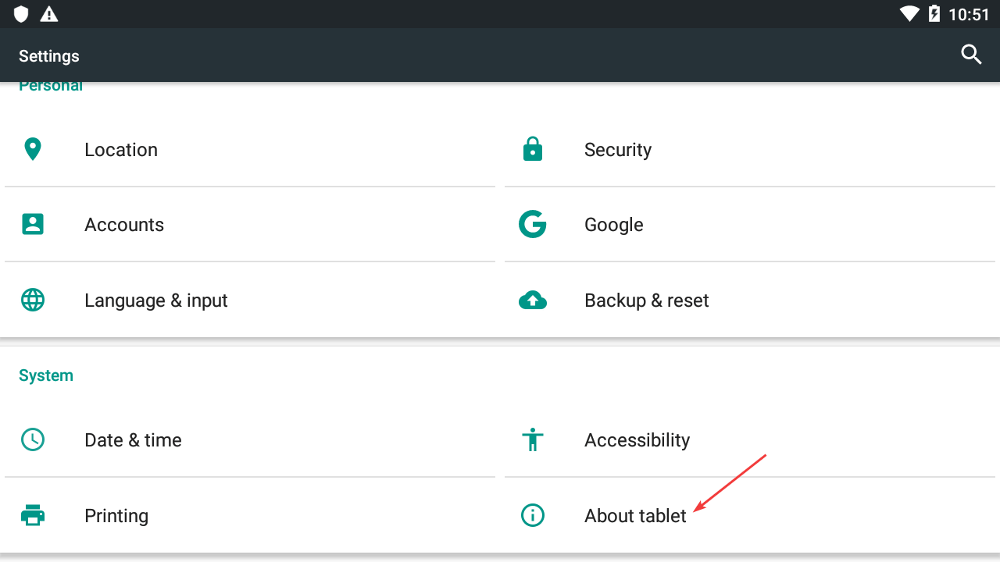

Щелкаем 7 раз по пункту `Build number`:

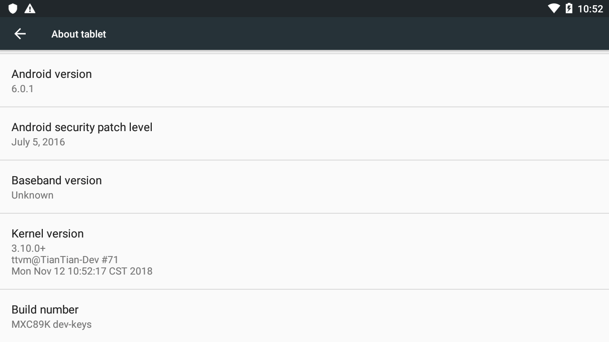

Поднимаемся в настройках на уровень выше и видим раздел `Developer options`:

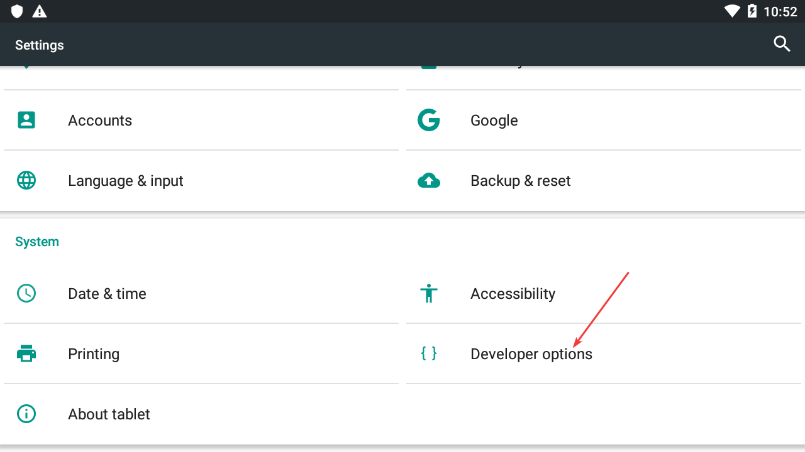

Включаем пункт `USB debugging`:

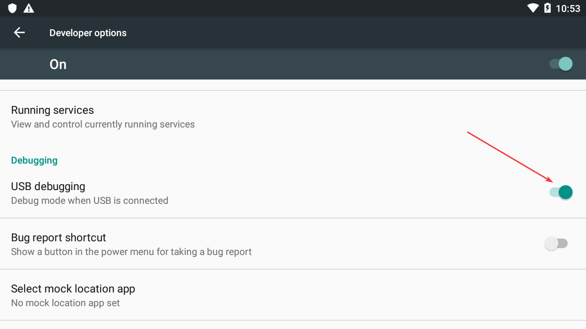

**Закрываем** эмулятор и заново его запускаем.

Теперь в Android Studio появится новое устройство (эмулятор должен быть запущен):

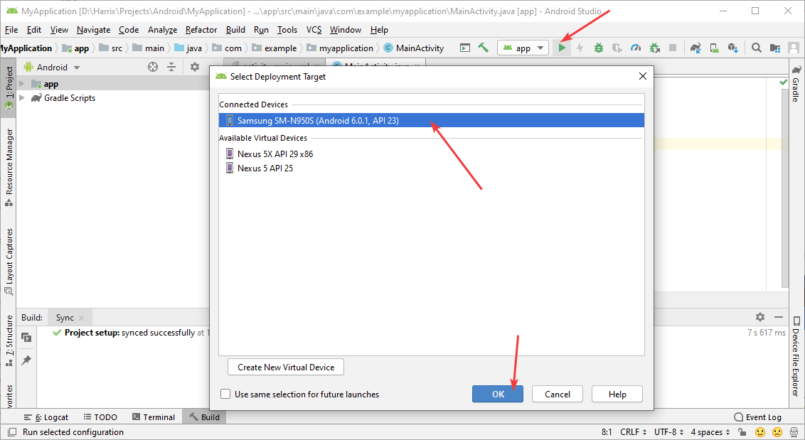

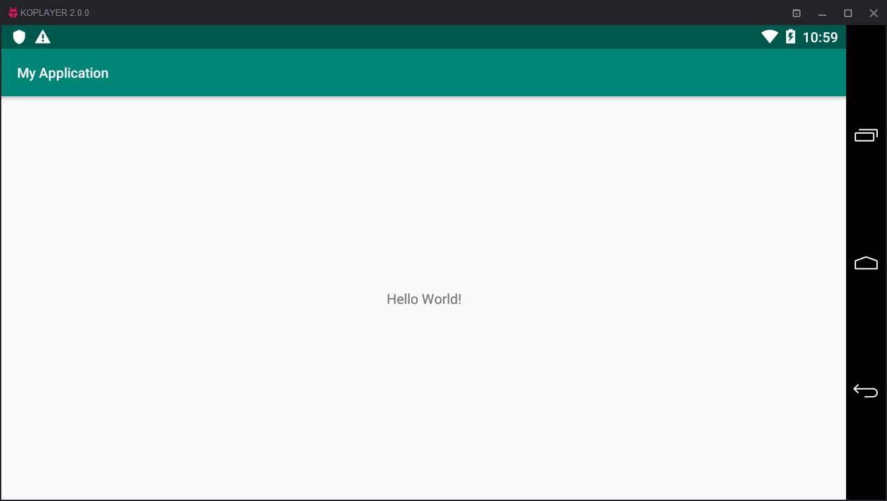

## Если устройство не видится

Если вы запустили эмулятор, а Android Studio его не видит, то нужно сделать следующее.

Найти папку в папке Android SDK, в которой находится файл `adb.exe`. У меня это папка `D:\android\sdk\platform-tools`. Перейдите в командной строке в эту папку. Например, `Пуск` → `Выполнить` → `cmd` → `cd D:\android\sdk\platform-tools`.

Найти папку, в которую установлен Koplayer. У меня это папка `D:\KOPLAYER`. В ней в папке `UserData` есть папка `KOPLAYER`, в которой есть файл `TianTian.ini`. Полный путь к файлу у меня получился `D:\KOPLAYER\UserData\KOPLAYER\TianTian.ini`.

В этом файле найти строку со значением параметра `AdbPort`. У меня она равна `AdbPort=6555`.

Теперь в командной строке запустить команду `adb connect 127.0.0.1:6555` или `.\adb connect 127.0.0.1:6555` (в зависимости от командной строки, которую вы используете). Вместо числа `6555` вставьте то значение параметра `AdbPort`, которое у вас стоит. Эмулятор должен быть открытым. Если появилась надпись `connected to 127.0.0.1:6555`, то всё хорошо. Теперь в Android Studio эмулятор должен появиться:

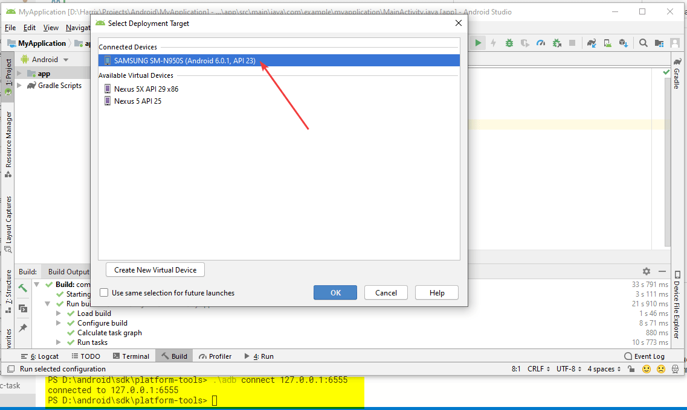

И да, данный трюк придется выполнять при каждом запуске эмулятора.
