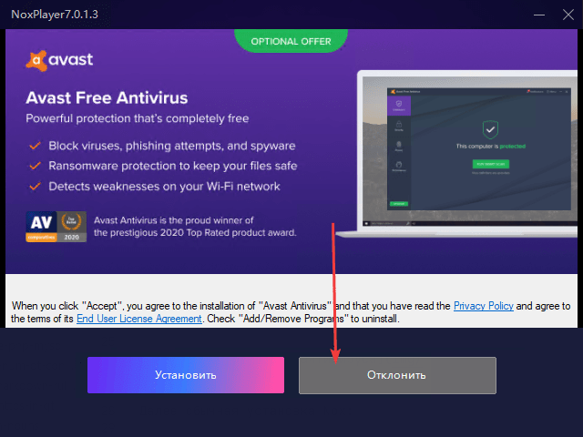
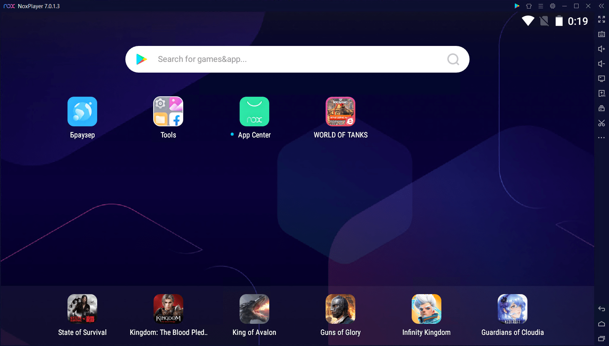
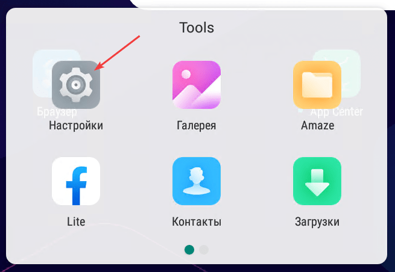
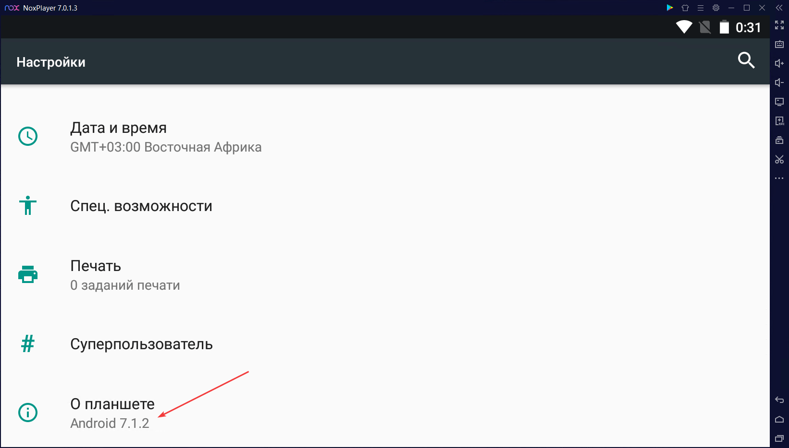
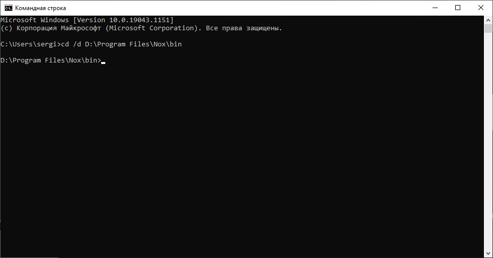
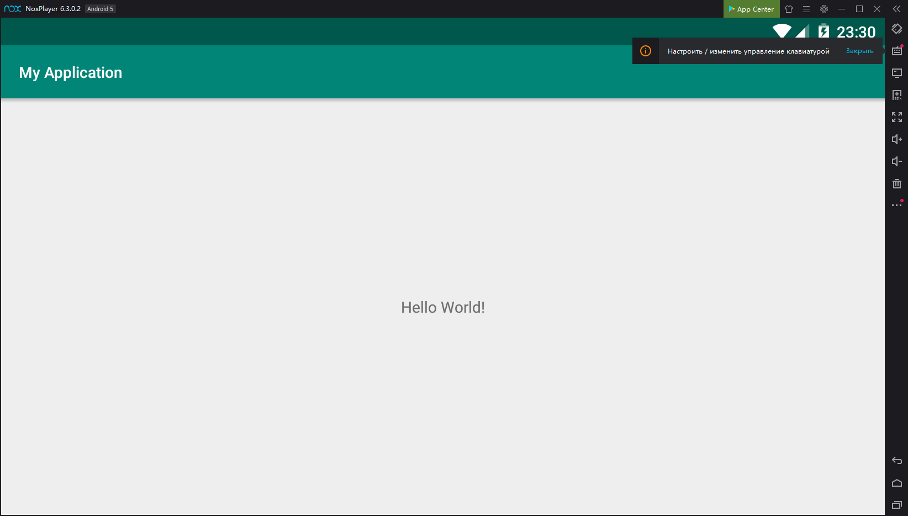

# Эмулятор Nox для Android Studio

В статье рассказывается, как подключить Nox player эмулятор к Android Studio для запуска своих разрабатываемых приложений.

Стандартный эмулятор в Android Studio довольно прожорливое и капризное существо. И нормально работает на хороших компьютерах с Intel процессорами. Так что обладателям AMD процессоров вкупе со слабыми машинами приходится плохо. На помощь приходят сторонние эмуляторы. Nox — один из них.

## Скачивание и установка

На сайте <https://ru.bignox.com/> скачиваем установщик:


Установка проста:


Вам же не нужен лишний антивирус, установленный впридачу? Тогда не соглашаемся с его:


Далее обычная установка Nox:




Проходим инструкцию по использованию или закрываем её:


Теперь эмулятор полностью готов к работе:



## Настройка для работы в Android Studio

Включаем в настройках Nox root-права:


Перезагружаем устройство:


После перезагрузки заходим в настройки Android:




Заходим в пункт `О планшете`:



Щелкаем 7 раз по пункту `Номер сборки`:


Поднимаемся в настройках на уровень выше и видим раздел `Для разработчиков`:


Включаем пункт `Отладка по USB`:


Теперь нужно запустить командную строку и перейти в ней в папку, в которую установился Nox. Например у меня это папка `D:\Program Files\Nox\bin\`:




После этого вводим следующую команду и ждем её выполнение:

```console
nox_adb.exe connect 127.0.0.1:62001
```


Эту команду нужно будет выполнять при каждом запуске Windows.

Теперь в Android Studio появится новое устройство (эмулятор должен быть запущен):




## Дополнительно

На практике замечено, что иногда при запуске эмулятора в нем пропадает звук. Помогает почему-то закрытие Chrome перед запуском Nox. После запуска можно опять включать Chrome. Иногда кроме Chrome нужно выключить и другие приложения. Почему так происходит — не знаю.
