# Установка Qt под Visual Studio, MinGW и для разработки под Android

Инструкция по установке Qt с компилятором Visual Studio, MinGW и возможностью программировать под Android на примере Windows 10.

Если вы хотите установить Qt просто, чтобы программировать на C++ под Windows с стандартным компилятором, то вам подойдет упрощенная установка, описанная тут: [Установка Qt](/blog/2018/install-qt-mingw/).

Если вы хотите установить Qt под Windows XP, то данная статья вам не подойдет, так что вам сюда: [Установка Qt 4.8.4 на Windows XP](/blog/2014/install-qt-on-windows-xp/).

## Подготовка для работы с компилятором Visual Studio

Если вы хотите использовать компилятор под Visual Studio, то вам нужно установить **Visual Studio**. В статье [Установка Visual Studio 2017 Community](/blog/2017/install-visual-studio-2017/) рассказывается как это сделать.

Если вы хотите разрабатывать универсальные UWP приложения, то не забудьте включить режим `Режим разработчика` в параметрах Windows 10:


Решите до установки Qt, какой язык интерфейса будет у Visual Studio. От этого зависит язык сообщений об ошибках, которые будут приходит при компилировании проектов в Qt.

Можно язык поменять в настройках Visual Studio:


Но сейчас я предпочитаю в установщике `Visual Studio Installer` удалить русский пакет и установить английский, чтобы русский язык вообще нигде не вылазил:


## Подготовка для программирования под Android

Если вы хотите писать приложения под Android, то вам нужно установить **JDK**. Об этом можно узнать из статьи [Установка JDK 8 в Windows](/blog/2014/install-jdk-on-windows/). Обратите внимание, что на июль 2019 рекомендую устанавливать по прежнему Java 8, хотя уже вышла Java 12, так как Qt с ними еще не умеет нормально работать. Но может в момент вашего прочтения этой статьи уже всё поменялось:


Также вам будет нужен **Android SDK** и **Android NDK**. Можно их скачать отдельно, но рекомендую поставить Android Studio и оттуда управлять SDK и NDK с нормальным механизмом обновления. Статья об установке: [Установка Android Studio в Windows](/blog/2018/install-android-studio/). Особое внимание уделите на установку пакетов SDK из статьи.

Только **после установки необходимых вам программ** можно приступать к установке Qt.

### Установка NDK

Как было сказано выше, то для тех, кто хочет программировать на Qt под Android, то вам нужен Android NDK.

Итак, после установки Android Studio открываем её. Либо так:


Либо так:


В разделе `SDK Tools` отмечаем `NDK` и устанавливаем его:


Теперь Android Studio можно закрывать.

## Скачивание Qt

Практика нескольких лет наблюдений показывает, что Qt регулярно меняет алгоритм нахождения open source версии установщика, так что учтите это.

Перейдите на страницу: <https://www.qt.io/download>.

Там вам нужно спуститься почти в самый низ:


И там находите `Go open source`:


Нам рекомендуют скачать online установщик. Раньше я ставил через offline установщик, но для установки версий MinGW, Visual Studio, Android приходилось устанавливать через несколько инсталляторов, и обновляются такие сборки реже. Так что скачиваем online установщик через кнопку `Download`, ссылка на который находится в самом низу страницы (на 2020-02-09):


Если же вам нужен всё-таки offline установщик, то спуститесь в самый низ и увидите ссылку на них:


## Установка

Запускаем скаченный файл:


Если у вас есть учетка на сайте Qt, то вводите данные, иначе нажимаете `Skip`:


В списке компонентов выбираем Qt Creator:


В последней версии Qt выбираем пакеты с нужными компиляторами.

- `MSVC` — это компилятор под Visual Studio. Например, `MSVC 2017 64 bit` означает версию компилятора по Visual Studio 2017 в виде 64-битной версии. Выбирайте пакеты согласно вашей версии Visual Studio и битности операционной системы.
- `UWP` — это версия пакета под компилятор Visual Studio для написания [универсальных приложений](https://ru.wikipedia.org/wiki/Универсальная_платформа_Windows) Windows 10
- `MinGW` — компилятор MinGW для написания десктопных приложений. Для работы с ним не нужно ничего дополнительного устанавливать, как с другими пакетами.
- `Android ARMv7` и `Android x86` — позволят компилировать приложения под Android на разных семействах процессоров.
- `Sources` — Если вам нужны исходники классов Qt библиотек, то выбирайте этот пункт.

Лично мне у меня 64-битная Windows 10 с Visual Studio 2017 Community, и мне нужно проверять программы как на компиляторе Visual Studio, так и на MinGW. А также нужно программировать под Android. Поэтому я отметил вот эти пакеты:


`Sources` — исходники Qt можно не выбирать, если они вам не нужны.

Рекомендую также выбрать для установки дополнительные компоненты. Их можно выбирать все:


Если вам интересна программа [Qt 3D Studio](http://doc.qt.io/qt3dstudio/index.html) и [Qt Installer Framework](http://doc.qt.io/qtinstallerframework/), то можете их отметить:


Соглашаемся с условиями:


Лично я у себя в этом окне ввожу `Программирование\Qt`, но тут для скриншота оставил стандартное значение:


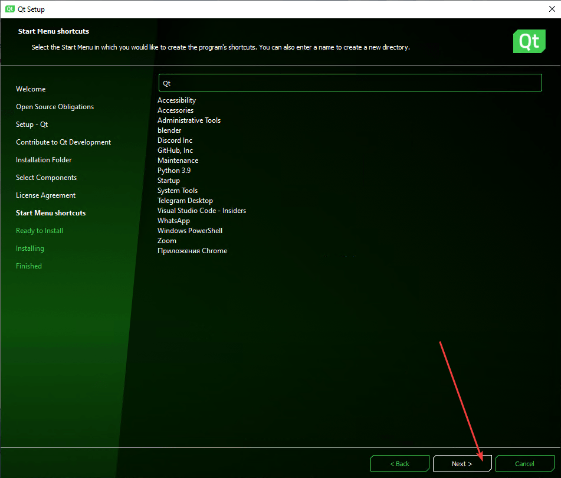

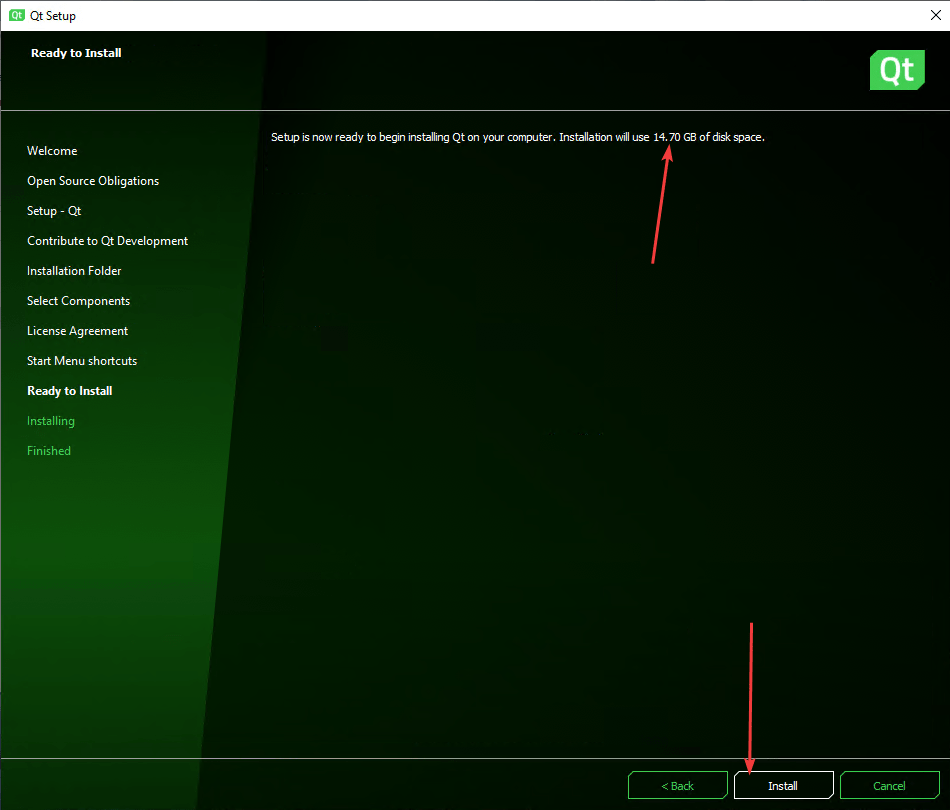

## Настройка

Если Qt Creator запустился с русским интерфейсом, то настоятельно рекомендую поменять его на английский:


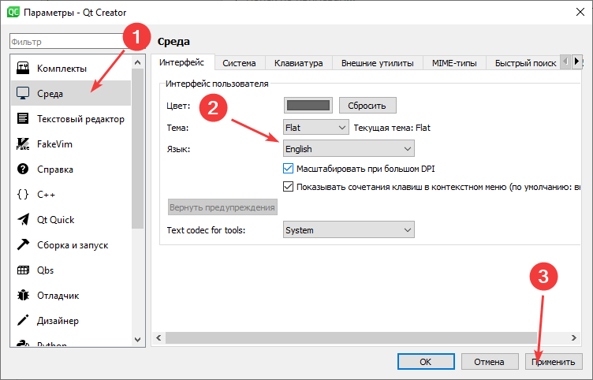

Потом перезапустите Qt Creator:

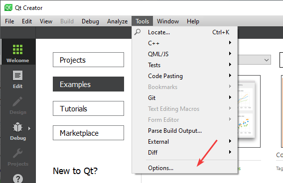

Если вы создадите какой-нибудь проект в Qt и скомпилируете его под разными режимами (Release, Debug), то у вас в папке, где находится папка с проектом появятся еще папки с скомпилированным проектом:


На мой взгляд это крайне неудобно и засоряет папку, где у вас могут находится другие проекты. Лучше было бы, чтобы эти скомпилированные файлы располагались в специальной папке в папке проекта. Поэтому я меняю в настройках путь. Вы можете не менять — это не принципиально.

Первоначальное значение параметра `Default build directory`:

```text
../%{JS: Util.asciify("build-%{CurrentProject:Name}-%{CurrentKit:FileSystemName}-%{CurrentBuild:Name}")}
```


Новое значение параметра `Default build directory`:

```text
_build
```


**Update 2019-07-13.** Сейчас у меня стоит такое значение:

```text
_build/%{JS: Util.asciify("build-%{CurrentProject:Name}-%{CurrentKit:FileSystemName}-%{CurrentBuild:Name}")}
```

И да. Для тех, кто использует git. В файле `.gitignore` я добавляю следующую строчку:

```text
*_build*
```

## Настройка для работы с компилятором Visual Studio

Если у вас Visual Studio с русским интерфейсом, то в сообщениях об ошибках при компилировании в Qt вы будете видеть крякозябры. В статье [Крякозябры в Qt под Visual Studio](/blog/2016/fix-qt-under-visual-studio/) рассказывается как от них избавиться.

Можно поменять язык интерфейса Visual Studio на английский, но лучше это сделать до установки Qt, как говорилось выше. Но если вы все-таки это сделали после установки Qt, и новые проекты хорошо компилируются под компилятором Visual Studio, то со старыми проектами могут возникнуть проблемы:

```console
Project ERROR: msvc-version.conf loaded but QMAKE_MSC_VER isn't set
```

```console
:-1: error: msvc-version.conf loaded but QMAKE_MSC_VER isn't set
```


Эти ошибки можно исправить либо удалив полностью **build** папку с собранным проектом, либо удалив оттуда файл с расширением `.qmake.stash`. Про предварительное удаление файла `*.pro.user` тоже не забывайте.

## Настройка для программирования под Android

Перейдем в настройки Qt:


Находим вкладку `Devices`, а там вкладку `Android`. В разделе `JDK Location` месторасположение JDK должно определиться автоматически. Если не так, то найдите этот путь и укажите тут в настройках:


В разделе `Android SDK Location` выбираем папку, где установлено SDK библиотеки:


В разделе `Android NDK Location` выбираем папку, где установлено NDK библиотеки:


Нажмите кнопку `OK`:


Настройки закончились.

**Update 2019-07-13.** Практика показывает, что Qt не всегда поспевает за изменениями в Android SDK и NDK. Поэтому иногда требуются шаманства с бубном, чтобы всё заработало. Причем каждый раз будут свои проблемы. Что делать? Гуглите те сообщения об ошибках, которые у вас будут возникать и ищите ответ на <https://forum.qt.io/>. Например, на данный момент Qt не собирает приложения с Android SDK Build-Tools 29 и ему нужна версия 28.

Вначале удаляем 29 версию:


Потом устанавливаем 28 версию и те пакеты, которые удалились вместе с 29 версией:


**Update 2019-07-13.** С NDK также могут быть проблемы, так что велика вероятность, что последняя версия NDK у вас не заработает. Тут рекомендую скачать старую версию NDK на официальном сайте <https://developer.android.com/ndk/downloads/older_releases>. На момент обновления статьи работала NDK версии 19:


Распакуйте отдельно данный архив и укажите в Qt, когда до этого дойдет дело (об этом читайте ниже в статье):


Если у вас проблемы с эмулятором, то помните, что в конце статьи [Установка Android Studio в Windows](/blog/2018/install-android-studio/) есть описание того, как создать виртуальные устройства в стандартном эмуляторе, а также рассмотрены несколько других сторонних эмуляторов.

## Пример программы

В статье [Базовое приложение в Qt Widgets](/blog/2014/basic-app-qt-widgets/) рассказано как создать стандартное Windows приложение со стандартными контролами. Теперь же попробуем создать шаблонное приложение на основе Qt Quick, где логика пишется на C++, а интерфейс на QML:


Выбираем вариант **Qt Quick Application — Swipe**:


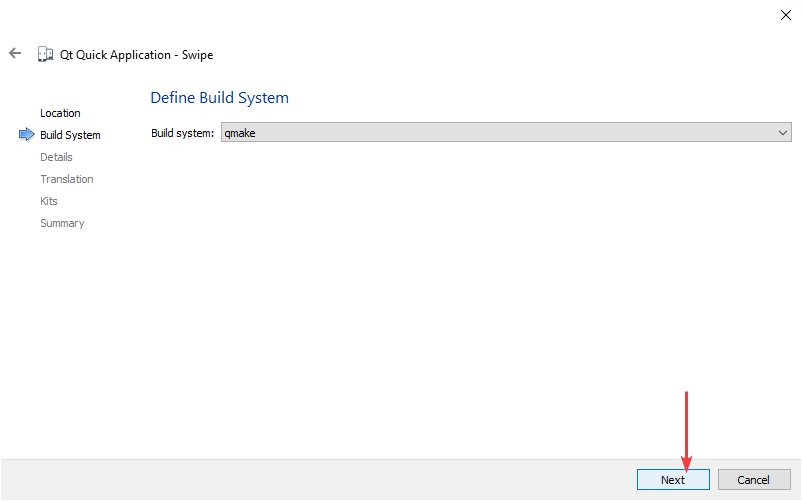

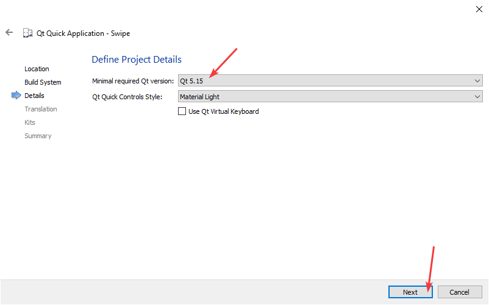

Выберем для теста все возможные компиляторы для сборки проекта:


Вначале скомпилируем проект под стандартный MinGW, который мы никак выше не настраивали (это и не нужно):

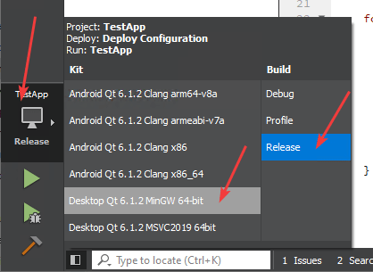


Теперь попробуем скомпилировать через компилятор Visual Studio:


Может возникнуть такая ошибка:


Если у вас возникнет такая ошибка, то закройте Qt Creator, удалите папку со сборкой проекта (у меня это папка `_build`), а в папке с проектом удалите файл `*.pro.user`. Потом откройте заново Qt Creator, откройте в нем проект и заново скомпилируйте проект и запустите его:


Теперь попробуем запустить под Android на эмуляторе:


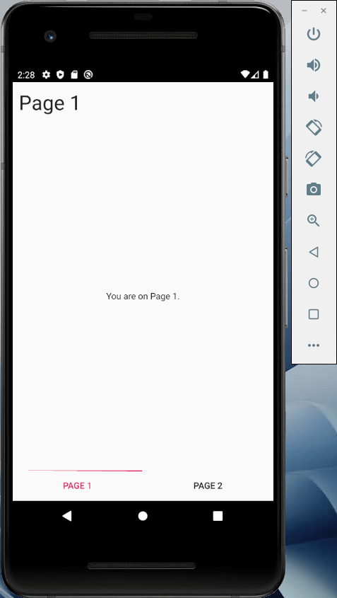

Потом можно повторить историю с запуском приложения как универсальное приложение Windows:


Обратите внимание на то, что именно с UWP чаще всего возникают проблемы с запуском приложения из-за обновлений Qt и Visual Studio. У меня было много раз, когда после обновления первого или второго продукта UWP приложения с теми или иными сообщениями не хотели запускаться.

**Update 2019-07-13.** Если честно, то лично у меня работа с UWP приложениями в Qt почти всегда не работает после переустановки Qt и сопутствующих программ. И лишь танцы с бубном иногда спасают ситуацию. Но, например, в данный момент даже они не помогли, и еще до этапа компиляции проекта выводится вот такая ошибка:


В своё время была долгая беседа в баг-трекере по поводу этой ошибки: <https://bugreports.qt.io/browse/QTCREATORBUG-21366>, и программисты Qt никак не могли решить её. В тот раз всё разрешилось обновлением Visual Studio. В чем было дело: я не знаю. Может реально в обновлении было что-то исправлено, или это повлияло лишь косвенно. Но на данный момент такая же проблема у меня проявляется опять и как её решить я не знаю.

## Дополнительные настройки

В этом разделе опишу свои собственные настройки Qt, которые не обязательны, но могут вам пригодиться.

### Вертикальная линия для ограничения длины строк

Рекомендую поставить вертикальную линию в редакторе кода, чтобы следить за длиной строчек кода в параметре `Display right margin at column`. Я использую значение равное `120`:

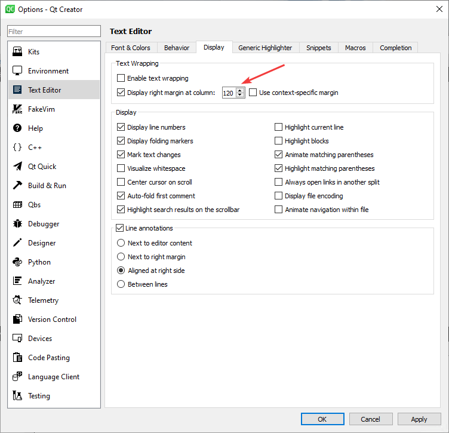

## Два пробела для отступов вместо четырех

Мне не нравится использовать 4 пробела в отступах: 2 пробела достаточно:


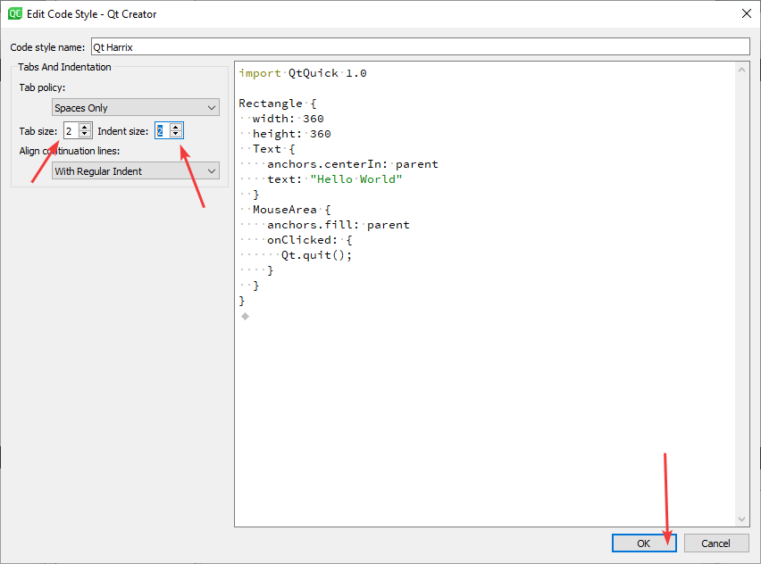


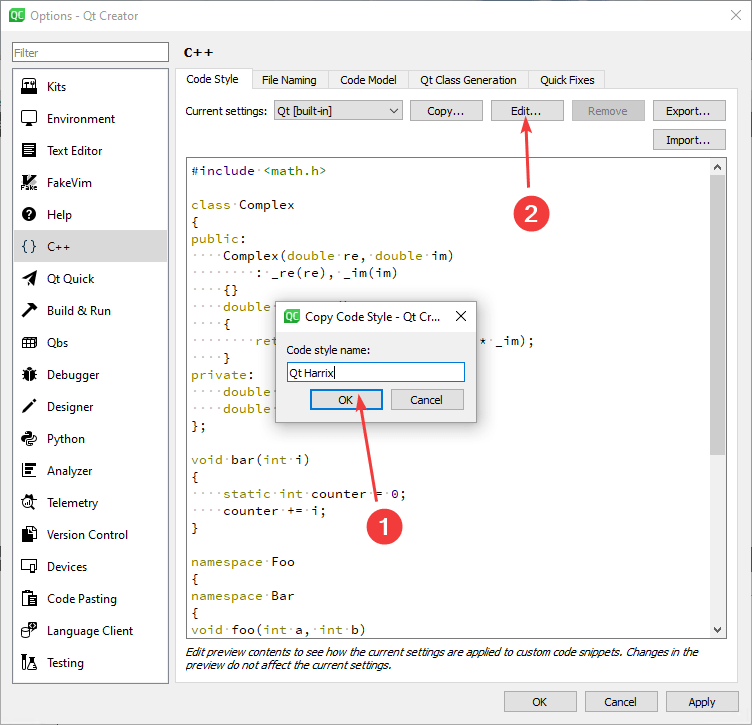

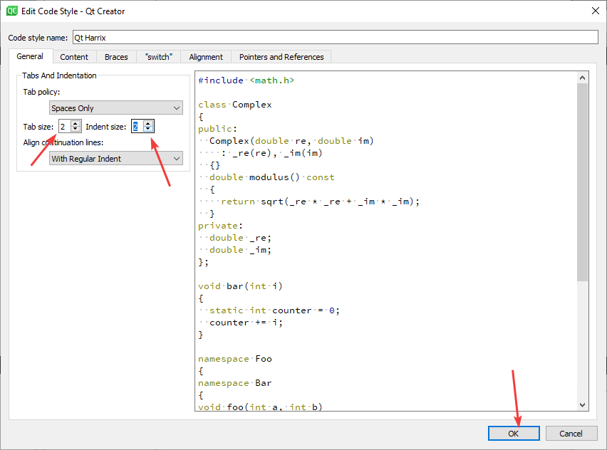

## Дублирование строки

Во многих редакторах команда `Ctrl` + `D` дублирует строчку, тогда как в Qt Creator данная команда выполняется через `Ctrl` + `Alt` + `Down`. Неудобно, поэтому поменяем. В настройках горячих клавишах находим команду `CopyLineDown`:

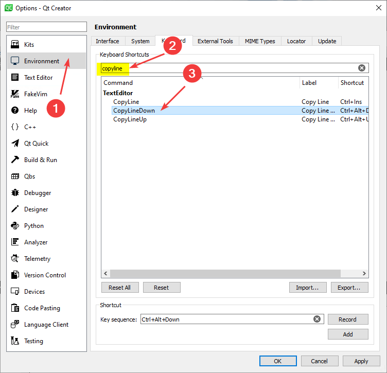

Меняем сочетание клавиш на `Ctrl` + `D`. Но мы увидим конфликт, так как на эту комбинацию клавиш назначена другая команда:


Найдем эту команду `DeleteSelectedElements` и удаляем сочетание горячих клавиш или меняем на другое:


Теперь конфликта нет, и комбинация `Ctrl` + `D` будет дублировать строку:


## Шрифты

Мне нравится шрифт `Roboto Mono`: красивый, бесплатный (лицензия Apache 2.0), используется по умолчанию в Android. В общем, везде его использую.

Скачать можно его можно тут: <https://github.com/google/fonts/tree/master/apache/robotomono>.

После установки шрифтов в настройках Qt можно поменять шрифт:


Было:


Стало:


Обидно, что расстояние между строчками немного уменьшилось.

## Автосохранение

Также выставляю автосохранение файлов на минимальное время в одну минуту:


