# Установка Qt

Инструкция по установке Qt с компилятором MinGW на Windows 10.

Если вы хотите установить Qt с поддержкой компилятора Visual Studio или для разработки под Android, то данная статья не подойдет, так что вам сюда: [Установка Qt под Visual Studio, MinGW и для разработки под Android](/blog/2018/install-qt-advanced/).

Если вы хотите установить Qt под Windows XP, то данная статья не подойдет, так что вам сюда: [Установка Qt 4.8.4 на Windows XP](/blog/2014/install-qt-on-windows-xp/).

## Скачивание Qt

Практика нескольких лет наблюдений показывает, что Qt регулярно меняет алгоритм нахождения open source версии установщика, так что учтите это.

Перейдите на страницу: <https://www.qt.io/download>.

Там вам нужно спуститься почти в самый низ:


И там находите `Go open source`:


Нам рекомендуют скачать online установщик. Раньше я ставил через offline установщик, но для установки версий MinGW, Visual Studio, Android приходилось устанавливать через несколько инсталляторов, и обновляются такие сборки реже. Так что скачиваем online установщик через кнопку `Download`, ссылка на который находится в самом низу страницы (на 2020-02-09):


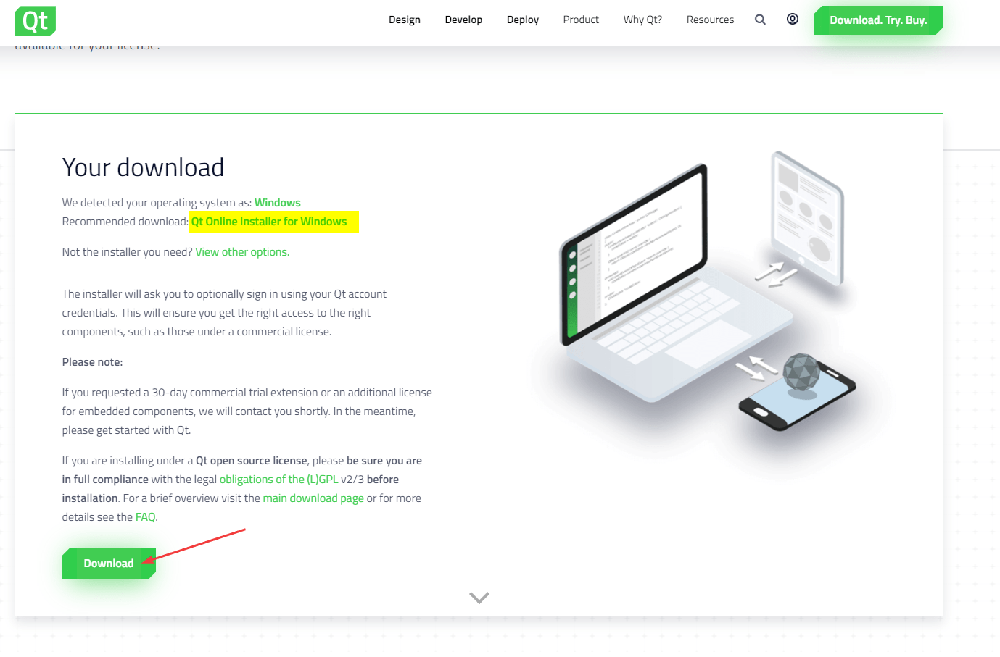

Если же вам нужен всё-таки offline установщик, то спуститесь в самый низ и увидите ссылку на них:

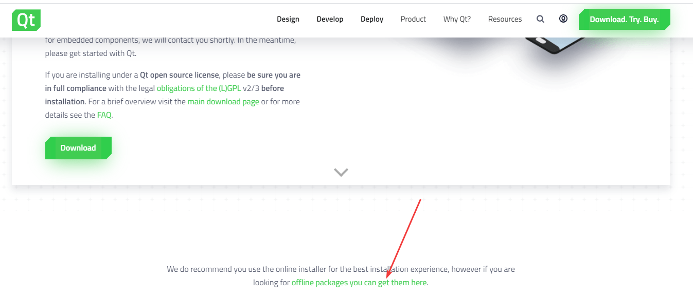

## Установка

Запускаем скаченный файл:

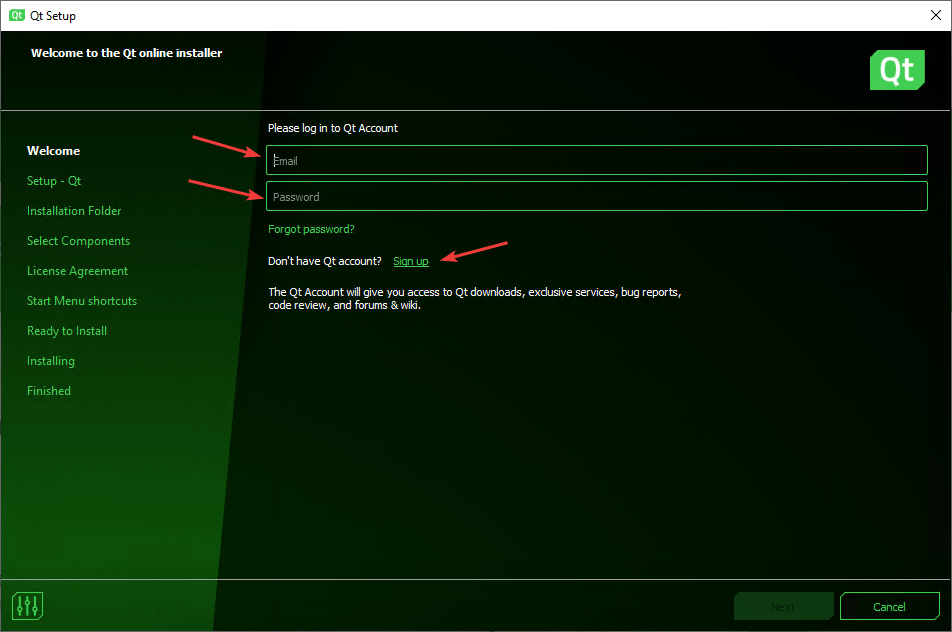

Если у вас есть учетка на сайте Qt, то вводите данные, иначе нажимаете `Skip`:

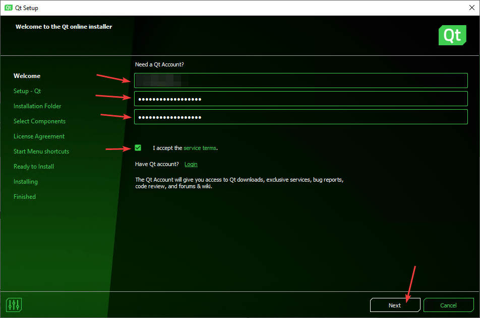


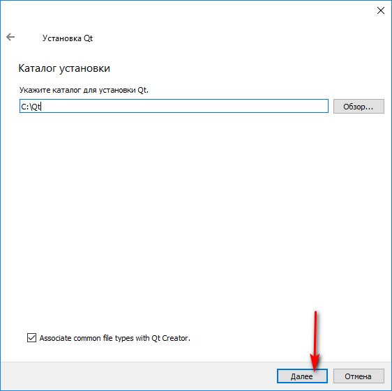

В списке компонентов выбираем Qt Creator:

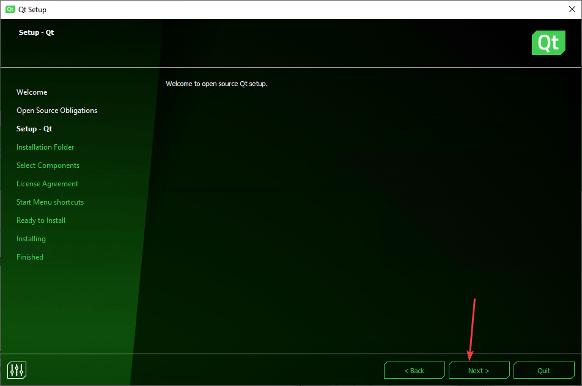

В последней версии Qt выбираем пакет с компилятором MinGW:

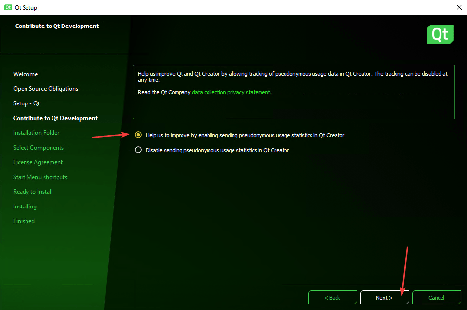

Рекомендую также выбрать для установки дополнительные компоненты. Их можно выбирать все:

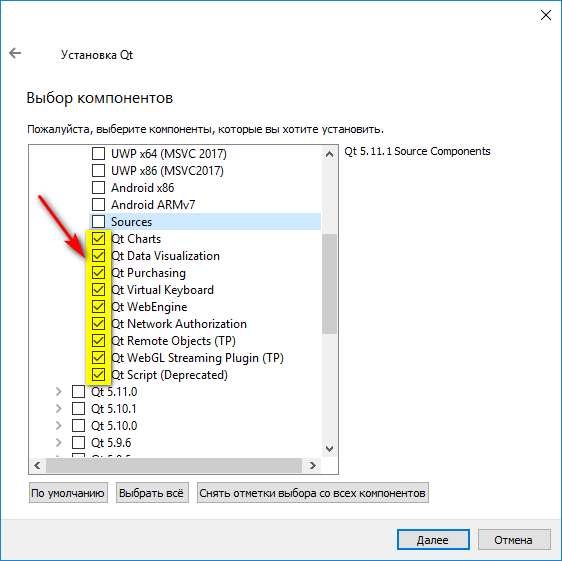

Соглашаемся с условиями:

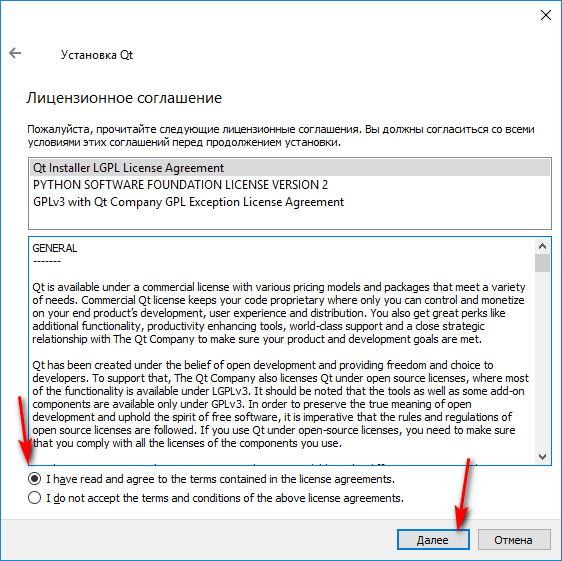

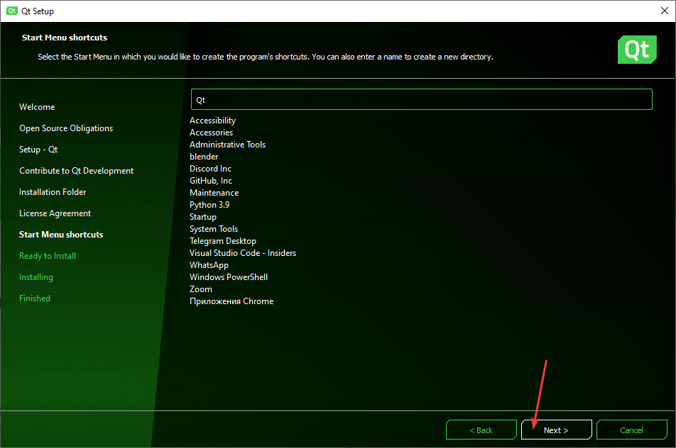

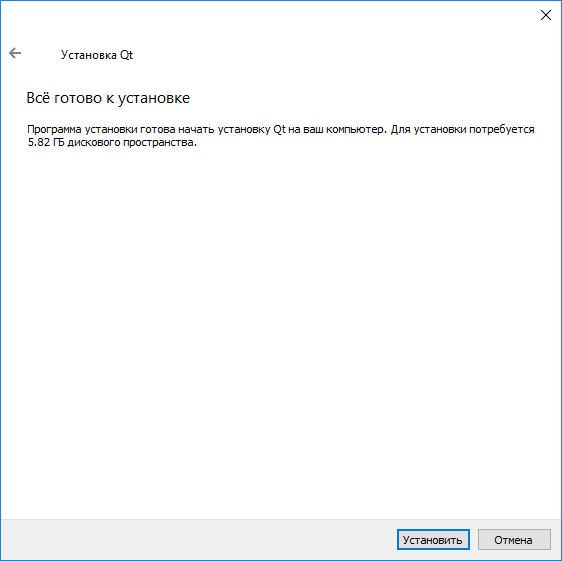


## Настройка

Если Qt Creator запустился с русским интерфейсом, то настоятельно рекомендую поменять его на английский:

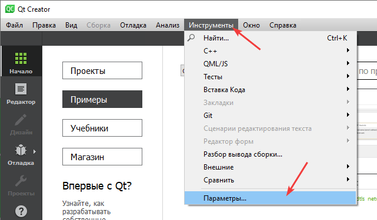

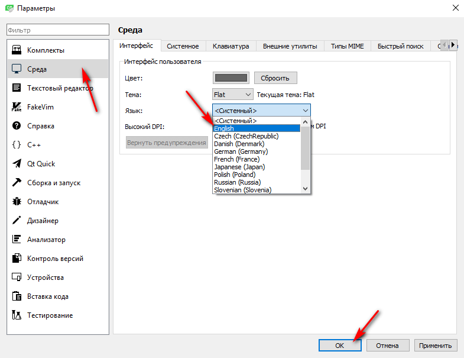

Потом перезапустите Qt Creator:

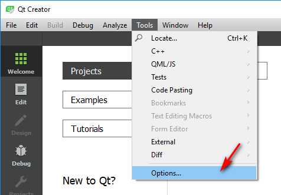

Если вы создадите какой-нибудь проект в Qt и скомпилируете его под разными режимами (Release, Debug), то у вас в папке, где находится папка с проектом появятся еще папки с скомпилированным проектом:

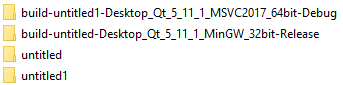

На мой взгляд это крайне неудобно и засоряет папку, где у вас могут находится другие проекты. Лучше было бы, чтобы эти скомпилированные файлы располагались в специальной папке в папке проекта. Поэтому я меняю в настройках путь.

Первоначальное значение параметра `Default build directory`:

```text
../%{JS: Util.asciify("build-%{CurrentProject:Name}-%{CurrentKit:FileSystemName}-%{CurrentBuild:Name}")}
```

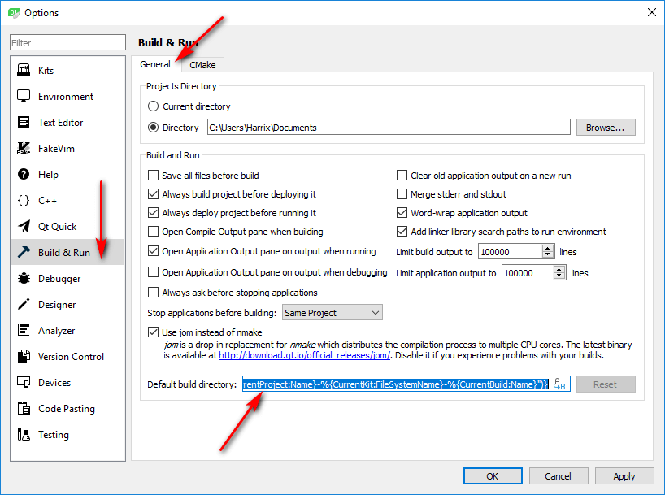

Новое значение параметра `Default build directory`:

```text
_build
```

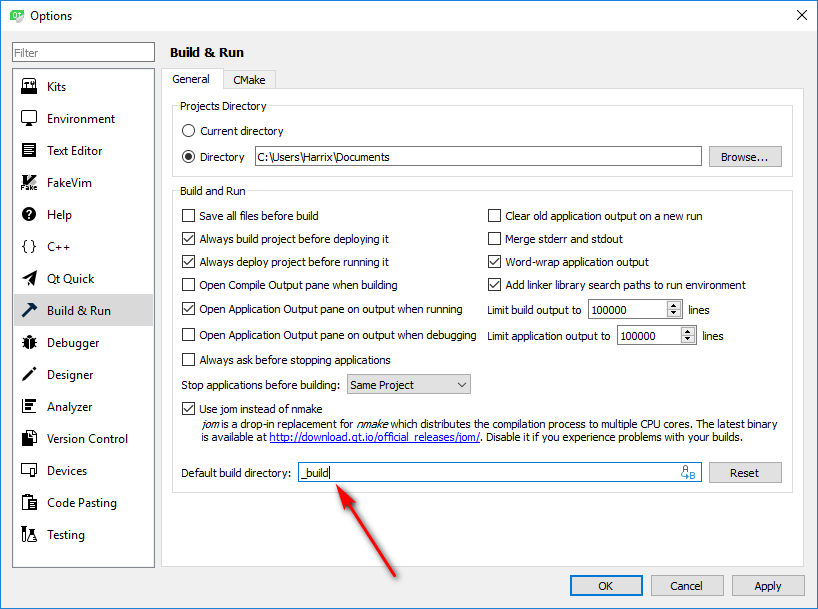

Можно поменять еще на такое значение:

```text
_build/%{JS: Util.asciify("build-%{CurrentProject:Name}-%{CurrentKit:FileSystemName}-%{CurrentBuild:Name}")}
```

И да. Для тех, кто использует git. В файле `.gitignore` я добавляю следующую строчку:

```text
*_build*
```

- Также рекомендую поставить вертикальную линию в редакторе кода, чтобы следить за длиной строчек кода в параметре `Display right margin at column`. Я использую значение равное `120`:

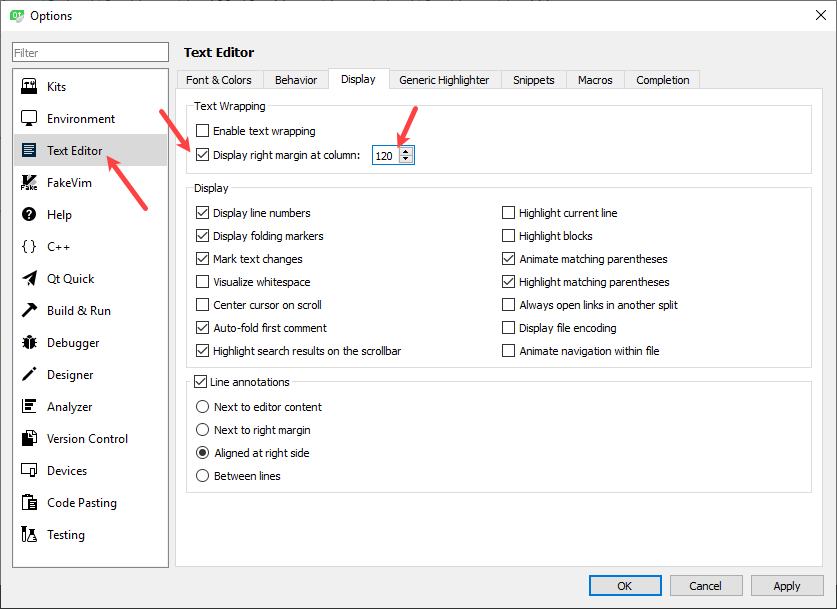
