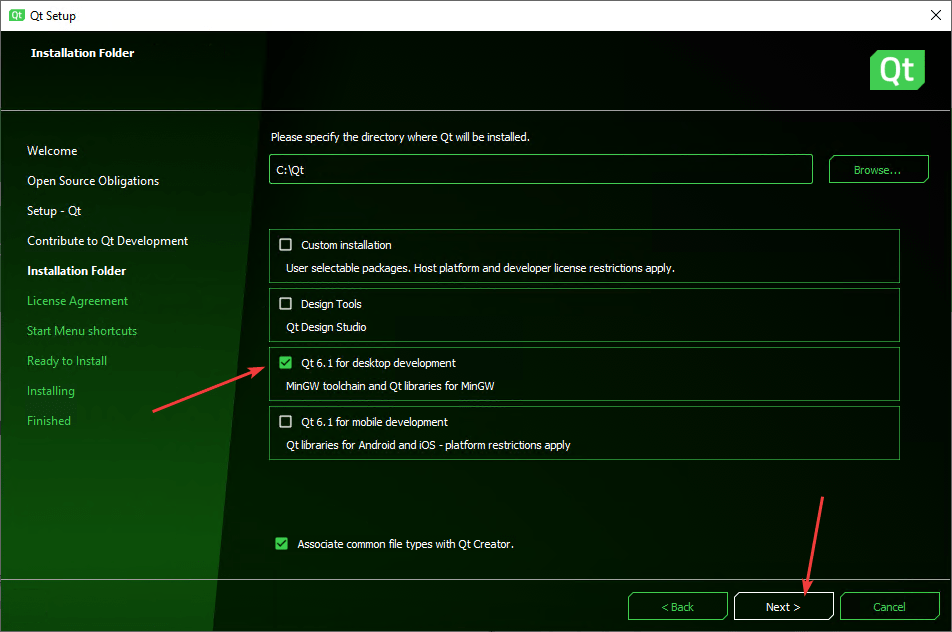
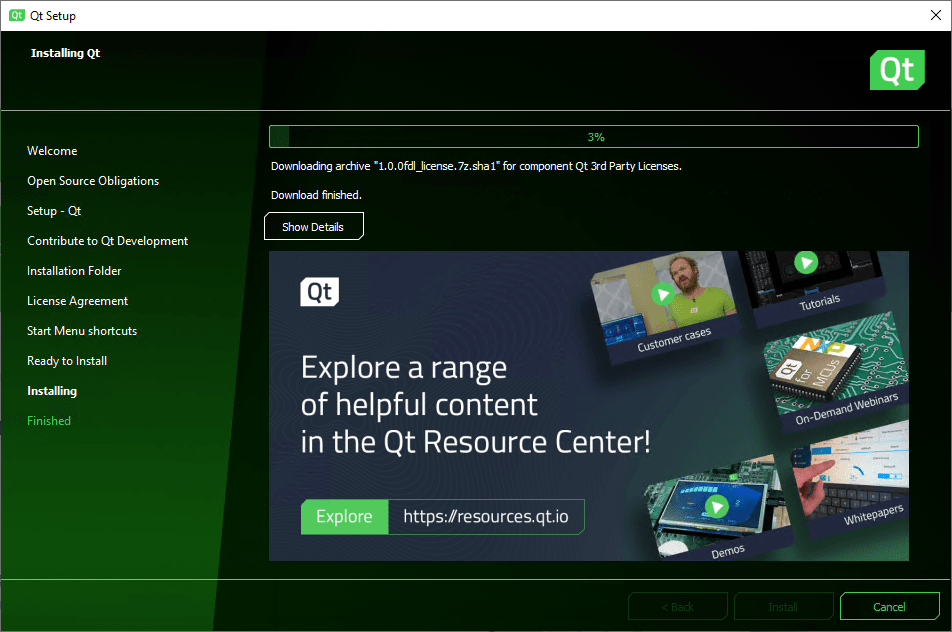

# Установка Qt

Инструкция по установке Qt с компилятором MinGW на Windows 10.

Если вы хотите установить Qt с поддержкой компилятора Visual Studio или для разработки под Android, то данная статья не подойдет, так что вам сюда: [Установка Qt под Visual Studio, MinGW и для разработки под Android](https://github.com/Harrix/harrix.dev-blog-2018/blob/main/2018-08-19-install-qt-advanced/2018-08-19-install-qt-advanced.md).

Если вы хотите установить Qt под Windows XP, то данная статья не подойдет, так что вам сюда: [Установка Qt 4.8.4 на Windows XP](https://github.com/Harrix/harrix.dev-blog-2014/blob/main/2014-02-02-install-qt-on-windows-xp/2014-02-02-install-qt-on-windows-xp.md).

## Скачивание Qt

Практика нескольких лет наблюдений показывает, что Qt регулярно меняет алгоритм нахождения open source версии установщика, так что учтите это.

Перейдите на страницу: <https://www.qt.io/download>.

Там вам нужно спуститься почти в самый низ:

И там находите `Go open source`:

Нам рекомендуют скачать online установщик. Раньше я ставил через offline установщик, но для установки версий MinGW, Visual Studio, Android приходилось устанавливать через несколько инсталляторов, и обновляются такие сборки реже. Так что скачиваем online установщик через кнопку `Download`, ссылка на который находится в самом низу страницы (на 2021-08-09):

Если же вам нужен всё-таки offline установщик, то спуститесь в самый низ и увидите ссылку на них:

## Установка

Запускаем скаченный файл. К сожалению, вам нужно иметь учетную запись Qt. Если её нет, то щелкаете на `Sign up`:

Вводите данные новой учетки, если перешли по `Sign up`:

После этого вы должны будете подтвердить учетку через письмо, которое придет на электронную почту, о чем говорит выделенная фраза:

Там, перейдя по ссылке, вам попросят ввести информацию о вас. Если вы используете Qt в личных целях, то укажите это, что позволит пользоваться Qt бесплатно:

После этого вы сможете в установщике пройти дальше, где еще раз укажите, что пользуетесь лично Qt, а не в компании:

В последней версии Qt выбираем пакет с компилятором MinGW:

Соглашаемся с условиями:

## Настройка

Если Qt Creator запустился с русским интерфейсом, то настоятельно рекомендую поменять его на английский:

Потом перезапустите Qt Creator.

## Создание первого приложения

Для проверки, что всё установилось хорошо, создадим пустое приложение и его запустим:

Если у вас запустилось приложение, то всё хорошо.
