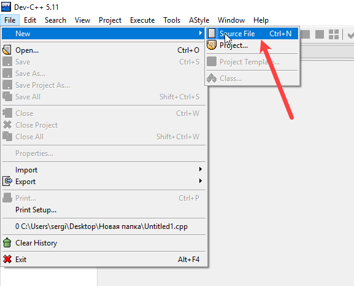
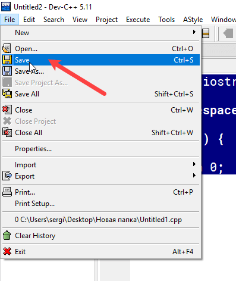
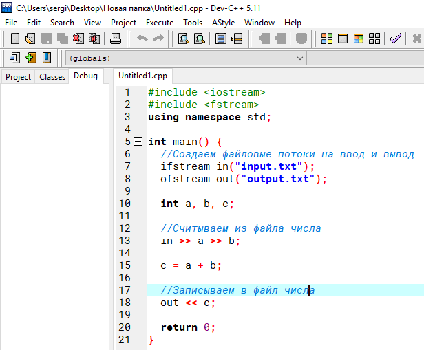
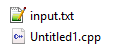
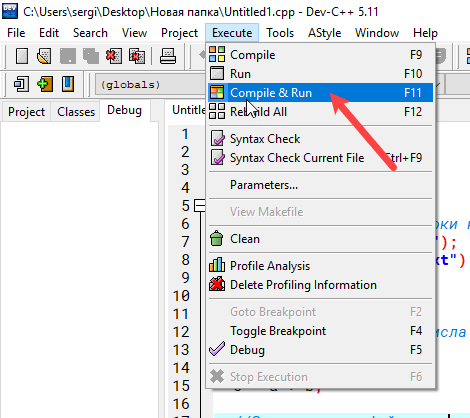
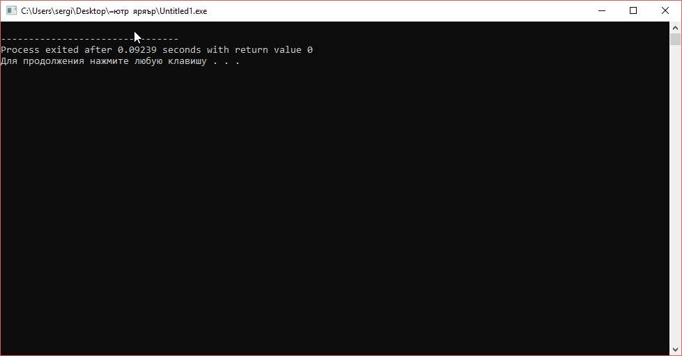
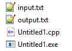

# Сложение двух чисел из файла в Dev-C++ (консольное приложение)

В статье рассказывается как в Dev-C++ считать из файла два числа, сложить их, а результат записать в другой файл.

## Создание проекта

Создайте файл исходного кода:



Напишите болванку приложения:

```cpp
#include <iostream>

using namespace std;

int main () {

  return 0;
}
```

Сохраните где-нибудь файл:



## Код основной программы

Подключите следующую библиотеку, работающую с файлами через потоки:

```cpp
#include <fstream>
```

А теле главной функции добавьте этот код:

```cpp
//Создаем файловые потоки на ввод и вывод
ifstream in("input.txt");
ofstream out("output.txt");

int a, b, c;

//Считываем из файла числа
in >> a >> b;

c = a + b;

//Записываем в файл числа
out << c;
```



Обратите внимание, что я тут не использую в конце программы, например, `system("pause")`.

## Запуск программы

Разместите в папку с исходным кодом программы файл `input.txt` со следующим содержимым:

```text
1 3
```



Запустите приложение:



Появится черное окно консоли, которое можно закрыть:



При этом в папке с исходным кодом программы появится файл `output.txt`:



И в нем будет хранится результат сложения двух чисел:

```text
4
```
