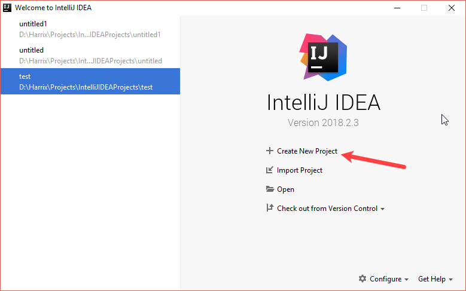
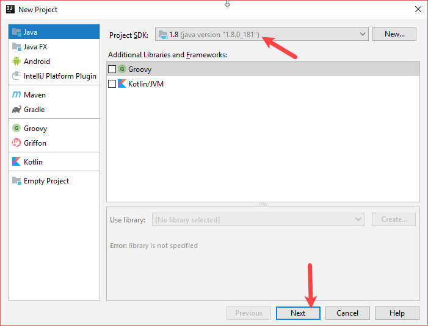
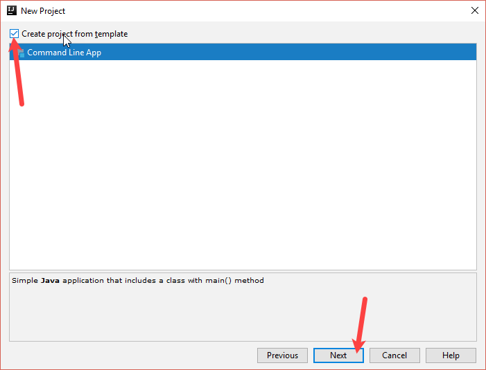
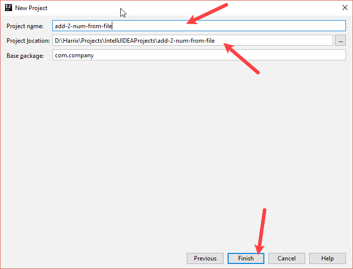
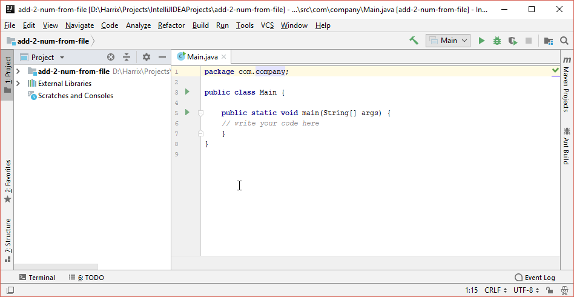
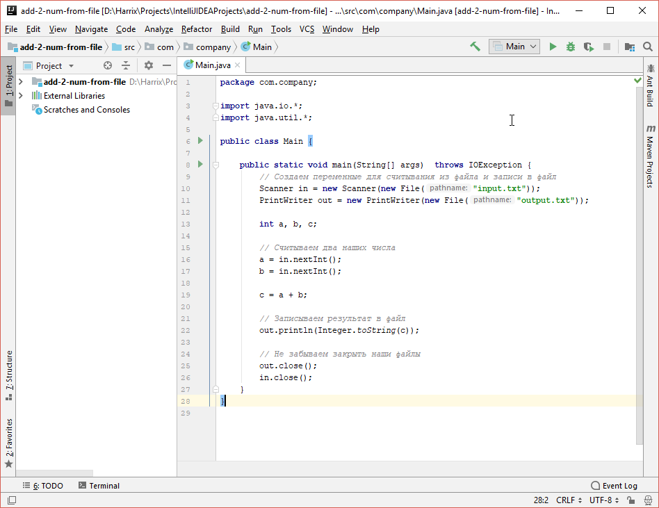
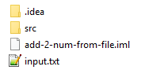
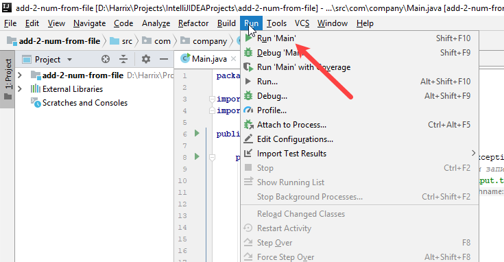
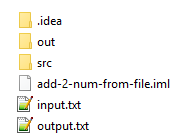

# Сложение двух чисел из файла в IntelliJ IDEA на Java (консольное приложение)


В статье рассказывается как в IntelliJ IDEA считать из файла два числа, сложить их, а результат записать в другой файл.

Статья рассчитана для написания приложения под [acmp.ru](//acmp.ru/).

## Создание проекта

---

**Создание проекта** <!-- !details -->



_Рисунок 1 — Создание нового проекта_



_Рисунок 2 — Выбор типа проекта_



_Рисунок 3 — Выбор шаблона консольного приложения_



_Рисунок 4 — Выбор названия проекта и папки его размещения_



_Рисунок 5 — Созданный проект_

---

## Болванка приложения

Вначале пропишем подключение стандартных пакетов, которые могут пригодиться в программе:

```java
import java.io.*;
import java.util.*;
```

Также в методе `main` пропишем `throws IOException`, чтобы не прописывать дополнительные `try ... catch` в теле метода.

По итогу получим вот такую болванку приложения (без строчки `package`):

```java
import java.io.*;
import java.util.*;

public class Main {

    public static void main(String[] args) throws IOException {
    // Тут будет располагаться основной код программы
    }
}
```

## Основной код программы

Напишем вот такой код:

```java
// Создаем переменные для считывания из файла и записи в файл
Scanner in = new Scanner(new File("input.txt"));
PrintWriter out = new PrintWriter(new File("output.txt"));

int a, b, c;

// Считываем два наших числа
a = in.nextInt();
b = in.nextInt();

c = a + b;

// Записываем результат в файл
out.println(Integer.toString(c));

// Не забываем закрыть наши файлы
out.close();
in.close();
```

Общий код программы (со строчкой `package`) будет выглядеть так:

```java
package com.company;

import java.io.*;
import java.util.*;

public class Main {

    public static void main(String[] args) throws IOException {
        // Создаем переменные для считывания из файла и записи в файл
        Scanner in = new Scanner(new File("input.txt"));
        PrintWriter out = new PrintWriter(new File("output.txt"));

        int a, b, c;

        // Считываем два наших числа
        a = in.nextInt();
        b = in.nextInt();

        c = a + b;

        // Записываем результат в файл
        out.println(Integer.toString(c));

        // Не забываем закрыть наши файлы
        out.close();
        in.close();
    }
}
```



_Рисунок 6 — Код программы_

## Запуск программы

Разместите в папку с исходным кодом программы (у меня это папка `add-2-num-from-file`) файл `input.txt` со следующим содержимым:

```text
1 3
```



_Рисунок 7 — Файл с входными данными_

Запустите приложение:



_Рисунок 8 — Запуск приложения_

После запуска в папке с исходным кодом программы появится файл `output.txt`:



_Рисунок 9 — Файл с выходными данными_

И в нем будет хранится результат сложения двух чисел:

```text
4
```

---

**Внимание!** <!-- !important -->

Если вы будете отправлять файл исходного кода на проверку на сайт [acmp.ru](//acmp.ru/), то в отправляемом файле удаляйте строчку `packages`.

---
