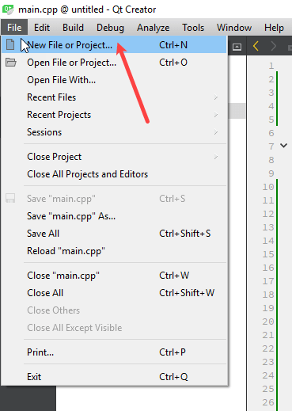
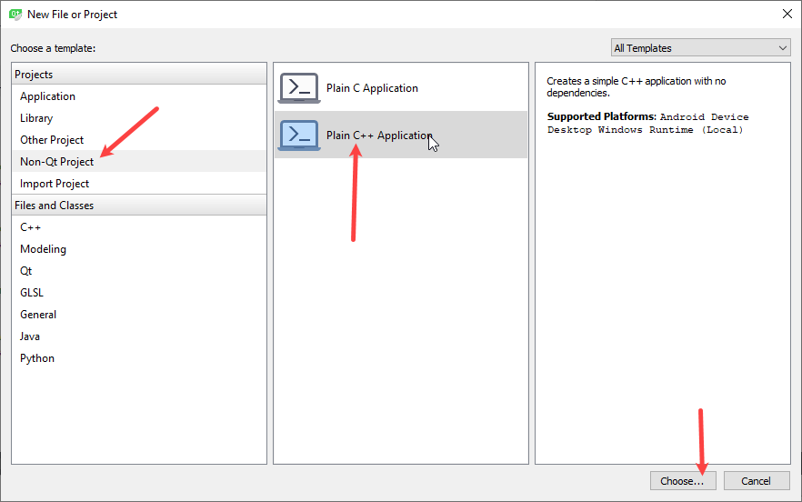
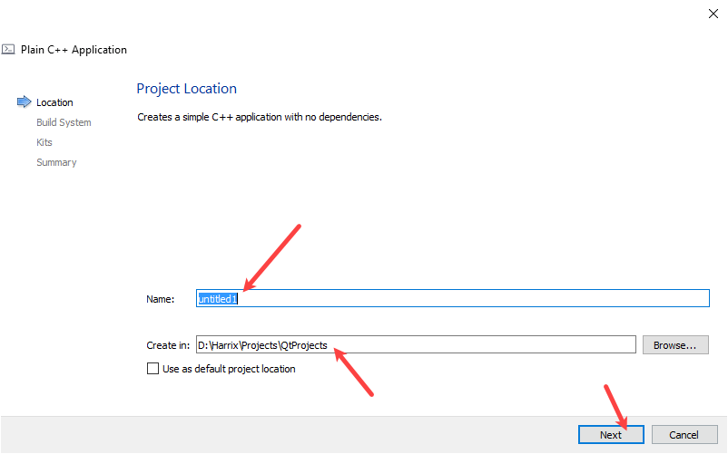
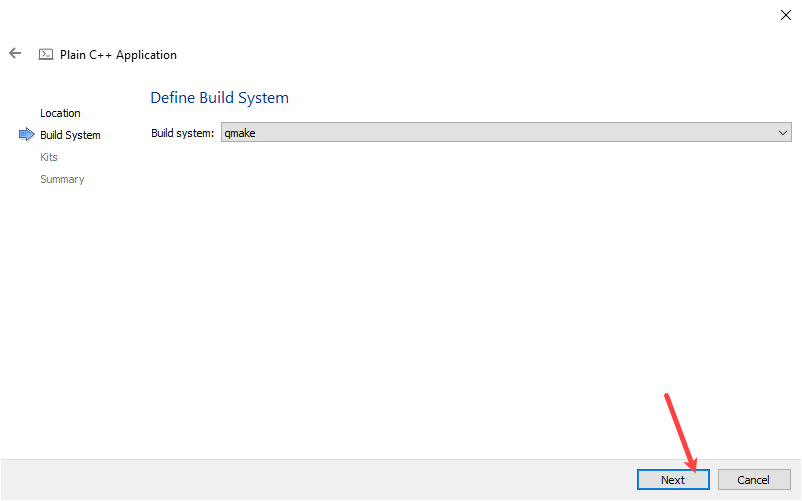
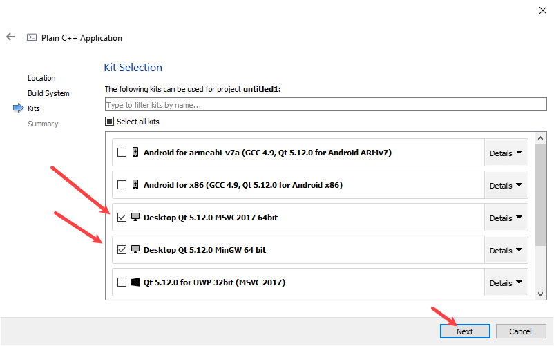
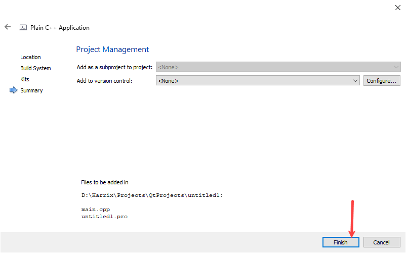
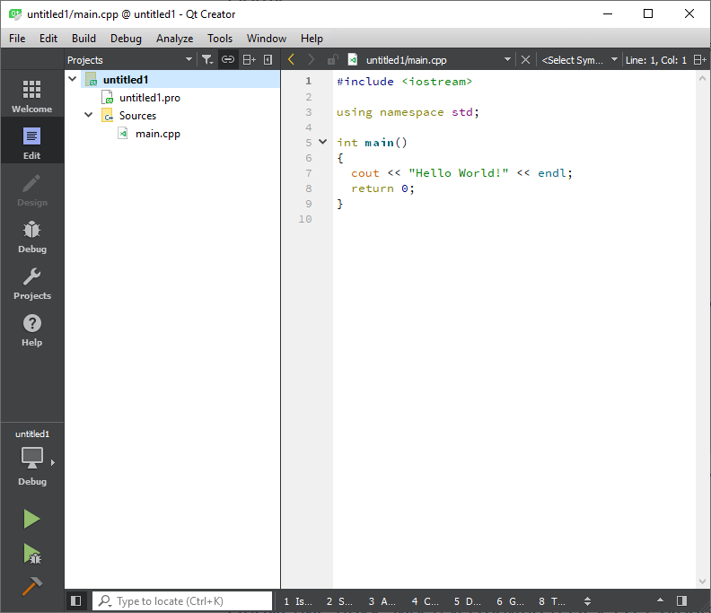
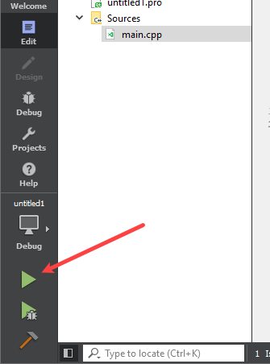
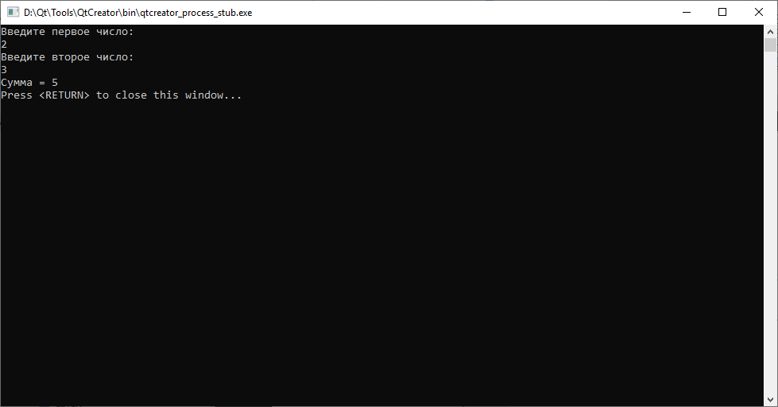

# Сложение двух чисел в Qt 5.12.0 на C++ (консольное приложение)


В статье рассказывается как создать консольное приложение сложения двух чисел в Qt 5.4.0 с использованием библиотеки Qt (то есть с использованием moc компилятора).

<details>
<summary>📖 Содержание</summary>

- [Приготовления](#приготовления)
- [Создание проекта](#создание-проекта)
- [Болванка приложения C++](#болванка-приложения-c)
- [Написание кода основной программы](#написание-кода-основной-программы)
- [Запуск программы](#запуск-программы)

В статье [Сложение двух чисел в Qt 5.4.0 на C++ (консольное приложение c moc компилятором)](https://github.com/Harrix/harrix.dev-articles-2015/blob/main/add-2-num-qt-moc-console/add-2-num-qt-moc-console.md) | [🡥](https://harrix.dev/ru/articles/2015/add-2-num-qt-moc-console/) рассказывается, как создать консольное приложение с использованием библиотек Qt.

</details>

## Приготовления

В статье [Установка Qt](https://github.com/Harrix/harrix.dev-articles-2018/blob/main/install-qt-mingw/install-qt-mingw.md) | [🡥](https://harrix.dev/ru/articles/2018/install-qt-mingw/) и в статье [Установка Qt под Visual Studio, MinGW и для разработки под Android](https://github.com/Harrix/harrix.dev-articles-2018/blob/main/install-qt-advanced/install-qt-advanced.md) | [🡥](https://harrix.dev/ru/articles/2018/install-qt-advanced/) узнаете, как всё установить и настроить.

## Создание проекта



_Рисунок 1 — Создание нового проекта_

Выбираем тип проекта, не основанного на библиотеках Qt:



_Рисунок 2 — Выбор типа нового проекта_



_Рисунок 3 — Выбор названия проекта_



_Рисунок 4 — Выбор системы сборки_

У меня установлено несколько компиляторов, так что для тестирования я выбираю как MinGW, так и Visual Studio. Вы можете выбрать какой-нибудь один:



_Рисунок 5 — Выбор компилятора_



_Рисунок 6 — Дополнительная настройка проекта_



_Рисунок 7 — Созданный проект_

## Болванка приложения C++

Пропишем подключение библиотек:

Пропишем пространство имен стандартной библиотеки, чтобы потом нужно было меньше прописывать кода:

```cpp
using namespace std;//Подключение стандартной библиотеки функций
```

В функции `main` пропишем строчки кода, чтобы русский язык отображался корректно (строчка `setlocale(LC_ALL, "RUSSIAN");` не сработает):

```cpp
setlocale(LC_ALL, "ru_RU.UTF-8");
```

И удалим строчку с выводом `Hello World!`

В итоге получаем готовую болванку программы на C++:

```cpp
#include <iostream>

using namespace std;

int main()
{
  setlocale(LC_ALL, "ru_RU.UTF-8");

  // Тут пишем код

  return 0;
}
```

## Написание кода основной программы

А теперь пропишем основной код нашей программы, где через `cin` мы считываем в переменные наши числа, а через `cout` выводим текст в консоль:

```cpp
int a, b, c;

cout << "Введите первое число:" << endl;
cin >> a;

cout << "Введите второе число:" << endl;
cin >> b;

c = a + b;

cout << "Сумма = " << c << endl;
```

Полная программа будет выглядеть так:

```cpp
#include <iostream>

using namespace std;

int main()
{
  setlocale(LC_ALL, "ru_RU.UTF-8");

  int a, b, c;

  cout << "Введите первое число:" << endl;
  cin >> a;

  cout << "Введите второе число:" << endl;
  cin >> b;

  c = a + b;

  cout << "Сумма = " << c << endl;

  return 0;
}
```

Если вы не хотите использовать русские буквы, то код будет немного проще:

```cpp
#include <iostream>

using namespace std;

int main()
{
  int a, b, c;

  cout << "Input first number:" << endl;
  cin >> a;

  cout << "Input second number:" << endl;
  cin >> b;

  c = a + b;

  cout << "Sum = " << c << endl;

  return 0;
}
```

## Запуск программы



_Рисунок 8 — Запуск программы_

При вводе наших чисел получим вот это:



_Рисунок 9 — Результат выполнения программы_
