# Анимация на канве в Android

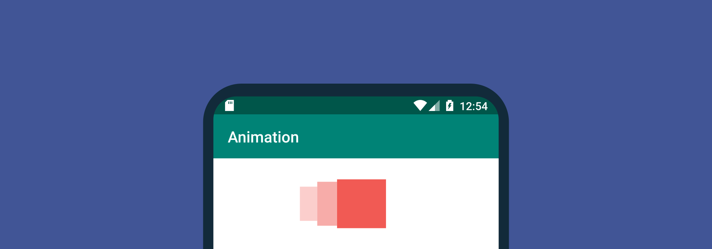

В статье приводятся несколько примеров рисования анимации на канве в Android Studio.

<details>
<summary>📖 Содержание ⬇️</summary>

## Содержание

- [Создание пустого проекта](#создание-пустого-проекта)
- [Подготовка приложения](#подготовка-приложения)
- [Первое рисование](#первое-рисование)
- [Первая анимация](#первая-анимация)
- [Примеры анимаций](#примеры-анимаций)
- [Дополнительные примеры анимаций](#дополнительные-примеры-анимаций)

</details>

## Создание пустого проекта

<details>
<summary>Создание пустого проекта</summary>

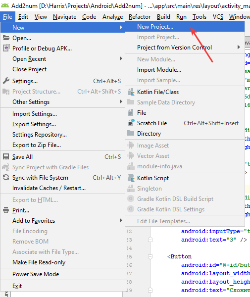

_Рисунок 1 — Пункт меню для создания нового приложения_

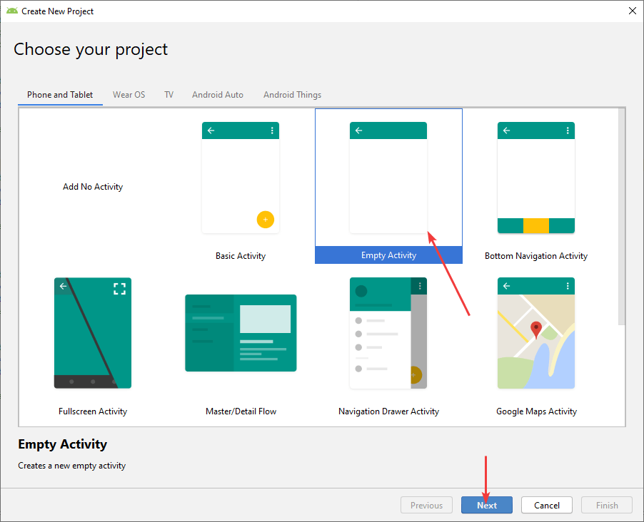

_Рисунок 2 — Выбор типа активности_

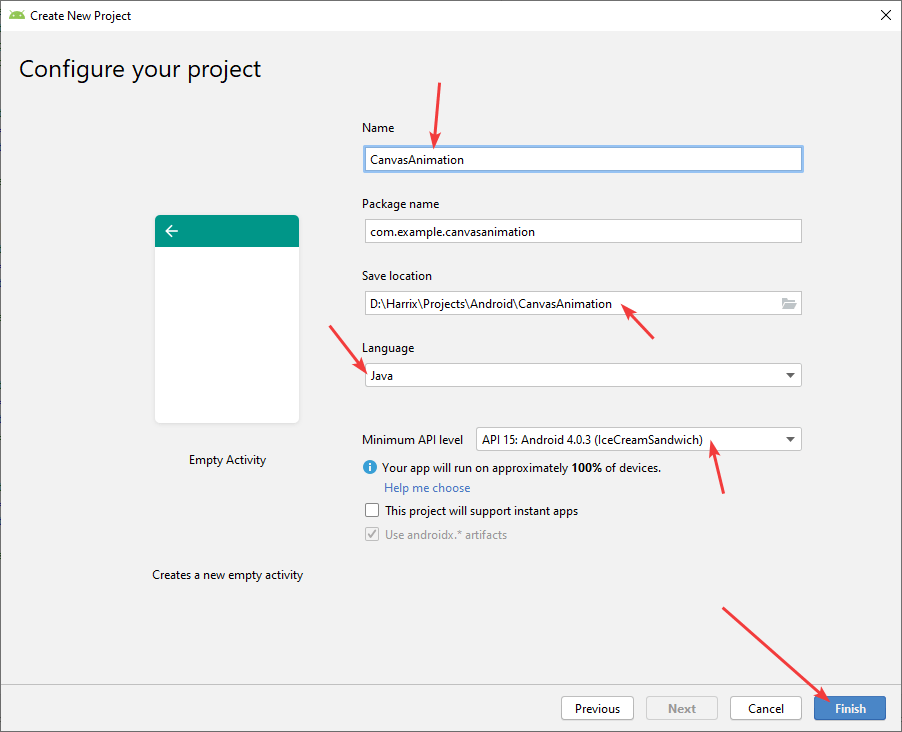

_Рисунок 3 — Выбор настроек проекта_

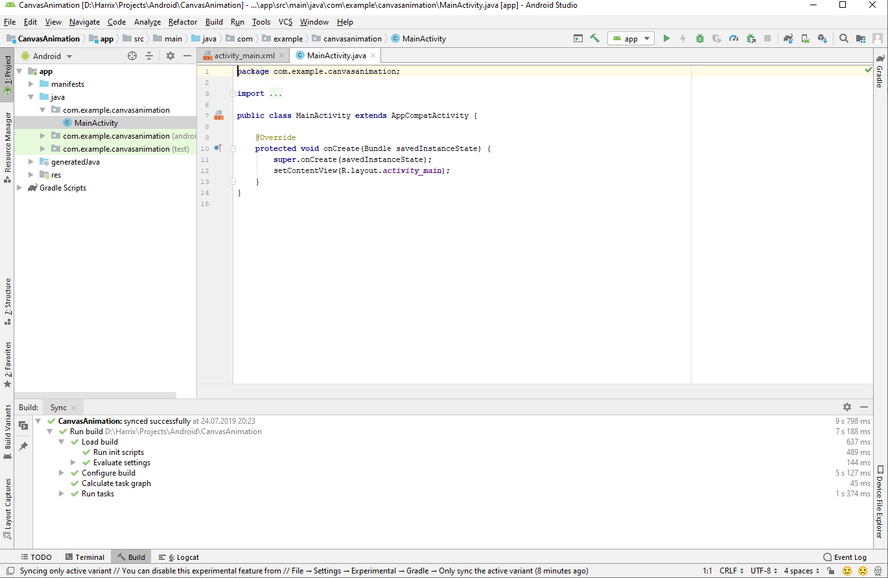

_Рисунок 4 — Созданное приложение_

</details>

## Подготовка приложения

Щелкаем слева на пакете вашего проекта с Java файлами правой кнопкой и создаем новый класс:

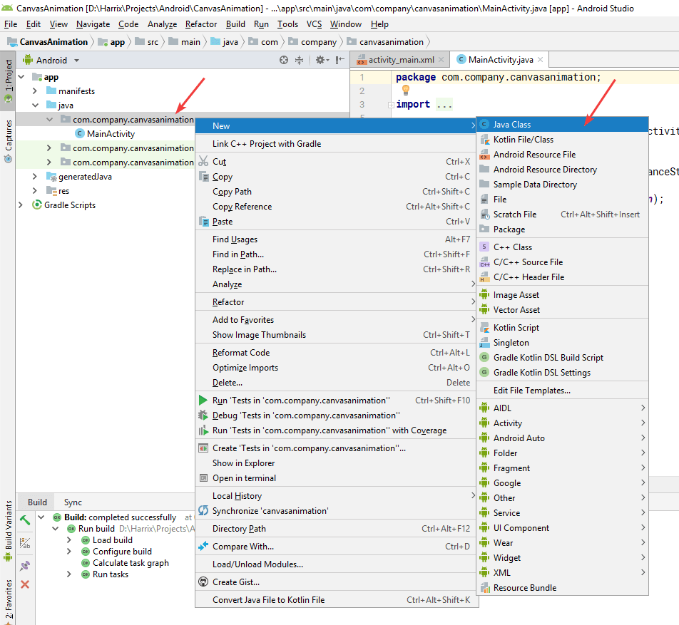

_Рисунок 5 — Создание нового класса_

Назовем класс, например, `MyView`:

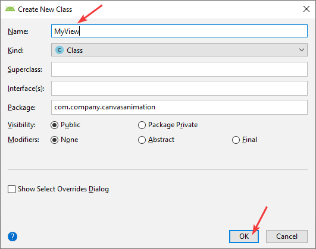

_Рисунок 6 — Выбор названия нового класса_

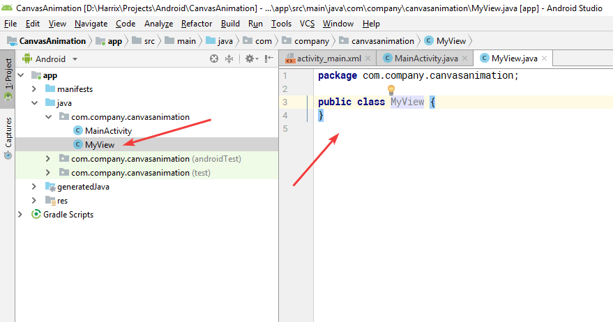

_Рисунок 7 — Созданный класс_

Сейчас наш класс представлен строками:

```java
public class MyView {
}
```

Заменим эти строки на следующие:

```java
import android.content.Context;
import android.graphics.Canvas;
import android.view.View;

public class MyView extends View {

    public MyView(Context context) {
        super(context);
    }

    @Override
    protected void onDraw(Canvas canvas) {
        super.onDraw(canvas);
        //Здесь располагаются команды рисования
        ///...
    }
}
```

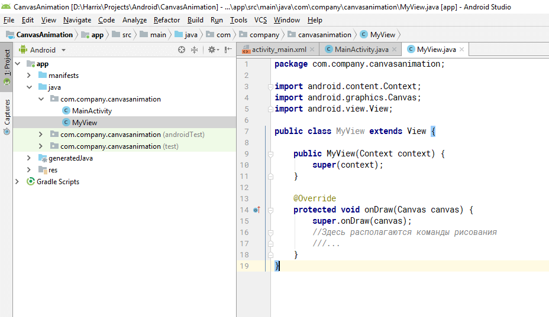

_Рисунок 8 — Тело нашего класса_

Обратите внимание на то, что самую первую строку `package` мы не трогаем.

Теперь перейдем в файл `MainActivity.java`. Там есть строчка `setContentView(R.layout.activity_main);`, которая связывает нашу активность с разметкой XML файла `activity_main.xml`. Но так как мы будем рисовать на канве, то в данном проекте мы откажемся от разметки и всё будем вручную рисовать на канве. Поэтому вышеуказанную строку мы заменим:


_Рисунок 9 — Строка, которую нужно изменить_

Меняем на следующую, которая связывает активность с созданным нами классом `MyView`:

```java
setContentView(new MyView(this));
```

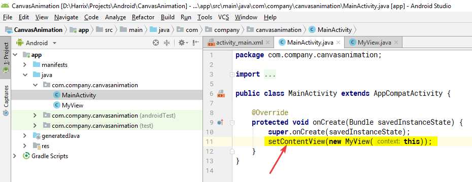

_Рисунок 10 — Строка, на которую нужно поменять_

Запустим наш проект:

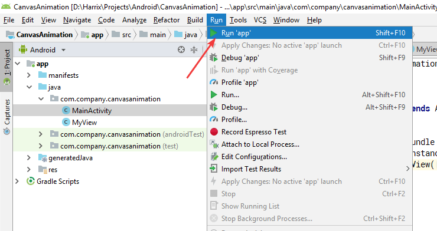

_Рисунок 11 — Запуск приложения_

Если видим белый экран, то всё в порядке:

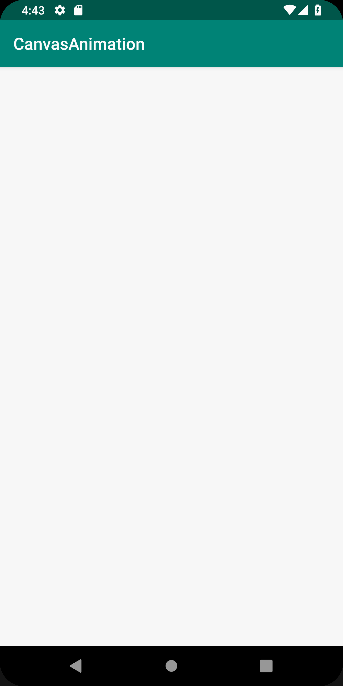

_Рисунок 12 — Запущенное приложение_

## Первое рисование

Теперь мы забываем про файл `MainActivity.java` и работаем только с файлом `MyView.java`.

В методе `onDraw` прописываем такой код:

```java
Paint paint = new Paint();
paint.setColor(Color.YELLOW);
paint.setStyle(Paint.Style.FILL);

canvas.drawCircle(300, 300, 200, paint);
```

Некоторые моменты будут отмечены красным из-за отсутствия подключения нужных классов. Решается через нажатие `Alt` + `Enter`:

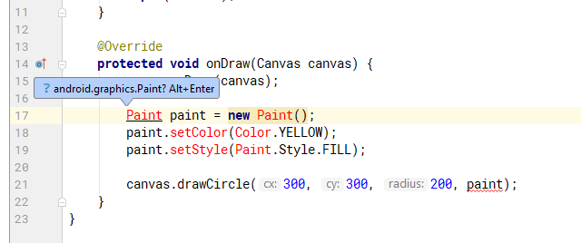

_Рисунок 13 — Вызов команды по исправлению решения_

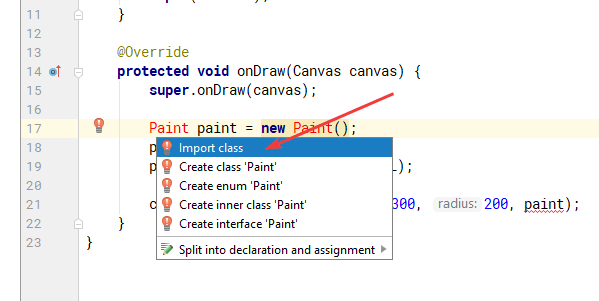

_Рисунок 14 — Выбираем подключение импорта_

После этого у нас наверху появятся подключенные файлы классов, а краснота уйдет:

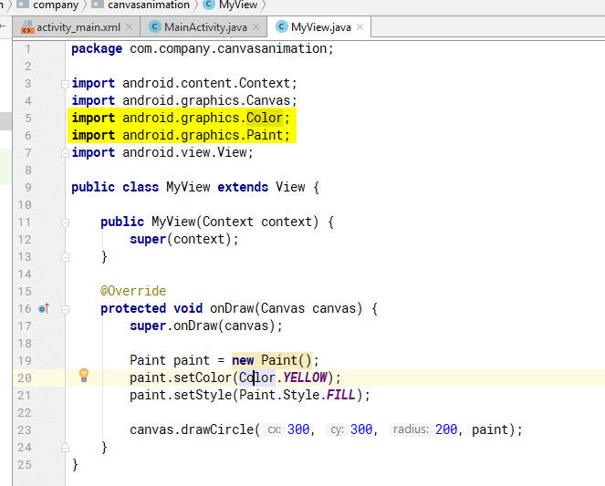

_Рисунок 15 — Подключенные классы_

Если запустим сейчас приложение, то должны увидеть желтый шарик:

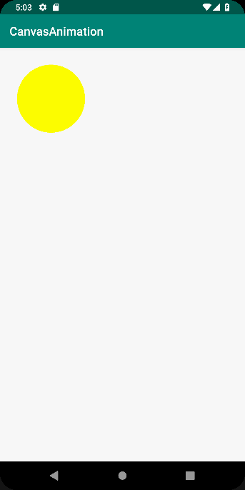

_Рисунок 16 — Запущенное приложение_

А данный код нарисует закрашенный желтый кружок, прямоугольник с красной обводкой, а также прямоугольник с закругленными краями:

```java
Paint paint = new Paint();
paint.setColor(Color.YELLOW);
paint.setStyle(Paint.Style.FILL);
canvas.drawCircle(300, 300, 200, paint);

paint.setColor(Color.RED);
paint.setStyle(Paint.Style.STROKE);
paint.setStrokeWidth(20);
canvas.drawRect(100,200,300,500,paint);

canvas.drawRoundRect(200,500,1000,1000, 100, 200, paint);
```

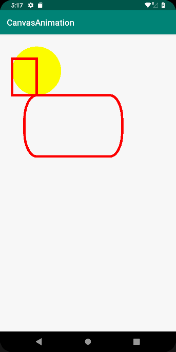

_Рисунок 17 — Несколько фигур на канве_

Класс `Paint` отвечает за кисточку, которая используется во всех остальных командах (`canvas.drawCircle()`, canvas.drawRect(), `canvas.drawRoundRect()`).

Метод `canvas.drawCircle()` рисует круг с заданными координатами центра и радиусом.

Метод `canvas.drawRect()` рисует прямоугольник, у которого указываем координаты верхнего левого и нижнего правого угла.

Метод `canvas.drawRoundRect()` рисует прямоугольник, у которого указываем координаты верхнего левого и нижнего правого угла, а также радиусы закругления по оси `Ox` и `Oy`.

## Первая анимация

Для того, чтобы попросить Android нарисовать новый кадр, нужно в конце метода `onDraw` вызвать метод `invalidate()`:

```java
public class MyView extends View {

    public MyView(Context context) {
        super(context);
    }

    @Override
    protected void onDraw(Canvas canvas) {
        super.onDraw(canvas);

        // Отрисовка кадра

        invalidate();
    }
}
```

В первой анимации будем изменять координату верхнего левого угла прямоугольника (первую строку с `package` не трогать):

```java
import android.content.Context;
import android.graphics.Canvas;
import android.graphics.Color;
import android.graphics.Paint;
import android.view.View;

public class MyView extends View {

    int x = 0;

    public MyView(Context context) {
        super(context);
    }

    @Override
    protected void onDraw(Canvas canvas) {
        super.onDraw(canvas);
        Paint paint = new Paint();
        paint.setColor(Color.RED);
        paint.setStyle(Paint.Style.STROKE);
        paint.setStrokeWidth(20);

        x++;
        canvas.drawRect(x,200,300,500,paint);

        invalidate();
    }
}
```

[Первая анимация](img/run_05.avif)

## Примеры анимаций

Заставим наш прямоугольник двигаться нормально. Для этого будем изменять координаты обоих углов прямоугольника. Ширина прямоугольника будет равна 300 px:

```java
import android.content.Context;
import android.graphics.Canvas;
import android.graphics.Color;
import android.graphics.Paint;
import android.view.View;

public class MyView extends View {

    int x = 0;

    public MyView(Context context) {
        super(context);
    }

    @Override
    protected void onDraw(Canvas canvas) {
        super.onDraw(canvas);
        super.onDraw(canvas);
        Paint paint = new Paint();
        paint.setColor(Color.RED);
        paint.setStyle(Paint.Style.STROKE);
        paint.setStrokeWidth(20);

        x = x + 10;
        canvas.drawRect(x,200,300 + x,500,paint);

        invalidate();
    }
}
```

[Движение прямоугольника](img/run_06.avif)

Но у нас прямоугольник выезжает за границы. Сделаем так, чтобы он при достижения правой границы останавливался:

```java
import android.content.Context;
import android.graphics.Canvas;
import android.graphics.Color;
import android.graphics.Paint;
import android.view.View;

public class MyView extends View {

    int x = 0;

    public MyView(Context context) {
        super(context);
    }

    @Override
    protected void onDraw(Canvas canvas) {
        super.onDraw(canvas);
        Paint paint = new Paint();
        paint.setColor(Color.RED);
        paint.setStyle(Paint.Style.STROKE);
        paint.setStrokeWidth(20);

        int widthRect = 300;
        x = x + 10;

        if (x > canvas.getWidth() - widthRect) x = canvas.getWidth() - widthRect;

        canvas.drawRect(x,200,widthRect + x,500,paint);

        invalidate();
    }
}
```

[Движение прямоугольника с остановкой](img/run_07.avif)

Сделаем так, чтобы прямоугольник при достижения правой границы отскакивал в противоположную сторону, а потом отскакивал от левой границы:

```java
import android.content.Context;
import android.graphics.Canvas;
import android.graphics.Color;
import android.graphics.Paint;
import android.view.View;

public class MyView extends View {

    int x = 0; // Координата по горизонтали левого верхнего угла прямоугольника
    int widthRect = 300; // Ширина прямоугольника
    int vx = 10; // Скорость по оси Ox

    public MyView(Context context) {
        super(context);
    }

    @Override
    protected void onDraw(Canvas canvas) {
        super.onDraw(canvas);
        Paint paint = new Paint();
        paint.setColor(Color.RED);
        paint.setStyle(Paint.Style.STROKE);
        paint.setStrokeWidth(20);

        x = x + vx;

        if (x > canvas.getWidth() - widthRect) vx = vx * -1;
        if (x < 0) vx = vx * -1;

        canvas.drawRect(x,200,widthRect + x,500,paint);

        invalidate();
    }
}
```

[Движение прямоугольника с отскакиванием от сторон](img/run_08.avif)

## Дополнительные примеры анимаций

Теперь пусть прямоугольник двигается по горизонтали и по вертикали. А при соударении со краями будет увеличивать толщину своих линий:

```java
import android.content.Context;
import android.graphics.Canvas;
import android.graphics.Color;
import android.graphics.Paint;
import android.view.View;

public class MyView extends View {

    int x = 0; // Координата по горизонтали левого верхнего угла прямоугольника
    int y = 0; // Координата по вертикали левого верхнего угла прямоугольника
    int widthRect = 300; // Ширина прямоугольника
    int heightRect = 200; // Высота прямоугольника
    int strokeWidth = 20; // Толщина линии прямоугольника
    int vx = 10; // Скорость прямоугольника по горизонтали
    int vy = 10; // Скорость прямоугольника по вертикали

    public MyView(Context context) {
        super(context);
    }

    @Override
    protected void onDraw(Canvas canvas) {
        super.onDraw(canvas);
        Paint paint = new Paint();
        paint.setColor(Color.RED);
        paint.setStyle(Paint.Style.STROKE);
        paint.setStrokeWidth(strokeWidth);

        x = x + vx;
        y = y + vy;

        if (x > canvas.getWidth() - widthRect)  {
            vx = vx * -1;
            strokeWidth+=30;
        }
        if (x < 0)  {
            vx = vx * -1;
            strokeWidth+=30;
        }

        if (y > canvas.getHeight() - heightRect) {
            vy = vy * -1;
            strokeWidth+=30;
        }
        if (y < 0) {
            vy = vy * -1;
            strokeWidth+=30;
        }

        canvas.drawRect(x,y,widthRect + x,heightRect+y,paint);

        invalidate();
    }
}
```

[Движение прямоугольника по двум осям](img/run_09.avif)

Теперь пусть при соударении со стенками случайно меняется толщина линий и их цвет:

```java
import android.content.Context;
import android.graphics.Canvas;
import android.graphics.Color;
import android.graphics.Paint;
import android.view.View;

public class MyView extends View {

    int x = 0;
    int y = 0;
    int widthRect = 300;
    int heightRect = 200;
    int strokeWidth = 20;
    int vx = 10;
    int vy = 10;
    int blue = 0;
    int green = 0;
    int red = 0;

    public MyView(Context context) {
        super(context);
    }

    void modifyRect() {
        strokeWidth = (int)(Math.random()*100);
        blue = (int)(Math.random()*255);
        green = (int)(Math.random()*255);
        red = (int)(Math.random()*255);
    }

    @Override
    protected void onDraw(Canvas canvas) {
        super.onDraw(canvas);
        Paint paint = new Paint();
        paint.setColor(Color.rgb(red, green, blue));
        paint.setStyle(Paint.Style.STROKE);
        paint.setStrokeWidth(strokeWidth);

        x = x + vx;
        y = y + vy;

        if (x > canvas.getWidth() - widthRect)  {
            vx = vx * -1;
            modifyRect();
        }
        if (x < 0)  {
            vx = vx * -1;
            modifyRect();
        }

        if (y > canvas.getHeight() - heightRect) {
            vy = vy * -1;
            modifyRect();
        }
        if (y < 0) {
            vy = vy * -1;
            modifyRect();
        }

        canvas.drawRect(x,y,widthRect + x,heightRect+y,paint);

        invalidate();
    }
}
```

[Движение прямоугольника по двум осям со случайными изменениями](img/run_10.avif)

Пример анимации с двумя прямоугольниками, которые двигаются независимо друг от друга:

```java
import android.content.Context;
import android.graphics.Canvas;
import android.graphics.Color;
import android.graphics.Paint;
import android.view.View;

public class MyView extends View {

    int x = 0;
    int y = 0;
    int widthRect = 300;
    int heightRect = 200;
    int vx = 10;
    int vy = 10;

    int x2 = 800;
    int y2 = 500;
    int widthRect2 = 300;
    int heightRect2 = 200;
    int vx2 = -10;
    int vy2 = -10;

    int strokeWidth = 20;
    int blue = 0;
    int green = 0;
    int red = 0;

    public MyView(Context context) {
        super(context);
    }

    void modifyRect() {
        strokeWidth = (int)(Math.random()*100);
        blue = (int)(Math.random()*255);
        green = (int)(Math.random()*255);
        red = (int)(Math.random()*255);
    }

    @Override
    protected void onDraw(Canvas canvas) {
        super.onDraw(canvas);
        Paint paint = new Paint();
        paint.setColor(Color.rgb(red, green, blue));
        paint.setStyle(Paint.Style.STROKE);
        paint.setStrokeWidth(strokeWidth);

        x = x + vx;
        y = y + vy;
        if (x > canvas.getWidth() - widthRect)  {
            vx = vx * -1;
            modifyRect();
        }
        if (x < 0)  {
            vx = vx * -1;
            modifyRect();
        }
        if (y > canvas.getHeight() - heightRect) {
            vy = vy * -1;
            modifyRect();
        }
        if (y < 0) {
            vy = vy * -1;
            modifyRect();
        }
        canvas.drawRect(x,y,widthRect + x,heightRect+y,paint);

        x2 = x2 + vx2;
        y2 = y2 + vy2;
        if (x2 > canvas.getWidth() - widthRect)  {
            vx2 = vx2 * -1;
            modifyRect();
        }
        if (x2 < 0)  {
            vx2 = vx2 * -1;
            modifyRect();
        }
        if (y2 > canvas.getHeight() - heightRect) {
            vy2 = vy2 * -1;
            modifyRect();
        }
        if (y2 < 0) {
            vy2 = vy2 * -1;
            modifyRect();
        }
        canvas.drawRect(x2,y2,widthRect2 + x2,heightRect2+y2,paint);

        invalidate();
    }
}
```

[Движение двух прямоугольников](img/run_11.avif)

И напоследок пример анимации с двумя прямоугольниками, которые двигаются синхронно. Причем внутри каждого прямоугольника есть круг, координаты которого случайно немного изменяются после каждого соударения:

```java
import android.content.Context;
import android.graphics.Canvas;
import android.graphics.Color;
import android.graphics.Paint;
import android.view.View;

public class MyView extends View {

    int x = 0;
    int y = 0;
    int widthRect = 300;
    int heightRect = 200;
    int strokeWidth = 20;
    int vx = 10;
    int vy = 10;
    int blue = 0;
    int green = 0;
    int red = 0;
    int madX = 0;
    int madY = 0;

    public MyView(Context context) {
        super(context);
    }

    void modifyRect() {
        strokeWidth = (int)(Math.random()*100);
        blue = (int)(Math.random()*255);
        green = (int)(Math.random()*255);
        red = (int)(Math.random()*255);
        madX = (int)(Math.random()*100 - 50);
        madY = (int)(Math.random()*100 - 50);
    }

    @Override
    protected void onDraw(Canvas canvas) {
        super.onDraw(canvas);
        Paint paint = new Paint();
        paint.setColor(Color.rgb(red, green, blue));
        paint.setStyle(Paint.Style.STROKE);
        paint.setStrokeWidth(strokeWidth);

        x = x + vx;
        y = y + vy;

        if (x > canvas.getWidth() - widthRect)  {
            vx = vx * -1;
            modifyRect();
        }
        if (x < 0)  {
            vx = vx * -1;
            modifyRect();
        }

        if (y > canvas.getHeight() - heightRect) {
            vy = vy * -1;
            modifyRect();
        }
        if (y < 0) {
            vy = vy * -1;
            modifyRect();
        }

        canvas.drawRect(x,y,widthRect + x,heightRect+y,paint);
        int xSecond = x + 600;
        canvas.drawRect(xSecond,y,widthRect + xSecond,heightRect+y,paint);

        canvas.drawCircle(xSecond + widthRect/2 + madX,y+heightRect/2 + madY,10,paint);
        canvas.drawCircle(x + widthRect/2 + madX,y+heightRect/2 + madY,10,paint);

        invalidate();
    }
}
```

[Движение двух синхронных прямоугольников](img/run_12.avif)
