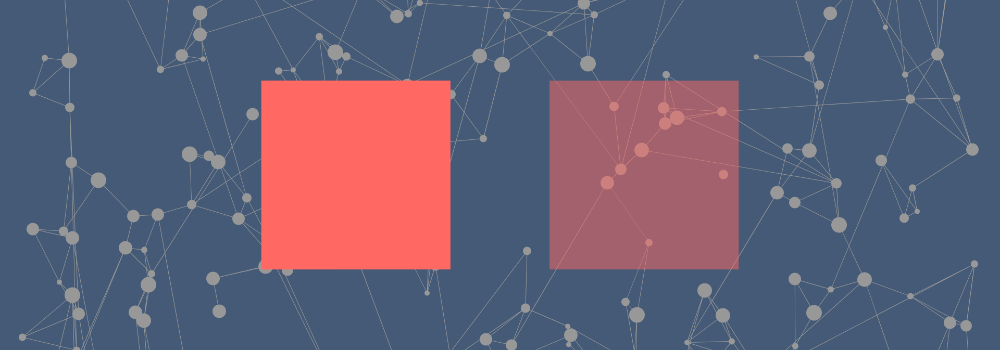

# Анимация перехода display из none в block



<details>
<summary>📖 Содержание</summary>

## Содержание

- [Постановка задачи](#постановка-задачи)
- [Пример](#пример)
- [Проблема](#проблема)
- [Решение](#решение)
- [Решение с обратной анимацией](#решение-с-обратной-анимацией)

</details>

## Постановка задачи

Есть некий объект со свойством `display: none`. Нужно анимировать его появление, при изменении параметра `display`, например, на `block`.

## Пример

Невидимый прямоугольник делаем видимым при нажатии на кнопку:

```html
<button id="button">Show</button>

<div id="rect"></div>
```

```javascript
document.addEventListener("DOMContentLoaded", () => {
  const button = document.getElementById("button");
  const rect = document.getElementById("rect");

  button.addEventListener("click", () => {
    rect.classList.toggle("is-visible");
  });
});
```

```css
#rect {
  width: 100px;
  height: 100px;
  background-color: red;

  display: none;
}

#rect.is-visible {
  display: block;
}
```

## Проблема

Стандартный способ анимации через `transition` не работает. Но это и не удивительно:

```css
#rect {
  width: 100px;
  height: 100px;
  background-color: red;

  transition: all 0.5s ease-in-out;

  display: none;
}
```

Но даже через введение параметра `opacity` ничего не работает:

<https://codepen.io/Harrix/pen/vjNeGe>

```css
#rect {
  width: 100px;
  height: 100px;
  background-color: red;

  transition: all 0.5s ease-in-out;

  display: none;
  opacity: 0;
}

#rect.is-visible {
  display: block;
  opacity: 1;
}
```

## Решение

Будем использовать `@keyframes`:

<https://codepen.io/Harrix/pen/odjGZW>

```css
#rect {
  width: 100px;
  height: 100px;
  background-color: red;

  display: none;
  opacity: 0;
}

#rect.is-visible {
  display: block;
  opacity: 1;

  animation: fadeInFromNone 3s ease-in-out;
}

@keyframes fadeInFromNone {
  0% {
    display: none;
    opacity: 0;
  }

  1% {
    display: block;
    opacity: 0;
  }

  100% {
    display: block;
    opacity: 1;
  }
}
```

## Решение с обратной анимацией

Сейчас анимирован только переход из невидимого состояния в видимое. Сделаем так, чтобы работало и в обратную сторону. Как оказалось, это гораздо сложнее.

<https://codepen.io/Harrix/pen/JvYOKL>

```css
#rect {
  width: 100px;
  height: 100px;
  background-color: red;
  display: none;
  opacity: 0;
}

#rect.is-visible {
  display: block;
  animation: fadeInFromNone 0.5s ease-in-out;
  animation-fill-mode: forwards;
}

#rect.is-hidden {
  animation: fadeOutFromBlock 0.5s ease-in-out;
}

@keyframes fadeInFromNone {
  0% {
    opacity: 0;
  }
  100% {
    opacity: 1;
  }
}

@keyframes fadeOutFromBlock {
  0% {
    opacity: 1;
  }

  100% {
    opacity: 0;
  }
}
```

```javascript
document.addEventListener("DOMContentLoaded", () => {
  const button = document.getElementById("button");
  const rect = document.getElementById("rect");

  button.addEventListener("click", () => {
    toggleTwoClasses(rect, "is-visible", "is-hidden", 500);
  });
});

function toggleTwoClasses(element, first, second, timeOfAnimation) {
  if (!element.classList.contains(first)) {
    element.classList.add(first);
    element.classList.remove(second);
  } else {
    element.classList.add(second);
    window.setTimeout(function () {
      element.classList.remove(first);
    }, timeOfAnimation);
  }
}
```

Если добавим в HTML первый класс `is visible`, то вначале элемент будет видимым, а потом переключаться с видимого на невидимый:

```html
<button id="button">Show</button>

<div id="rect" class="is-visible"></div>
```
