# Установка Apache + PHP + MySQL + phpMyAdmin в Windows 10


В статье рассказывается о том, как настроить связку Apache + PHP + MySQL + phpMyAdmin в Windows 10.

<details>
<summary>📖 Содержание</summary>

## Содержание

- [Скачивание файлов](#скачивание-файлов)
- [Структура папок](#структура-папок)
- [Установка Apache](#установка-apache)
- [Установка PHP](#установка-php)
- [Установка MySQL](#установка-mysql)
- [Установка phpMyAdmin](#установка-phpmyadmin)
- [Добавление своего виртуального хоста [дополнительно]](#добавление-своего-виртуального-хоста-дополнительно)
- [Удаление служб [дополнительно]](#удаление-служб-дополнительно)

Данная статья является переработкой статьи 2014 года.

</details>

## Скачивание файлов

Файлы скачиваете согласно битности вашей операционной системы.

Вначале надо скачать и установить (и возможно перегрузить комп) системную библиотеку от Microsoft. Конкретная версия будет зависеть от сборки Apache. Сейчас для `Apache 2.4.35 Win64` нужна библиотека `Microsoft Visual C++ 2015 Redistributable Update 3`:

<https://www.microsoft.com/en-us/download/details.aspx?id=53840>

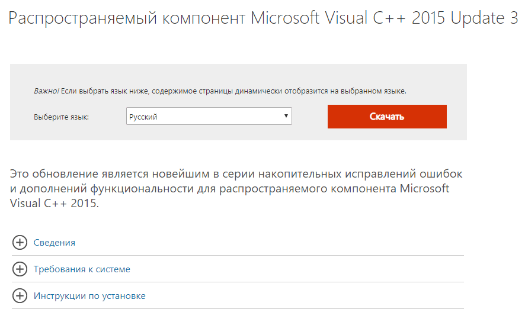

_Рисунок 1 — Скачивание Microsoft Visual C++ 2015 Redistributable Update 3_

Апач скачиваем не с официального сайта, а с другого, где есть скомпилированная под Windows версия Apache Lounge:

<https://www.apachelounge.com/download/>

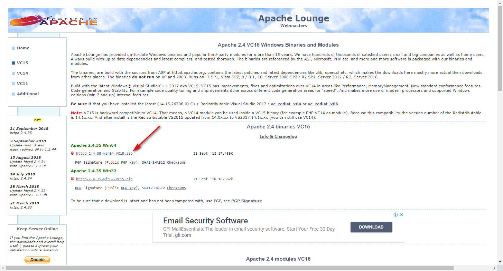

_Рисунок 2 — Скачивание Apache Lounge_

Теперь перейдем к скачиваю PHP. Будьте очень внимательны. Надо скачать архив с последней версией PHP вашей битности в версии `Thread Safe`. Я вначале несколько раз не то скачивал и не понимал, почему не работает:

<https://windows.php.net/download/>

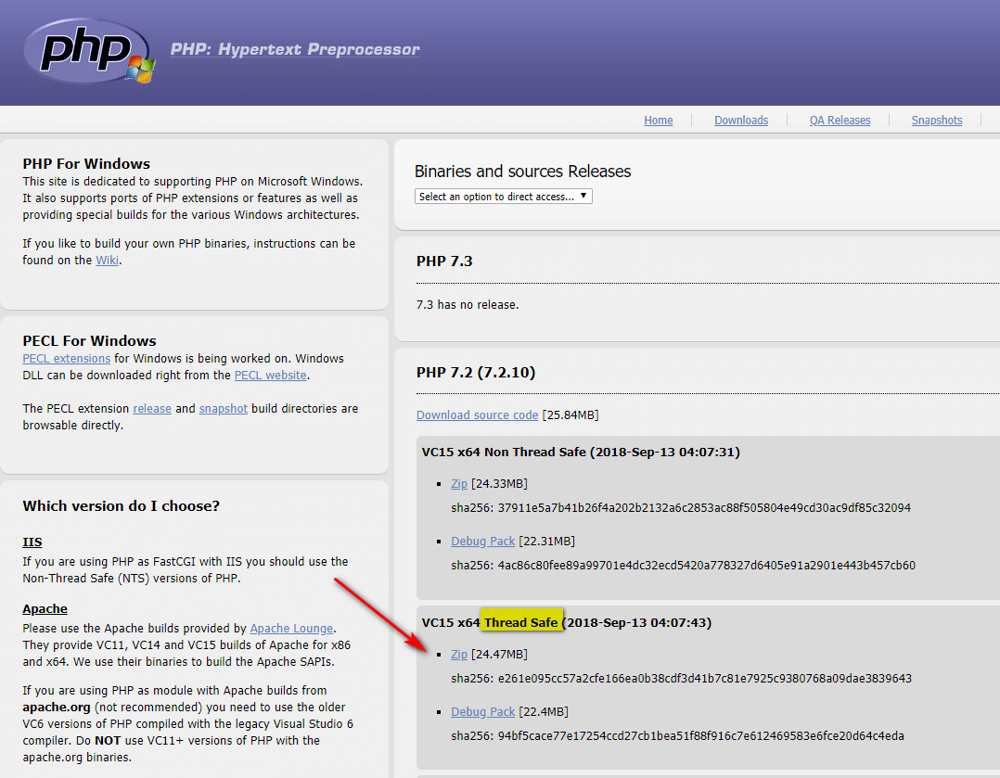

_Рисунок 3 — Скачивание PHP_

Для работы с базами данных скачиваем phpMyAdmin. На сайте только один вариант для загрузки:

<https://www.phpmyadmin.net/>

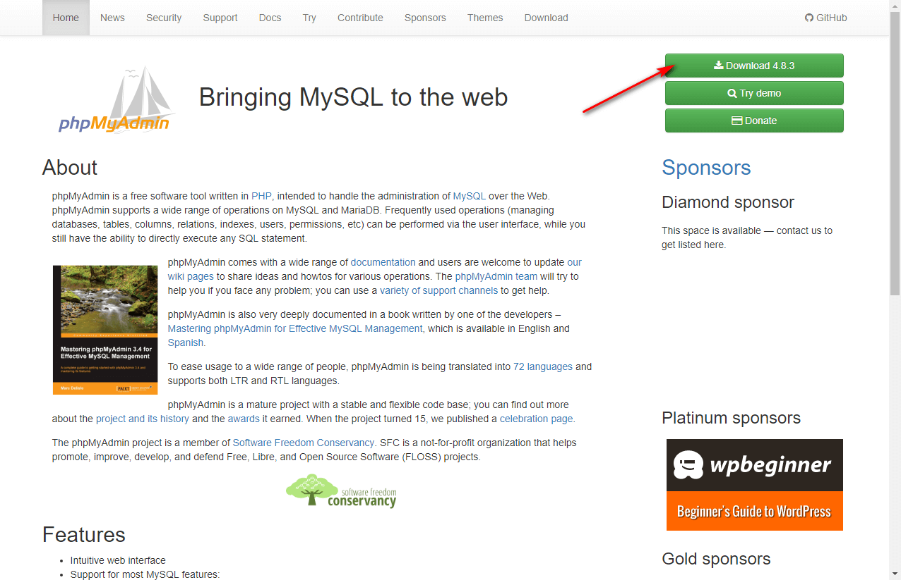

_Рисунок 4 — Скачивание phpMyAdmin_

Скачиваем MySQL с сайта в виде установщика под Windows:

<https://dev.mysql.com/downloads/installer/>

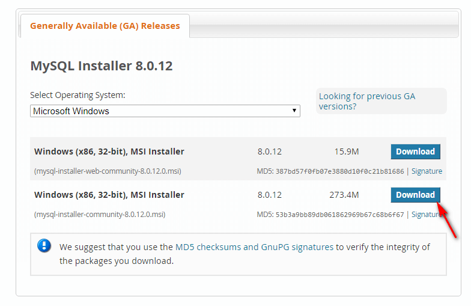

_Рисунок 5 — Скачивание MySQL_

И да, у вас сайт попросит зарегистрироваться, чтобы вы могли скачать файл.

## Структура папок

На диске `C:` (или на том, котором вы хотите разместить сервер) создаем папку `Server` в которую скидываем архивы Apache, PHP:

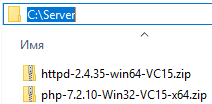

_Рисунок 6 — Папка Server_

В этой же папке создаем директорию `htdocs`, в которой создаем папки `www` и `phpmyadmin`. В последнюю копируем наш архив phpMyAdmin:

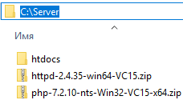

_Рисунок 7 — Папка Server с директорией htdocs_

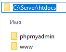

_Рисунок 8 — Папка htdocs_

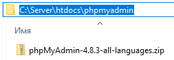

_Рисунок 9 — Папка phpmyadmin_

## Установка Apache

В папке `C:\Server` разархивируем архив с Apache и оставим только папку `Apache24`, а файлы `ReadMe.txt` и `-- Win64 VC15 --` (у вас может по-другому называться) удалим. Архив с Apache тоже удалим, так как он нам не нужен:

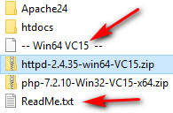

_Рисунок 10 — Лишние файлы для удаления_

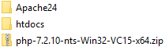

_Рисунок 11 — Содержимое папки Server_

Ищем теперь файл `C:\Server\Apache24\conf\httpd.conf` и открываем его в любом текстовом редакторе:

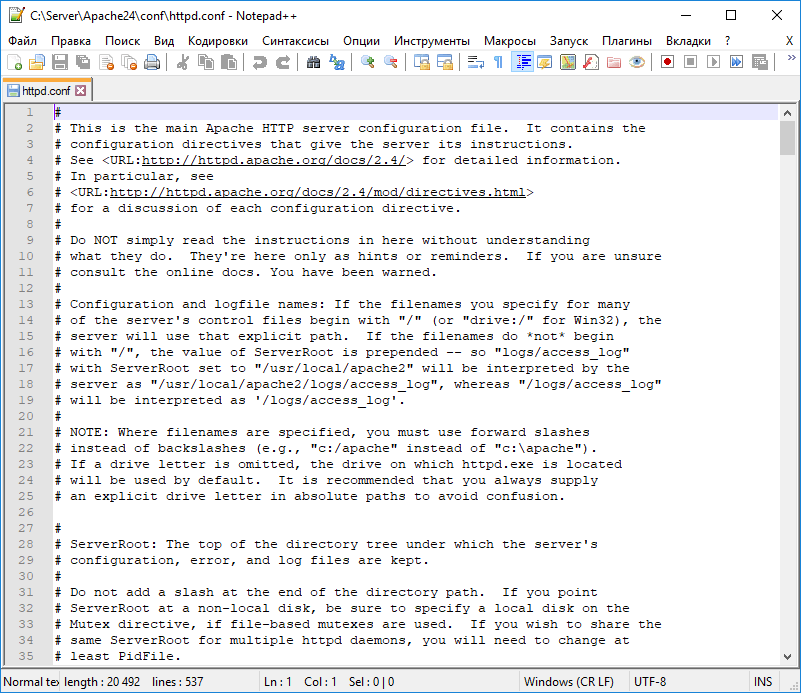

_Рисунок 12 — Файл httpd.conf_

Ищем и меняем в нем строчку:

```ini
#ServerName www.example.com:80
```

Меняем на следующее значение:

```ini
ServerName localhost
```

Ищем и меняем в нем строчку:

```ini
Define SRVROOT "c:/Apache24"
```

Меняем на следующее значение:

```ini
Define SRVROOT "c:/Server/Apache24"
```

Ищем и меняем в нем строчку:

```ini
DocumentRoot "${SRVROOT}/htdocs"
```

Меняем на следующее значение:

```ini
DocumentRoot "c:/Server/htdocs/"
```

Ищем и меняем в нем строчку:

```ini
<Directory "${SRVROOT}/htdocs">
```

Меняем на следующее значение:

```ini
<Directory "c:/Server/htdocs/">
```

Ищем и меняем в нем строчку:

```ini
DirectoryIndex index.html
```

Меняем на следующее значение:

```ini
DirectoryIndex index.html index.php index.htm
```

Ищем и меняем в нем строчку:

```ini
#Include conf/extra/httpd-vhosts.conf
```

Меняем на следующее значение:

```ini
Include conf/extra/httpd-vhosts.conf
```

Теперь находим файл `C:\Server\Apache24\conf\extra\httpd-vhosts.conf` и открываем его.

Удаляем всё в нем. И вставляем туда следующие строчки:

```ini
<VirtualHost *:80>
    DocumentRoot "c:/Server/htdocs/www"
    ServerName localhost
    ErrorLog "c:/Server/htdocs/www/error.log"
    CustomLog "c:/Server/htdocs/www/access.log" common
</VirtualHost>

<VirtualHost *:80>
   DocumentRoot "c:/Server/htdocs/phpmyadmin"
   ServerName phpmyadmin
   ErrorLog "c:/Server/htdocs/phpmyadmin/error.log"
   CustomLog "c:/Server/htdocs/phpmyadmin/access.log" common
</VirtualHost>
```

Теперь находим файл `C:\Windows\System32\drivers\etc\hosts` и открываем каким-нибудь блокнотом `под администратором` (иначе изменения при сохранении не сохранятся) и добавьте в него строчку:

```ini
127.0.0.1 phpmyadmin
```

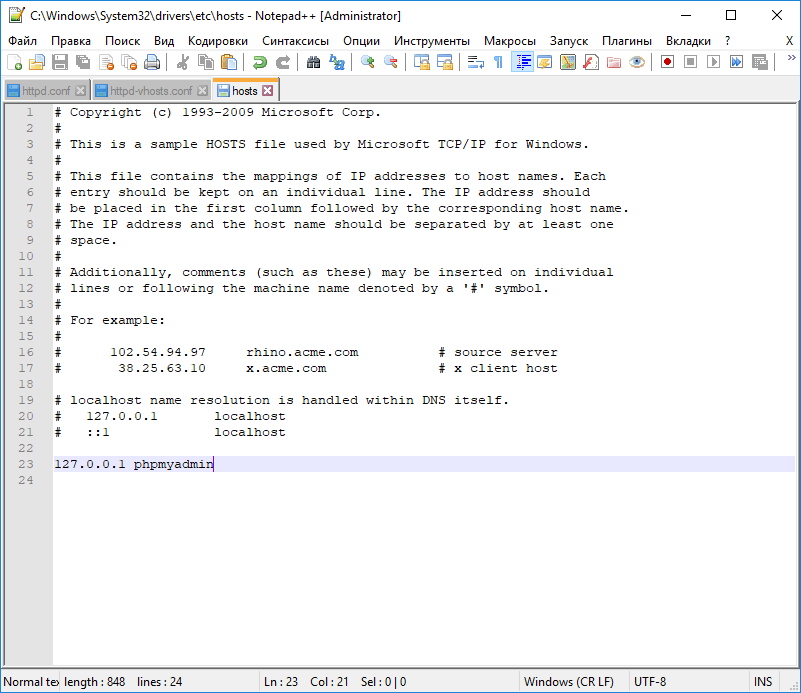

_Рисунок 13 — Файл hosts_

Теперь запустим приложение `C:\Server\Apache24\bin\httpd.exe`. При этом может появиться запрос на разрешение к доступу к сетям. Разрешаем:

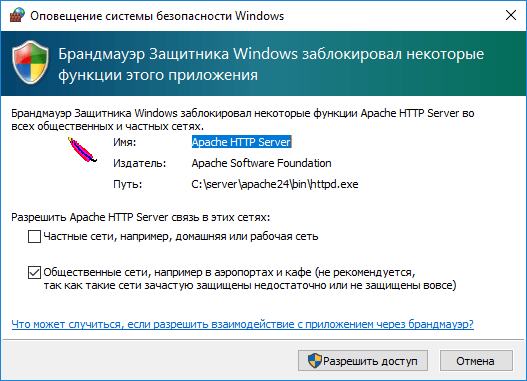

_Рисунок 14 — Запрос от Брандмауэра Windows_

Если вы видите ошибку, как на рисунке ниже, то вы не установили библиотеку от Microsoft, о которой говорилось в самом начале статьи:

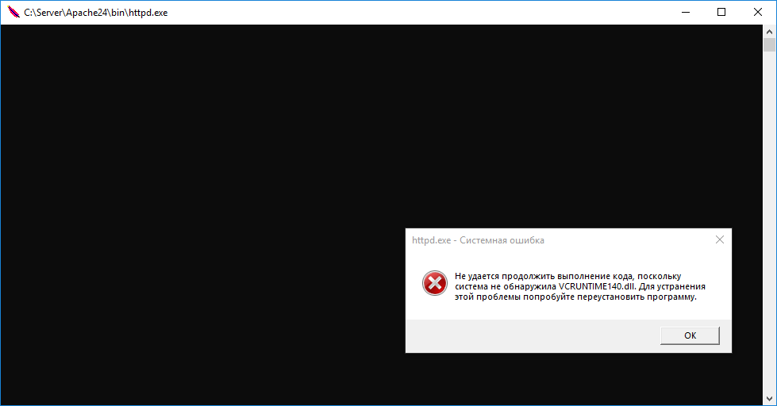

_Рисунок 15 — Сообщение об ошибке_

Откроем браузер и введем `http://localhost` и жмем `Enter`. Если видим следующее, то всё хорошо:

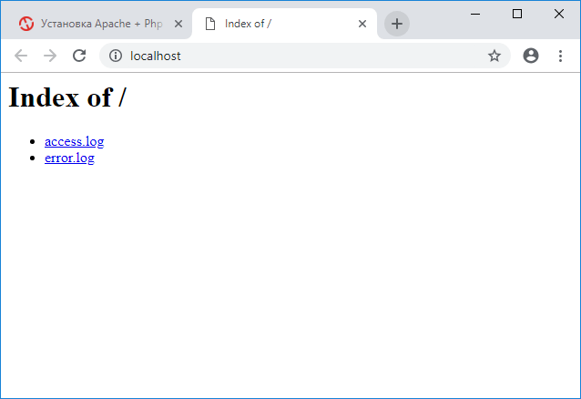

_Рисунок 16 — Первый запуск http://localhost_

Создадим текстовой файл `index.html` в папке `D:\Server\htdocs\www` со следующим содержимым:

```html
<!DOCTYPE html>
<html>
  <body>
    <h1>Localhost</h1>
    <p>This is page in Localhost.</p>
  </body>
</html>
```

И создадим текстовой файл `index.html` в папке `D:\Server\htdocs\phpmyadmin` со следующим содержимым:

```html
<!DOCTYPE html>
<html>
  <body>
    <h1>PhpMyAdmin</h1>
    <p>This is page in PhpMyAdmin.</p>
  </body>
</html>
```

Теперь, если откроем в браузере `http://localhost`, то получим:

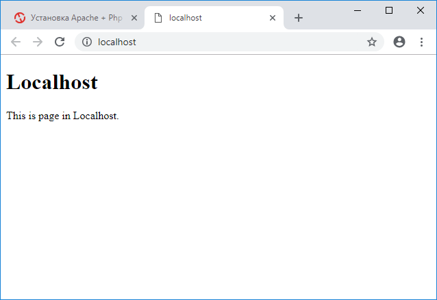

_Рисунок 17 — Проверка доступности HTML файла по адресу http://localhost_

А при заходе на адрес `http://phpmyadmin` получим вот это:

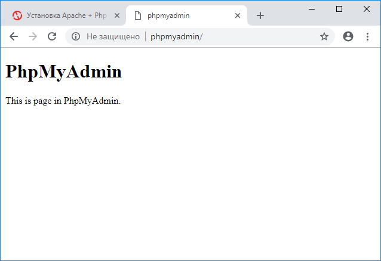

_Рисунок 18 — Проверка доступности HTML файла по адресу http://phpmyadmin_

Закрываем приложение `httpd.exe`. Тем самым мы закрыли наш созданный сервер. Сделаем так, чтобы сервер был всегда открыт при запуске системы.

Откроем командную строку под администратором. Через поиск находим программу `Командная строка`:

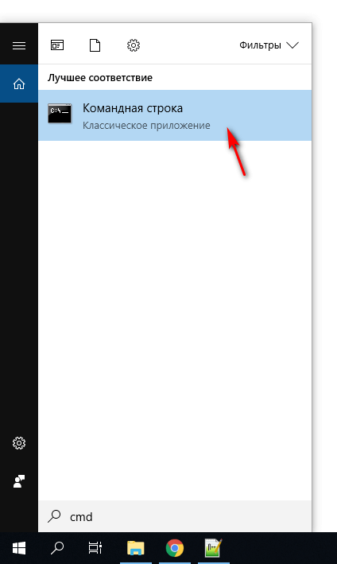

_Рисунок 19 — Поиск приложения командной строки_

Запускаем от имени администратора:

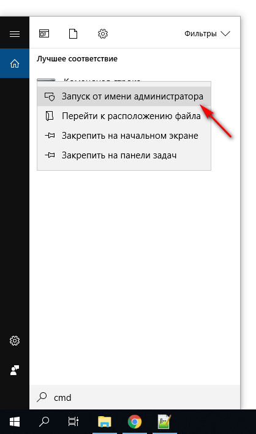

_Рисунок 20 — Запуск от имени администратора_


_Рисунок 21 — Запущенная командная строка_

Вводим там:

```shell
c:\Server\Apache24\bin\httpd.exe -k install
```

И нажимаем `Enter`:

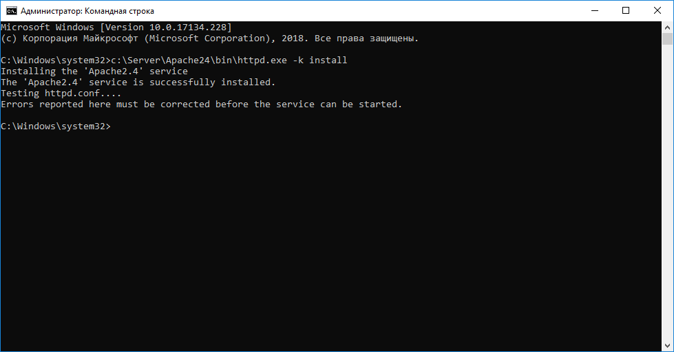

_Рисунок 22 — Установка службы Apache24_

Служба Apache24 установилась. Теперь сервер будет всегда работать при работе операционной системы.

Закрываем командную строку (а можете и не закрывать: еще пригодится).

Открываем приложение `C:\Server\Apache24\bin\ApacheMonitor.exe`. В трее должна появится иконка:

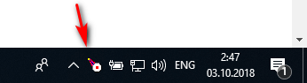

_Рисунок 23 — Иконка ApacheMonitor в трее_

Щелкаем по ней и выбираем кнопку `Start`:

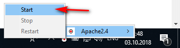

_Рисунок 24 — Запуск сервера_

Если иконка изменилась на зеленый квадратик, то всё в порядке:

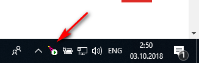

_Рисунок 25 — Сервер запущен_

Если осталась с красной точкой, то проверьте все шаги. И проверьте: вы закрыли или нет `httpd.exe`.

Чтобы каждый раз не заходить в папку `C:\Server\Apache24\bin` для запуска `ApacheMonitor.exe`, то создайте где-нибудь ярлык к программе.

## Установка PHP

Создадим папку `PHP` в папке `C:\Server` и туда разархивируем архив с PHP. Сам архив потом удалим:

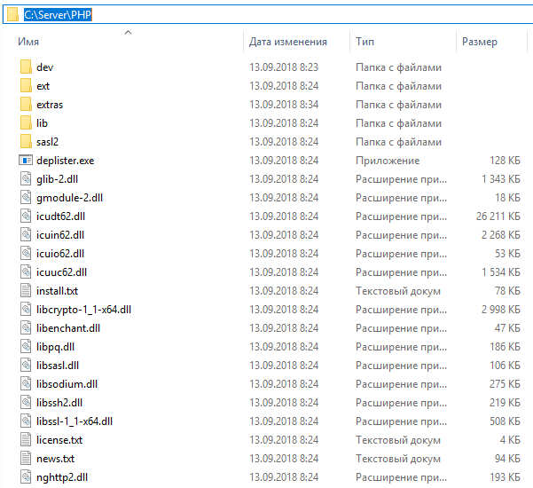

_Рисунок 26 — Содержимое папки с PHP_

В конец файла `C:\Server\Apache24\conf\httpd.conf` (с которым мы уже работали) добавим в самом конце такие строчки:

```ini
PHPIniDir "C:/Server/PHP"
AddHandler application/x-httpd-php .php
LoadModule php7_module "C:/Server/PHP/php7apache2_4.dll"
```

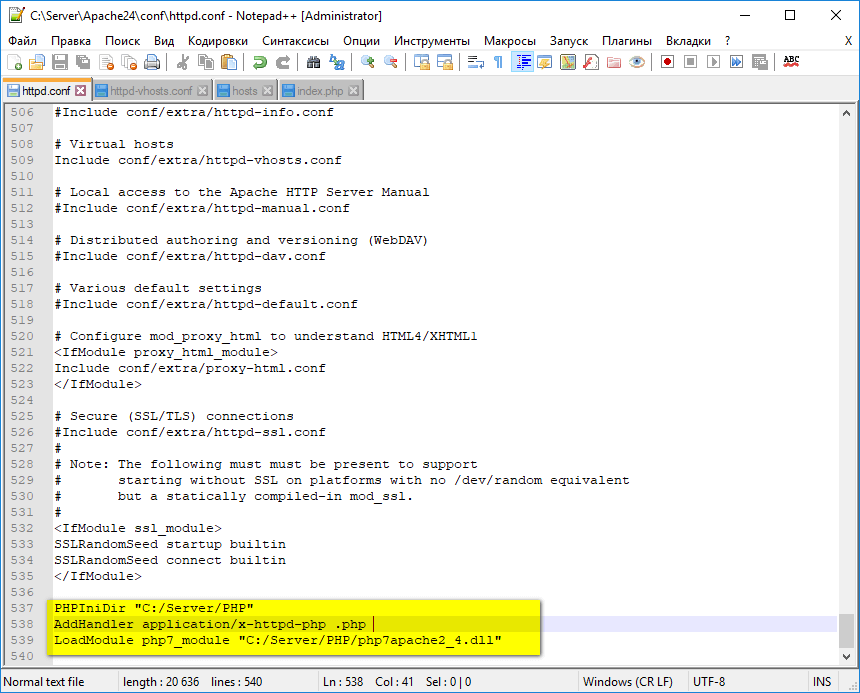

_Рисунок 27 — Файл httpd.conf_

В папке `D:\Server\htdocs\www` удаляем файл `index.html` и добавляем текстовой файл `index.php` с таким содержимым:

```php
<?php
phpinfo ();
?>
```

Перезапускаем сервер:

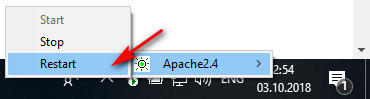

_Рисунок 28 — Перезапуск сервера_

И в браузере открываем `http://localhost`. Если видите такое,то всё в порядке:

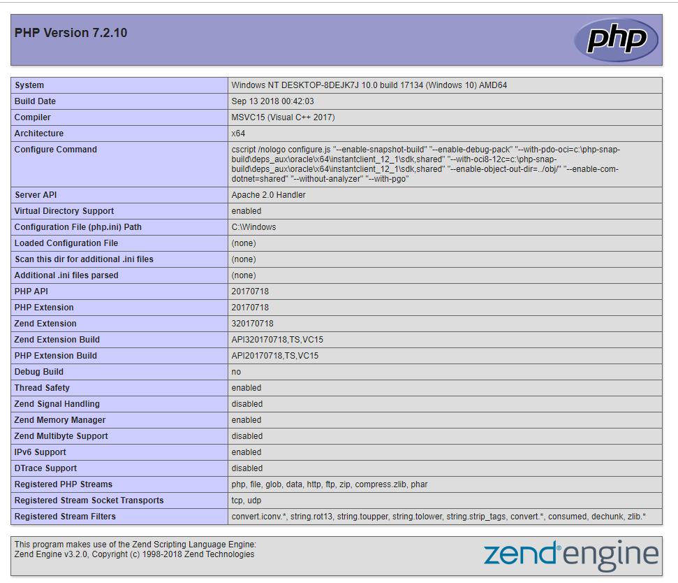

_Рисунок 29 — Результат работы PHP скрипта_

В папке `C:\Server\PHP` файл `php.ini-development` переименуем в `php.ini` и откроем его в блокноте.

Находим в нем строчку:

```ini
; extension_dir = "ext"
```

И заменяем на:

```ini
extension_dir="C:\Server\PHP\ext"
```

Находим строчки:

```ini
;extension=bz2
;extension=curl
;extension=fileinfo
;extension=gd2
;extension=gettext
;extension=gmp
;extension=intl
;extension=imap
;extension=interbase
;extension=ldap
;extension=mbstring
;extension=exif      ; Must be after mbstring as it depends on it
;extension=mysqli
;extension=oci8_12c  ; Use with Oracle Database 12c Instant Client
;extension=odbc
;extension=openssl
;extension=pdo_firebird
;extension=pdo_mysql
;extension=pdo_oci
;extension=pdo_odbc
;extension=pdo_pgsql
;extension=pdo_sqlite
;extension=pgsql
;extension=shmop
```

В этих строчках убираем точку с запятой в начале строк. То есть получим вот это:

```ini
extension=bz2
extension=curl
extension=fileinfo
extension=gd2
extension=gettext
extension=gmp
extension=intl
extension=imap
extension=interbase
extension=ldap
extension=mbstring
extension=exif      ; Must be after mbstring as it depends on it
extension=mysqli
extension=oci8_12c  ; Use with Oracle Database 12c Instant Client
extension=odbc
extension=openssl
extension=pdo_firebird
extension=pdo_mysql
extension=pdo_oci
extension=pdo_odbc
extension=pdo_pgsql
extension=pdo_sqlite
extension=pgsql
extension=shmop
```

Аналогично поступаем со стоками:

```ini
;extension=soap
;extension=sockets
;extension=sqlite3
;extension=tidy
;extension=xmlrpc
;extension=xsl
```

То есть в них убираем также точку с запятой:

```ini
extension=soap
extension=sockets
extension=sqlite3
extension=tidy
extension=xmlrpc
extension=xsl
```

Найдите в файле строчку:

```ini
short_open_tag = Off
```

И замените ее на:

```ini
short_open_tag = On
```

Создайте в папке `C:\Server` папку `temp`:

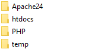

_Рисунок 30 — Папка temp в директории Server_

Найдите в `php.ini` строчку:

```ini
;     session.save_path = "N;/path"
```

И замените ее на:

```ini
session.save_path = "C:\Server\temp"
```

Найдите в `php.ini` строчку:

```ini
upload_max_filesize = 2M
```

И замените ее на:

```ini
upload_max_filesize = 200M
```

Найдите строчку:

```ini
post_max_size = 8M
```

И замените ее на:

```ini
post_max_size = 50M
```

Сохраните и перезапустите сервер. Если видите зеленый треугольник, то всё нормально. Фактически вы настроили сервер, но пока без MySQL:

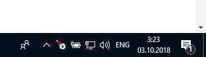

_Рисунок 31 — Индикация успешного перезапуска сервера_

## Установка MySQL

Запустим скаченный установщик MySQL, где соглашаемся на условия использования:

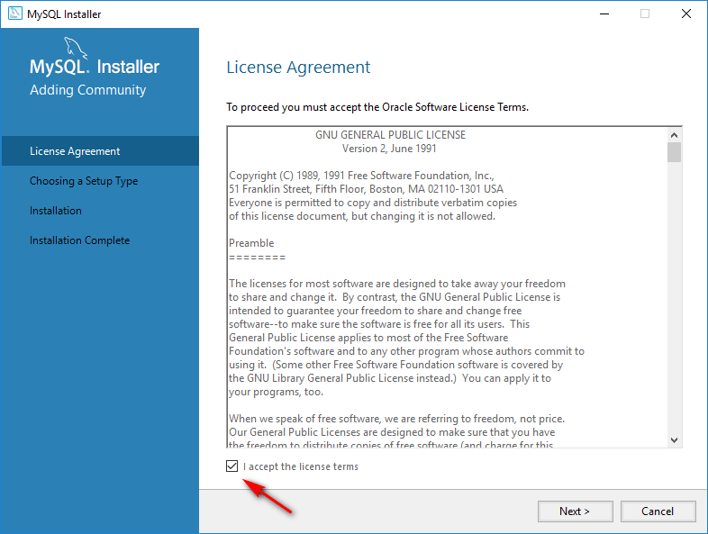

_Рисунок 32 — Первое окно мастера установки MySQL_

Выбираем тип установки `Custom`:

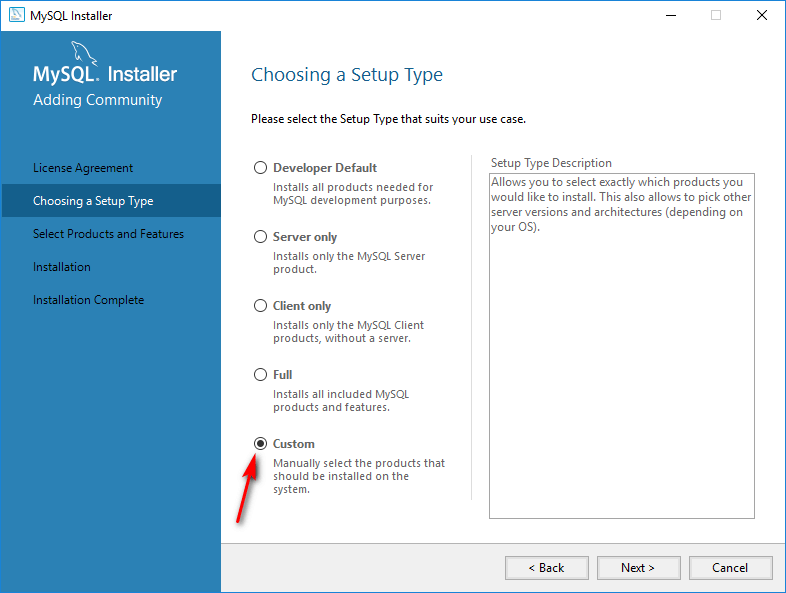

_Рисунок 33 — Выбор типа Установки_

Добавляем MySQL Server для установки и устанавливаем:

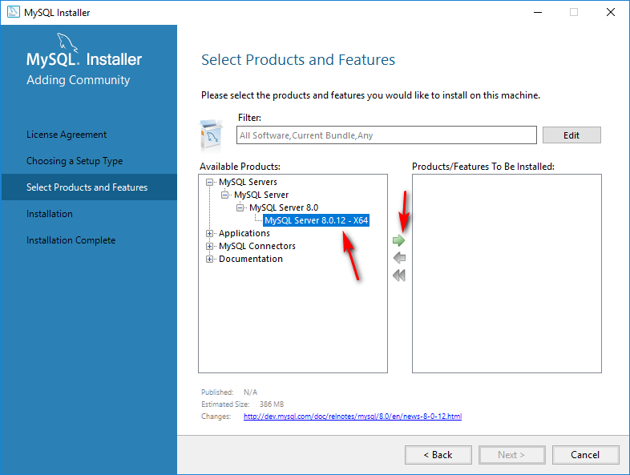

_Рисунок 34 — Выбор компонентов для установки_

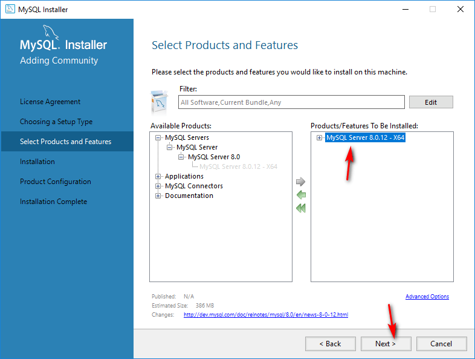

_Рисунок 35 — Список выбранных компонентов для установки_

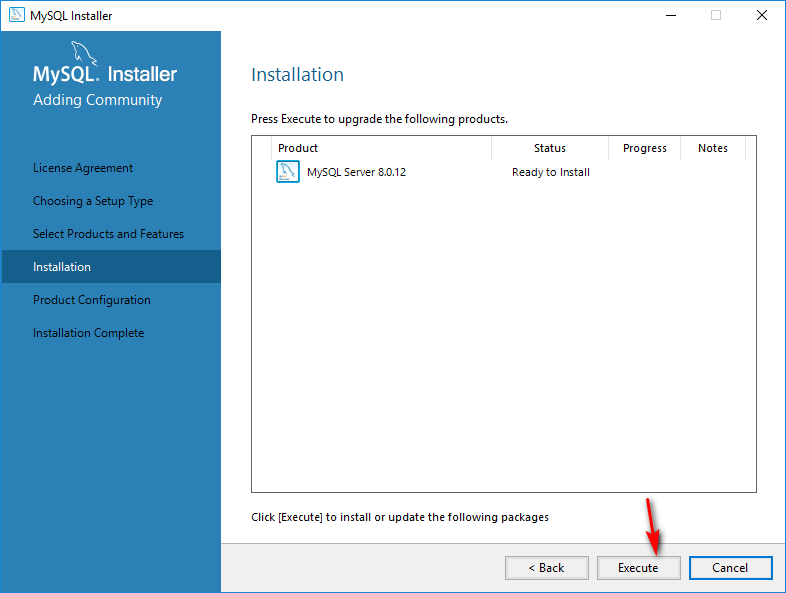

_Рисунок 36 — Установка_

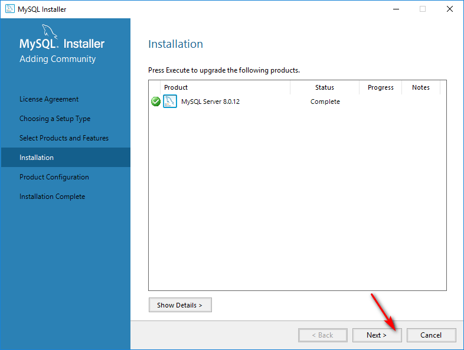

_Рисунок 37 — Окончание установки компонентов_

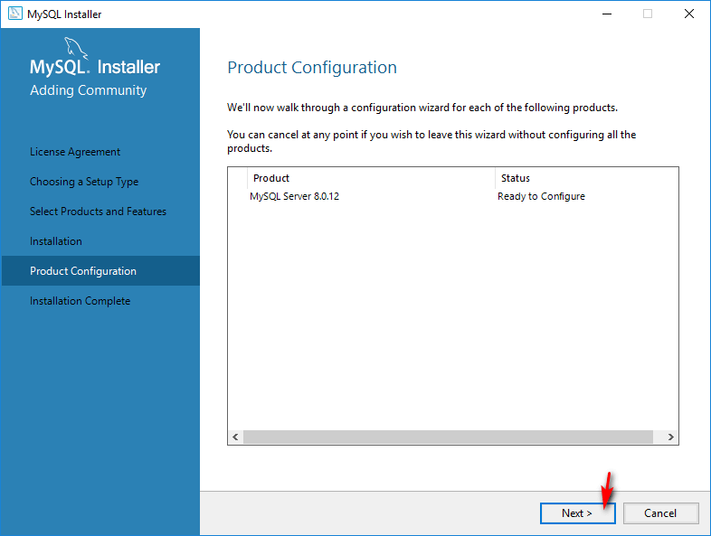

_Рисунок 38 — Окно перед конфигурацией MySQL_

Начинаем конфигурировать MySQL:

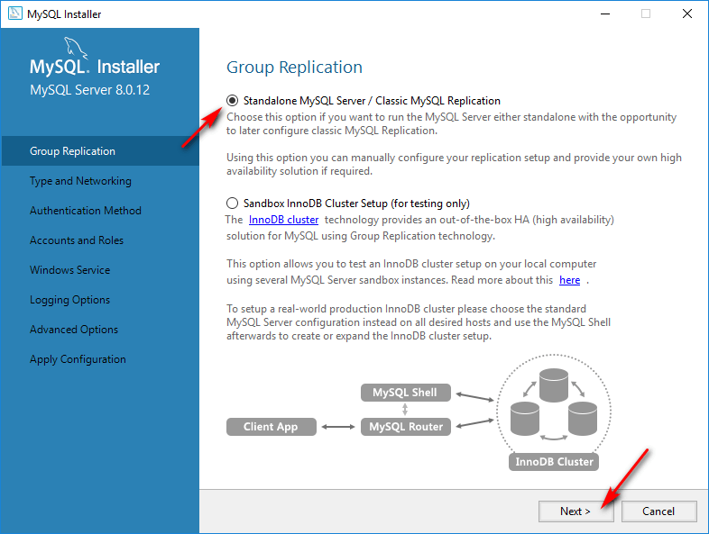

_Рисунок 39 — Выбор Group Replication_

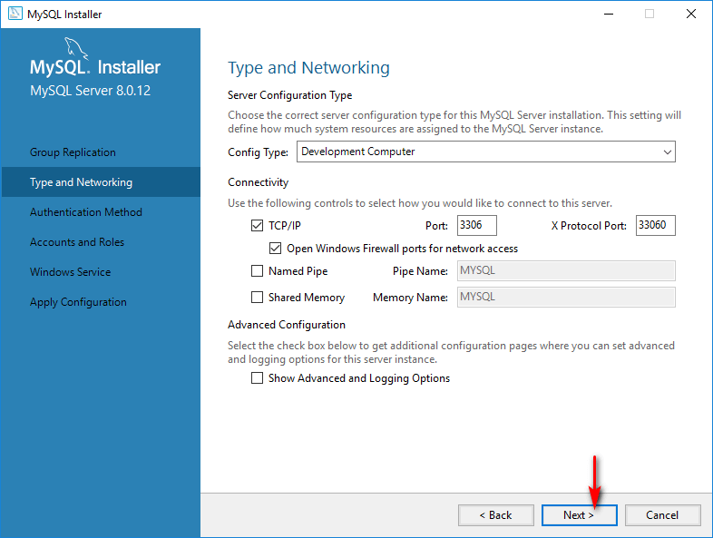

_Рисунок 40 — Выбор сетевых настроек_

Так как новый тип аутентификации пока не поддерживается в PHP, то выбираем старый способ аутентификации:

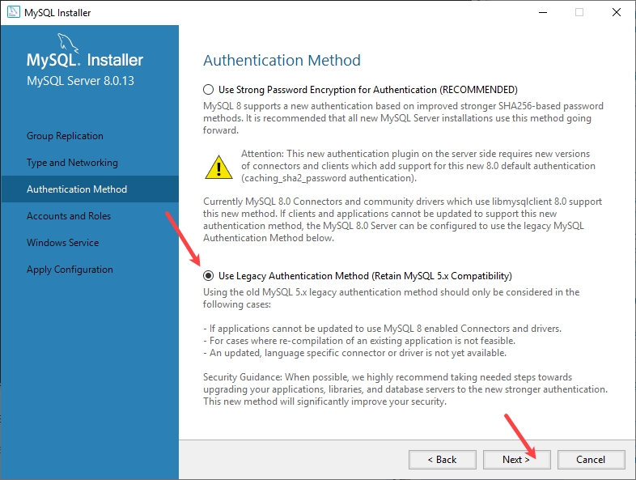

_Рисунок 41 — Выбор типа аутентификации_

Вводим пароль для root пользователя. У меня для примера используется пароль `1234`:

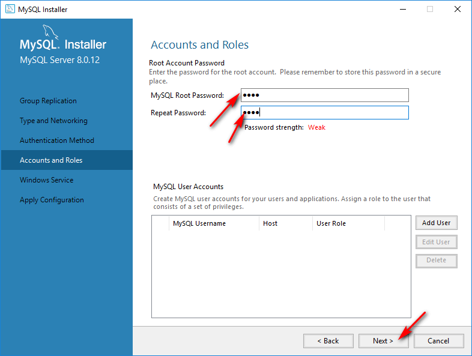

_Рисунок 42 — Выбор пароля для root пользователя_

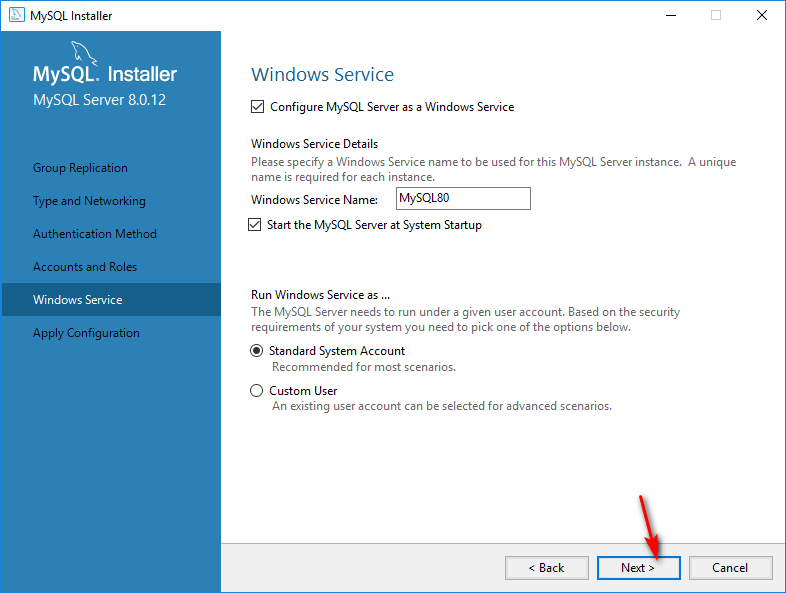

_Рисунок 43 — Настройка сервиса для Windows_

Применяем выбранную конфигурацию:

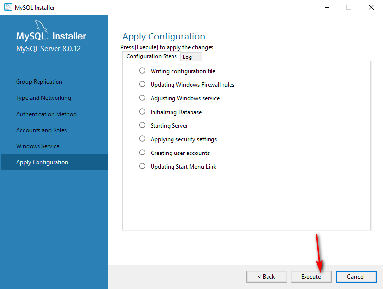

_Рисунок 44 — Запускаем настройку конфигурации_

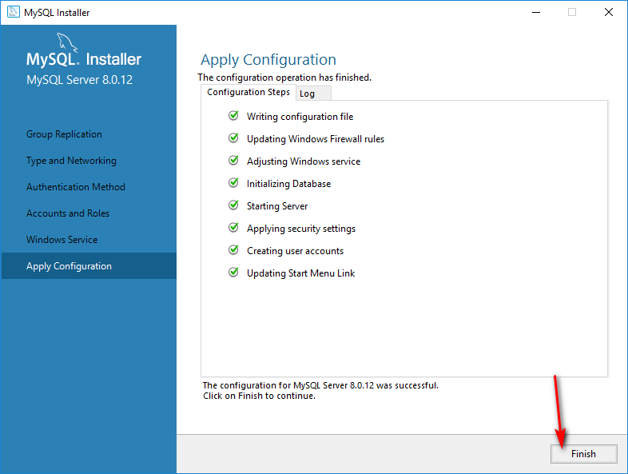

_Рисунок 45 — Окончание конфигурации_

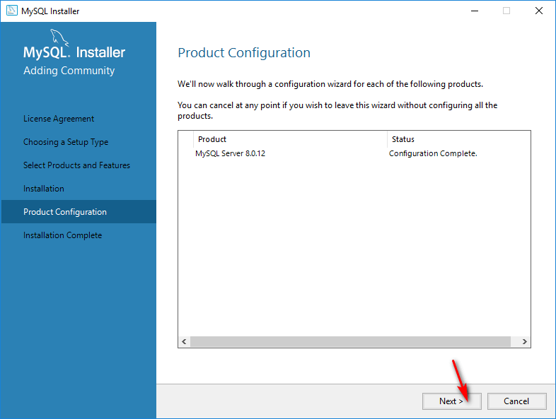

_Рисунок 46 — Второй шаг окончания конфигурации_

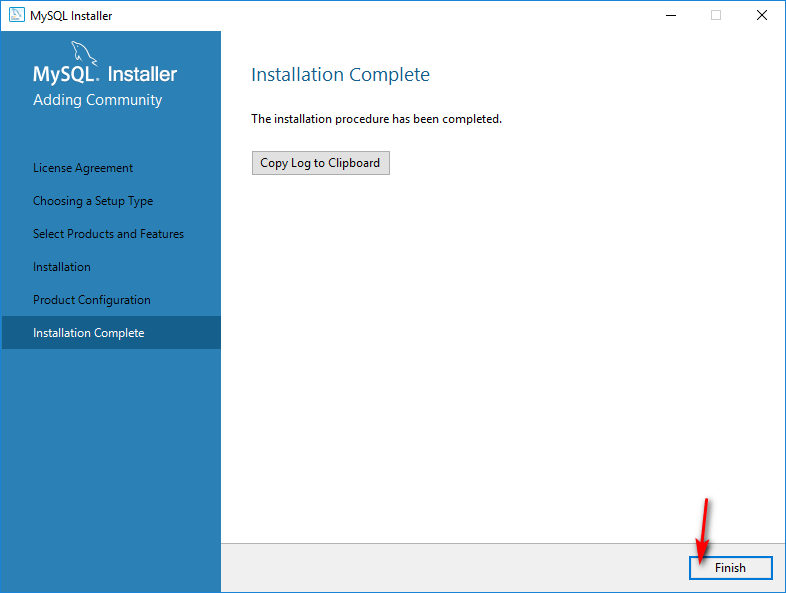

_Рисунок 47 — Окончание установки_

Проверим работу MySQL. Заменим содержимое файла `D:\Server\htdocs\www\index.php` на следующее:

```php
<?php
$db_conn = new mysqli("localhost", "root", "1234", "mysql");
if (mysqli_connect_errno()) {
  echo 'Connection to database failed:'.mysqli_connect_error();
  exit();
}
else {
  echo 'Ok';
}
?>
```

Вместо `1234` вставьте свой пароль. И перейдите на адрес `http://localhost/`.

Если вы видите `Ok`, то всё хорошо:

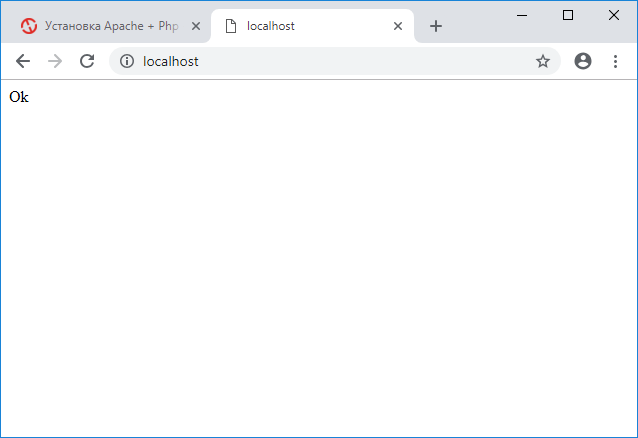

_Рисунок 48 — Подключение к базе mysql прошло успешно_

## Установка phpMyAdmin

В папке `D:\Server\htdocs\phpmyadmin` удалим файл `index.html`.

И разархивируем в папку наш скаченный архив с phpmyadmin:

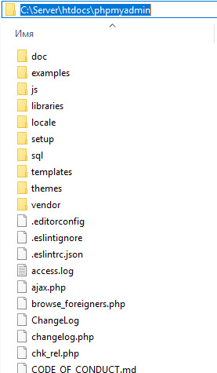

_Рисунок 49 — Содержимое папки phpmyadmin_

Создайте текстовой файл `config.inc.php` со следующим содержимым:

```php
<?php

$i=0;
$i++;

$cfg['Servers'][$i]['user'] = 'root';
$cfg['Servers'][$i]['password'] = '1234';
$cfg['Servers'][$i]['auth_type'] = 'config';
$cfg['Servers'][$i]['host'] = 'localhost';
$cfg['Servers'][$i]['connect_type'] = 'tcp';
$cfg['Servers'][$i]['compress'] = false;
$cfg['Servers'][$i]['extension'] = 'mysqli';
$cfg['Servers'][$i]['AllowNoPassword'] = true;

?>
```

Разумеется, что пароль вы меняете на свой.

После этого файл сохраняется в папке `D:\Server\htdocs\phpmyadmin`.

Перейдите в браузере по адресу: `http://phpmyadmin`. Если вы увидите работающий phpMyAdmin, то всё работает отлично:

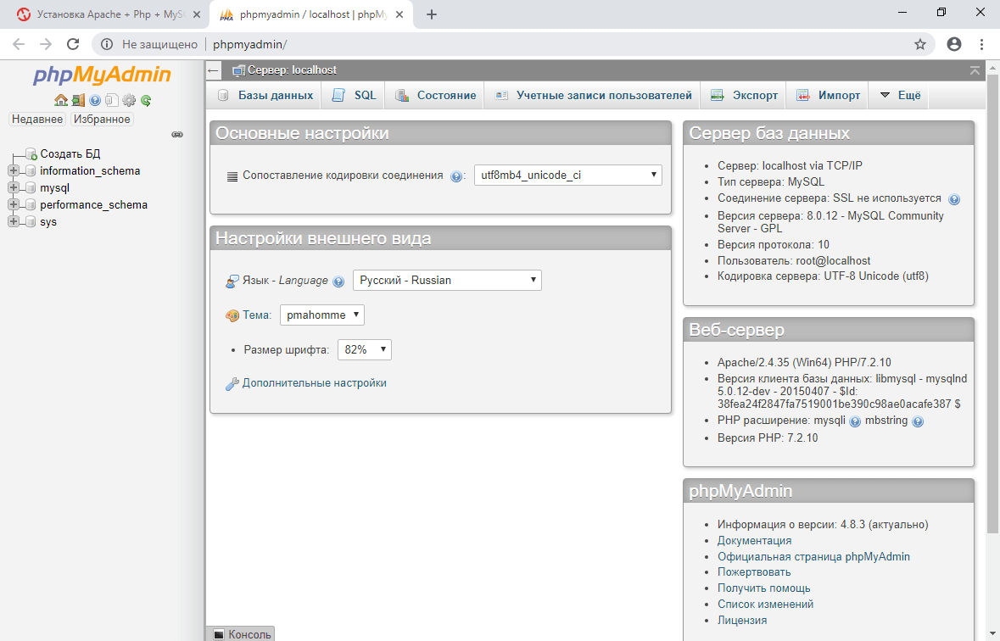

_Рисунок 50 — Запущенный phpMyAdmin_

## Добавление своего виртуального хоста [дополнительно]

В статье показано как добавлен был виртуальный хост `phpmyadmin`, то есть по адресу `http://phpmyadmin` у вас в браузере открывается ваш подсайт. Аналогичным образом добавляете и другие свои локальные сайты.

В папке `C:\Server\htdocs` создаете папку `[Название вашего локального сайта]`. Туда кидаете файла своего сайта.

В файле `C:\Server\Apache24\conf\extra\httpd-vhosts.conf` добавляете строчки:

```xml
<VirtualHost *:80>
   DocumentRoot "D:/Server/htdocs/[Название вашего локального сайта]"
   ServerName [Название вашего локального сайта]
   ErrorLog "D:/Server/htdocs/[Название вашего локального сайта]/error.log"
   CustomLog "D:/Server/htdocs/[Название вашего локального сайта]/access.log" common
</VirtualHost&gt
```

В файле `C:\Windows\System32\drivers\etc\hosts` под администратором добавляете строчку:

```ini
127.0.0.1 [Название вашего локального сайта]
```

После этого перезагружаете апач сервер через `ApacheMonitor` или перезагрузкой компа.

После этого по адресу `http://[Название вашего локального сайта]` в браузере будет открываться локальный сайт.

## Удаление служб [дополнительно]

В процессе экспериментов по настройке сервера вы можете захотеть начать всё сначала. По крайней мере, у меня такое было часто. Для этого достаточно удалить папки `Server`, так как полноценной установки в Windows не производилось. Но перед этим нужно остановить и удалить службы Apache и MySQL. Ниже приводится алгоритм, как это сделать.

Вызываем программу `Службы`. Способов много. Можно просто через обычный поиск в Windows:

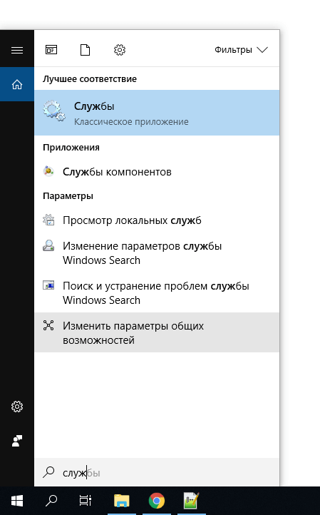

_Рисунок 51 — Поиск программы «Службы»_

Останавливаем нашу службу:

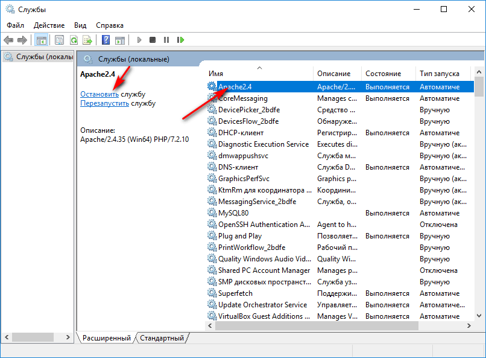

_Рисунок 52 — Команда «Остановить службу»_

Двойным щелчком по названию службы открываем подробности службы:

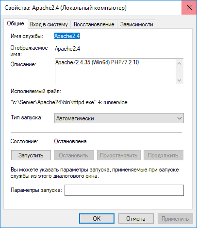

_Рисунок 53 — Свойства службы_

И копируем имя службы:

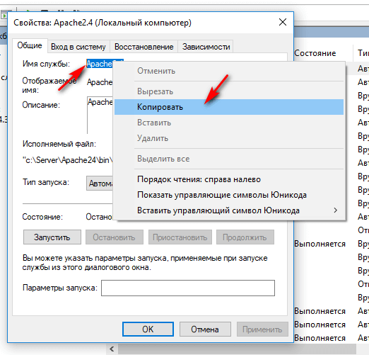

_Рисунок 54 — Копирование имени службы_

Запускаем от имени администратора командную строку:

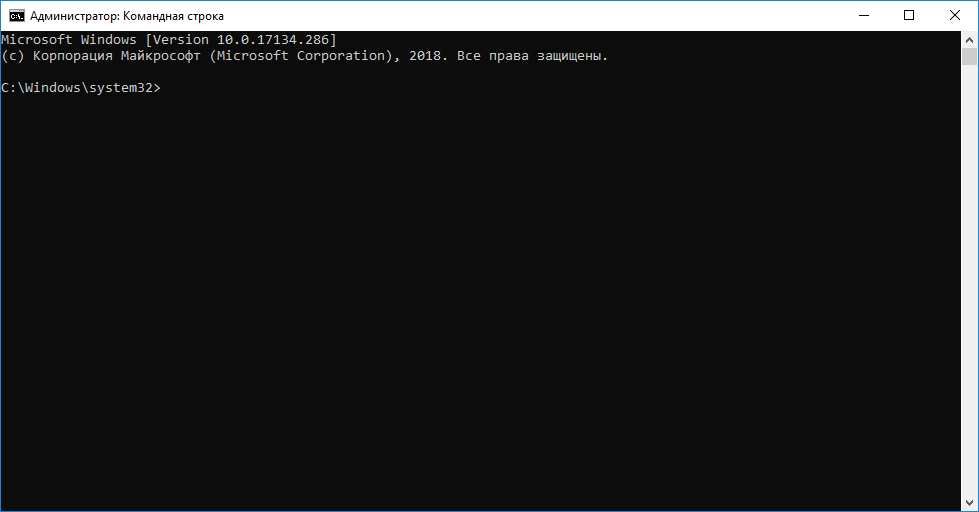

_Рисунок 55 — Командная строка_

Теперь пропишите команду удаления службы:

```shell
sc delete Apache2.4
```

И нажмите `Enter`. Служба удалена:

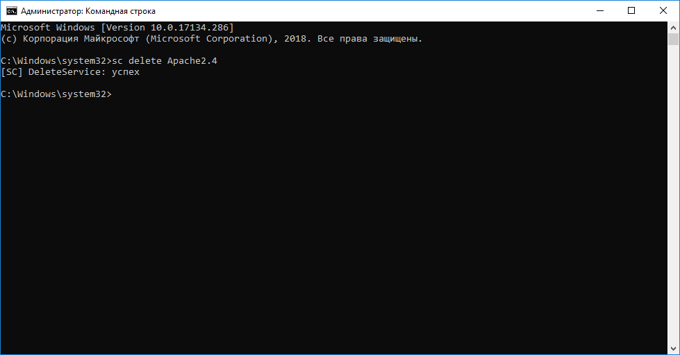

_Рисунок 56 — Удаление службы_

Возможно, придется перезагрузить комп, чтобы служба полностью удалилась. Один раз мне такое потребовалось.

Службу MySQL можно также удалить, но, если вы устанавливали MySQL через установщик, как в этой статье, то лучше просто деинсталлировать MySQL как обычную программу.
