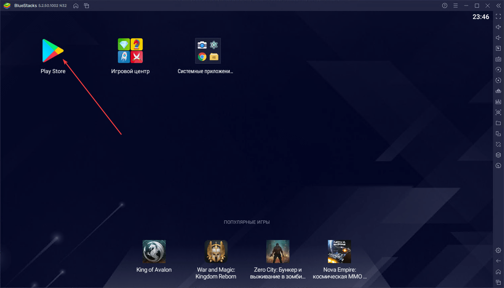
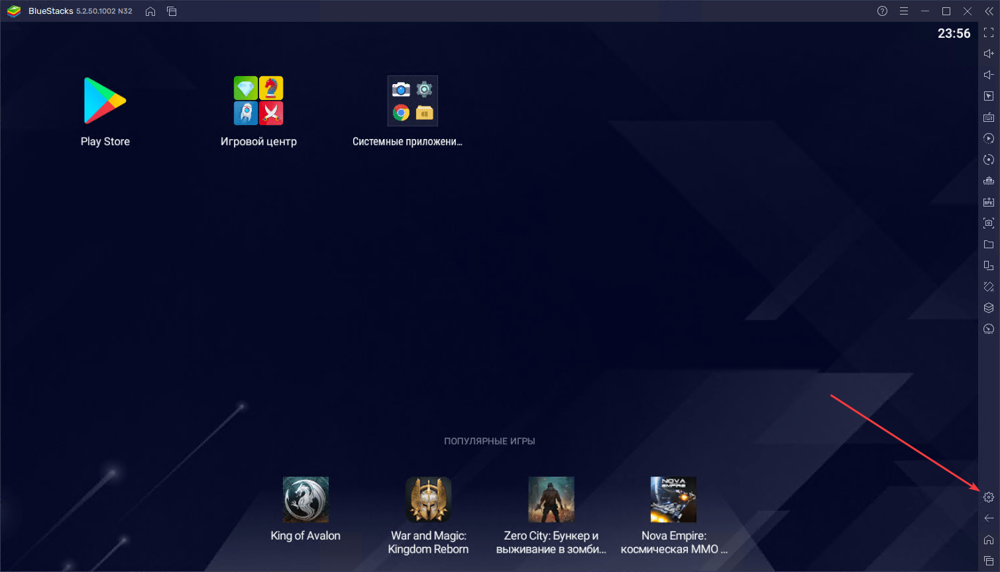
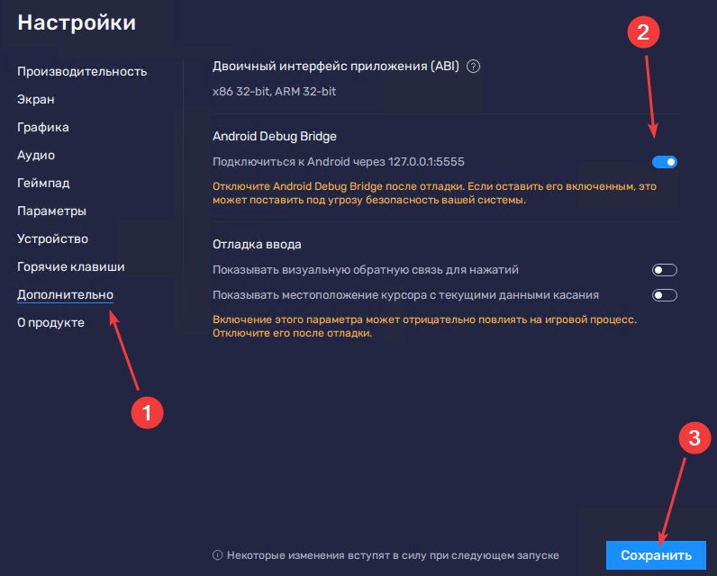
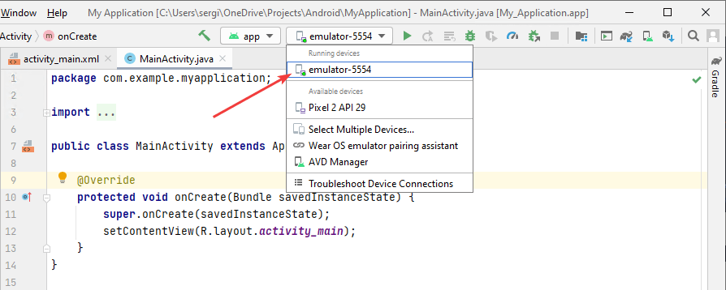
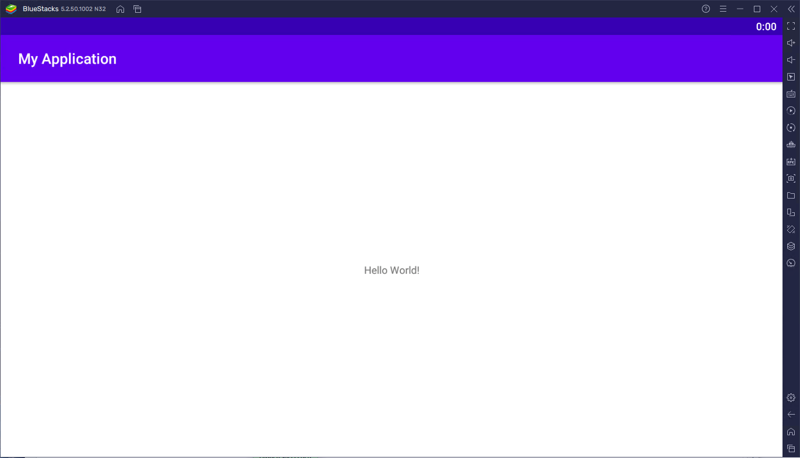

# Эмулятор BlueStacks для Android Studio

В статье рассказывается, как подключить BlueStacks эмулятор к Android Studio для запуска своих разрабатываемых приложений.

Стандартный эмулятор в Android Studio довольно прожорливое и капризное существо. И нормально работает на хороших компьютерах с Intel процессорами. Так что обладателям AMD процессоров вкупе со слабыми машинами приходится плохо. На помощь приходят сторонние эмуляторы. BlueStacks — один из них.

## Скачивание и установка

На сайте <https://www.bluestacks.com/ru/index.html> скачиваем установщик:

Обратите внимание, что HyperV и Песочница Windows должны быть отключены на Windows 10 Pro. Обидно.

Установка проста:

Мы увидим работающий эмулятор:

Если нужно, то можете ввести данные своей учетки от Google, а можно и пропустить:

Но пока его использовать в Android Studio не получится (хотя и будет его видеть). Перейдем в настройки эмулятора:

И включим Android Debug Bridge:

## Запуск приложения в Android Studio

Теперь в Android Studio появится новое устройство (эмулятор должен быть запущен):

Выбираете его и в BlueStacks увидите запущенное своё приложение:

