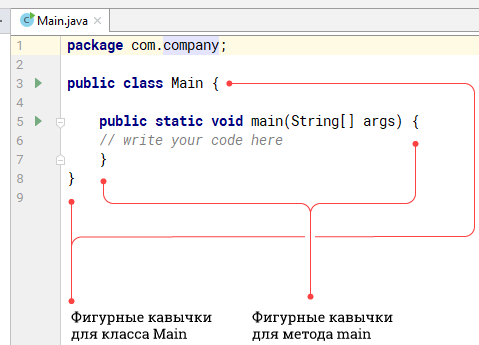
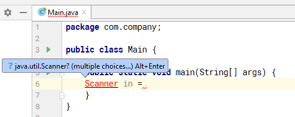
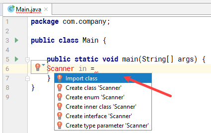
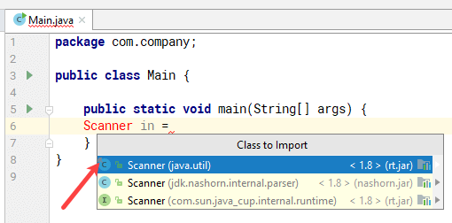
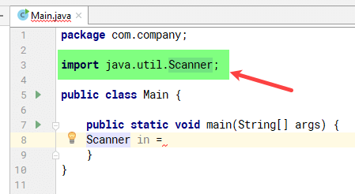
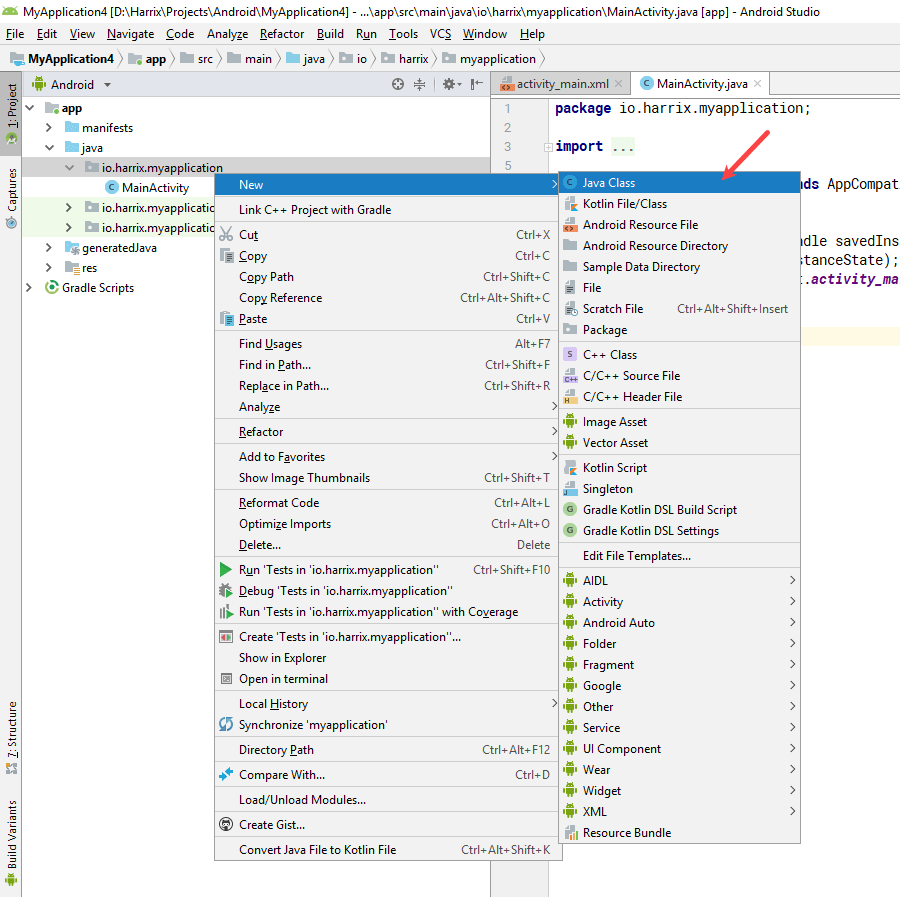
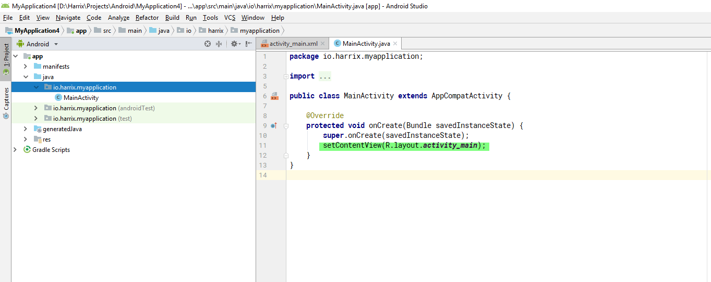

# Шпаргалка по Java + Android


В статье дается пополняемый время от времени несистемный набор материалов по Java для начинающих. Это скорее некий мини-конспект занятий.

## Статьи

Как установить программы, как написать первое приложение — на эти вопросы отвечают нижеприведенные статьи.

- [Установка JDK в Windows](https://github.com/Harrix/harrix.dev-blog-2019/blob/main/install-jdk-on-windows/install-jdk-on-windows.md) <!-- https://harrix.dev/ru/blog/2019/install-jdk-on-windows/ --> — вначале нужно установить JDK, без которого никуда в Java разработке.

- [Установка IntelliJ IDEA в Windows](https://github.com/Harrix/harrix.dev-blog-2019/blob/main/install-intellij-idea/install-intellij-idea.md) <!-- https://harrix.dev/ru/blog/2019/install-intellij-idea/ --> — для написания консольных приложений сейчас чаще всего используется IntelliJ IDEA.

- [Сложение двух чисел в IntelliJ IDEA на Java (консольное приложение)](https://github.com/Harrix/harrix.dev-blog-2019/blob/main/add-2-num-intellij-idea/add-2-num-intellij-idea.md) <!-- https://harrix.dev/ru/blog/2019/add-2-num-intellij-idea/ --> — первое приложение на IntelliJ IDEA.

- [Установка Android Studio в Windows](https://github.com/Harrix/harrix.dev-blog-2019/blob/main/install-android-studio/install-android-studio.md) <!-- https://harrix.dev/ru/blog/2019/install-android-studio/ --> — для написания приложений под Android на Java потребуется Android Studio от Google.

- [Сложение двух чисел в Android Studio на Java (Android приложение)](https://github.com/Harrix/harrix.dev-blog-2019/blob/main/install-intellij-idea/install-intellij-idea.md) <!-- https://harrix.dev/ru/blog/2019/install-intellij-idea/ --> — первое приложение под Android.

Если родной эмулятор от Android Studio не запускается или тормозит так, что работать нельзя, то можно попробовать сторонние эмуляторы, благо их много.

- [Genymotion](https://github.com/Harrix/harrix.dev-blog-2018/blob/main/genymotion-for-android-studio/genymotion-for-android-studio.md) <!-- https://harrix.dev/ru/blog/2018/genymotion-for-android-studio/ --> — по работе похож на родной эмулятор Android Studio. Можно устанавливать образы разных версий Android.

- [BlueStacks](https://github.com/Harrix/harrix.dev-blog-2018/blob/main/bluestacks-for-android-studio/bluestacks-for-android-studio.md) <!-- https://harrix.dev/ru/blog/2018/bluestacks-for-android-studio/ --> — известный эмулятор, предназначенный в первую очередь для запуска игр Android на ПК, но его можно использовать и для Android Studio.

- [Nox](https://github.com/Harrix/harrix.dev-blog-2018/blob/main/nox-for-android-studio/nox-for-android-studio.md) <!-- https://harrix.dev/ru/blog/2018/nox-for-android-studio/ --> — еще один популярный эмулятор от китайцев, которым лично много пользовался.

Дополнительные статьи:

- [Анимация на канве в Android](https://github.com/Harrix/harrix.dev-blog-2018/blob/main/android-canvas-animation/android-canvas-animation.md) <!-- https://harrix.dev/ru/blog/2018/android-canvas-animation/ --> — анимация на канве.

## Структура программы

Когда вы создаете консольную программу в IntelliJ IDEA, то автоматически, если при создании проекта поставили галочку около `Create project from template`, создается болванка приложения. В неё не нужно ничего удалять, в особенности, фигурные скобки:



_Рисунок 1 — Шаблон программы на Java_

Писать код нужно внутри фигурных скобок метода `main` до прохождения темы методов.

---

**Внимание!** <!-- !important -->

В программах и кусках кода (также как и в кодах на других сайтах) не будет строчки `package`, потому что она у вас уже есть. И свою строчку `package` не удаляйте!

---

## Программа сложения двух чисел

```java
import java.util.Scanner;

public class Main {

    public static void main(String[] args) {
        Scanner sc = new Scanner(System.in);

        int a, b, c;

        System.out.println("Введите первое число");
        a = sc.nextInt();//Считываем первое число

        System.out.println("Введите второе число");
        b = sc.nextInt();//Считываем второе число

        c = a + b;

        System.out.println("c = " + c);
    }
}
```

## Подключение пакетов и классов

Иногда нужно подключать пакеты и классы с нужными классами, чтобы ушли сообщения об ошибке, через сочетание клавиш `Alt` + `Enter`:



_Рисунок 2 — Отсутствует нужный импорт_



_Рисунок 3 — Выбор варианта решения проблемы_



_Рисунок 4 — Выбор импортируемого класса_



_Рисунок 5 — Подключенный импорт_

## Типы данных

Простейшие типы данных:

- `int` — целые числа (например, `int x = 5;`);
- `double` — вещественные числа (например, `double x = 5.5;`);
- `float` — тоже вещественные числа, но в оперативной памяти занимают в два раза меньше места (например, `float x = 5.5f;`);
- `boolean` — булевская переменная, которая может принимать только два значения: `true` или `false` (например, `boolean b = true;`);
- `String` — строчки (например, `String s = "Привет, мир!";`).

## Считывание данных с клавиатуры

```java
Scanner in = new Scanner(System.in);
int x = in.nextInt();
```

Более сложный вариант:

```java
Scanner in = new Scanner(System.in);

// Считываем целое число
int x = in.nextInt();

// Сканер можно использовать много раз
int y = in.nextInt();

// Считываем вещественное число
double d = in.nextDouble();

// Считываем строку до пробела
String s = in.next();

// Считываем всю строку до нажатия Enter
String line = in.nextLine();
```

Помните, что вещественные числа в Java коде записываются через точку (например, `double k = 5.8;`), а в консоли при запуске приложения точка или запятая зависит от настройки операционной системы: в русской Windows скорее всего будет запятая.

## Вывод текста на консоль

```java
// Вывод обычного текста
System.out.println("Пример текста");

// А тут текст выведется в одну строку
System.out.print("Первый кусок текста.");
System.out.print("Второй кусок текста.");

int x = 5, y = 6;
// Выводим значение переменной
System.out.println(x);
System.out.println("x = " + x);

// Вы можете собирать строчку из нескольких кусков
System.out.println("x = " + x + " y = " + y);

String name = "Петя";
// Вывод строки
System.out.println("Hello, " + name + "!");
```

## Арифметические действия

На примере вещественных чисел:

```java
double x = 5, y = 2, z;

// Сложение
z = x + y; // Выведет: 7

// Вычитание
z = x - y; // Выведет: 3

// Умножение
z = x * y; // Выведет: 10

// Деление
z = x / y; // Выведет: 2.5
```

Для целых чисел будет отличаться деление:

```java
int x = 5, y = 2, z;

// Деление
z = x / y; // Выведет: 2

// Остаток от деления
z = x % y; // Выведет: 1
```

Остаток от деления можно вычислять только для целых чисел.

Остаток от деления на 2 можно использовать для определения четности числа:

```java
if (x % 2 == 0) {
    // Число четное
} else {
    // Число нечетное
}
```

Остаток от деления на 10 дает последнюю цифру целого числа:

```java
int x = 56;
int num = x % 10; // num равен 6
```

## Условия

Пример простого условия:

```java
Scanner in = new Scanner(System.in);
int x = in.nextInt();

if (x > 0) {
    System.out.println("Число больше нуля");
}
```

Может содержать код, если условие не выполняется:

```java
Scanner in = new Scanner(System.in);
int x = in.nextInt();

if (x>0) {
    System.out.println("Число больше нуля");
} else {
    System.out.println("Число меньше нуля или равно нулю");
}
```

Если в условии выполняется только **одна** команда, то фигурные скобки можно не писать. Если строчек больше одной, то они обязательны:

```java
// Можно так
if (x > 0) {
    System.out.println("Число больше нуля");
}

// А можно и так
if (x > 0)
    System.out.println("Число больше нуля");

// А тут фигурные скобки опускать нельзя
if (x > 0) {
    System.out.println("Число больше нуля");
    System.out.println("Еще одна строчка");
}
```

Можно использовать разные операторы сравнения:

```java
if (x > 0) {
    System.out.println("Число больше нуля");
}

if (x < 0) {
    System.out.println("Число меньше нуля");
}

if (x >= 0) {
    System.out.println("Число больше нуля или равно нулю");
}

if (x <= 0) {
    System.out.println("Число меньше нуля или равно нулю");
}

if (x == 0) {
    System.out.println("Число равно нулю");
}

if (x != 0) {
    System.out.println("Число не равно нулю");
}
```

Можно использовать логический оператор «И», когда оба условия обязательно должны выполняться:

```java
Scanner in = new Scanner(System.in);
int x = in.nextInt();
int y = in.nextInt();

if ((x > 0) && (y > 0)) {
    System.out.println("Оба числа больше нуля");
}
```

Можно использовать логический оператор «ИЛИ», когда должно выполниться хотя бы одно из условий:

```java
Scanner in = new Scanner(System.in);
int x = in.nextInt();
int y = in.nextInt();

if ((x > 0) || (y > 0)) {
    System.out.println("Хотя бы одно из чисел больше нуля);
}
```

Также существует логический оператор «НЕ», который инвертирует логическую переменную: было `true` — стало `false`, было `false` — стало `true`:

```java
Scanner in = new Scanner(System.in);

int x = in.nextInt();
if (!(x==0)) {
    System.out.println("Число не равно нулю");
}
```

Условия могут быть вложенными. В примере оба варианта эквиваленты друг другу:

```java
if ((x > 0) && (y > 0)) {
    System.out.println("Оба числа больше нуля");
}

if (x > 0) {
    if (y > 0) {
        System.out.println("Оба числа больше нуля");
    }
}
```

## Циклы

Цикл используется, если нужно какую-то операцию сделать несколько раз:

```java
for (int i = 0; i < 100; i++) {
    System.out.println("Я буду хорошо учиться!");
}
```

Один прогон тела цикла (то, что в фигурных скобках) называется итерацией цикла.

Первая часть в цикле `for` выполняется до начала цикла, поэтому пример выше можно записать так:

```java
int i = 0;
for (; i < 100; i++) {
    System.out.println("Я буду хорошо учиться!");
}
```

Третья часть выполняется в конце каждой итерации, поэтому пример выше можно записать так:

```java
int i = 0;
for (; i < 100;) {
    System.out.println("Я буду хорошо учиться!");
    i++;
}
```

Вторая часть отвечает за проверку остановки цикла: если там истина, то цикл выполняется дальше, поэтому пример выше можно записать так:

```java
int i = 0;
for (;;) {
    if (i < 100) break;
    System.out.println("Я буду хорошо учиться!");
    i++;
}
```

Переменная `i` называется счетчиком цикла и изменяется от `0` до `n-1`:

```java
int n = 5;
for (int i = 0; i < n; i++) {
    System.out.println("i = " + i);
}
```

В консоли выведется текст:

```console
i = 0
i = 1
i = 2
i = 3
i = 4
```

Цикл `for` используется обычно, когда мы знаем сколько раз нужно выполнить цикл.

Цикл `while` используется обычно, когда мы не знаем заранее сколько раз придется выполнить цикл.

В примере ниже цикл будет выполняться до тех пор, пока не введем отрицательное число:

```java
public class Main {

    public static void main(String[] args) {
        Scanner in = new Scanner(System.in);

        int x = in.nextInt();
        while (x > 0) {
            System.out.println("x = " + x);
            x = in.nextInt();
        }
    }
}
```

Можно сделать пример выше более красивым, если будем использовать цикл `do while`, который называется циклом с постусловием. Один раз цикл обязательно выполнится в любом случае:

```java
public class Main {

    public static void main(String[] args) {
        Scanner in = new Scanner(System.in);

        int x;
        do {
            x = in.nextInt();
            System.out.println("x = " + x);
        } while (x > 0);
    }
}
```

Цикл `while` можно превратить в `for` и наоборот. Например, эти два варианта одинаково работают:

```java
int n = 5;
for (int i = 0; i < n; i++) {
    System.out.println("i = " + i);
}
```

```java
int n = 5;
int i = 0;
while (i < n) {
    System.out.println("i = " + i);
    i++;
}
```

И эти два варианта тоже работают одинаково:

```java
int x = 3;
while (x > 0) {
    System.out.println("x = " + x);
    x--;
}
```

```java
int x = 3;
for (;x > 0;) {
    System.out.println("x = " + x);
    x--;
}
```

Примеры бесконечных циклов:

```java
for (;;) {

}
```

```java
while (true) {

}
```

Если нужно прервать цикл, то можно использовать команду `break`:

```java
Scanner in = new Scanner(System.in);
int x;


while (true) {
    x = in.nextInt();
    if (x < 0) break;
}
```

Если нужно прервать только одну итерацию, то можно использовать команду `continue`:

```java
Scanner in = new Scanner(System.in);
String s;

while (true) {
    s = in.next();
    if (s.equals("Антон")) continue;
    System.out.println(s + " - странный человек");
}
```

Кстати, предыдущий пример можно реализовать только через `if`:

```java
Scanner in = new Scanner(System.in);
String s;

while (true) {
    s = in.next();
    if (!s.equals("Антон")) {
        System.out.println(s + " - странный человек");
    }
}
```

## Сравнение строк

Строки нельзя сравнивать через `==`. Например, числа можно сравнивать, а строчки нет:

```java
Scanner in = new Scanner(System.in);

// Так можно
int x = in.nextInt();
int y = in.nextInt();
if (x == y) {
    System.out.println("Числа равны");
}

// А так нельзя
String s = in.next();
String w = in.next();
if (s == w) {
    System.out.println("Строки равны");
}
```

Строки надо сравнивать через метод `equals`:

```java
Scanner in = new Scanner(System.in);

String s = in.next();
String w = in.next();
if (s.equals(w)) {
    System.out.println("Строки равны");
} else {
    System.out.println("Строки не равны");
}
```

## Методы

Методы пишем не в методе `main`, а выше или ниже него, но в классе Main. Пример метода и его вызов:

```java
public class Main {

    static void newMethod() {
        System.out.println("Какой-то текст");
    }

    public static void main(String[] args) {
        newMethod();
    }
}
```

Методы, которые вы вызываете в методе `main` должны быть `static`, так как сам метод main статический.

Метод может что-то принимать в качестве параметров:

```java
public class Main {

    static void writeNumber(int a) {
        System.out.println("Переменная a = " + a);
    }

    public static void main(String[] args) {
        int x = 5;
        writeNumber(x);
        // Выведется:
        // Переменная a = 5
    }
}
```

Метод может что-то возвращать на выходе:

```java
public class Main {

    static int plusOne(int a) {
        int result;
        result = a + 1;
        return result;
    }

    public static void main(String[] args) {
        int x = 5;
        int y = plusOne(x); // y = 6
    }
}
```

Метод может принимать на вход несколько параметров, но возвращает только один:

```java
public class Main {

    static int min(int a, int b) {
        if (a < b)
            return a;
        else
            return b;
    }

    public static void main(String[] args) {
        int x = 5, y = 9;
        int z = min(x, y); // z = 5
    }
}
```

## Массивы

В одной обычной примитивной переменной может хранится только одно значение, например, `x = 5;`.

В массиве же в одной переменной могут находиться несколько значений, каждое из которых имеет свой номер. Например, ниже представлен пример, где создается массив из 3 элементов, каждый из которых заполняется вручную, а потом поочередно выводятся на экран:

```java
int n = 3;
int x[] = new int[n];
x[0] = 5;
x[1] = 99;
x[2] = 23;
System.out.println(x[0]);
System.out.println(x[1]);
System.out.println(x[2]);
```

Для массивов очень удобно использовать циклы. В примере ниже данные в массив вводится с клавиатуры, а потом массив выводится двумя способами:

```java
Scanner in = new Scanner(System.in);
int n = 10; // Количество элементов
int x[] = new int[n]; // Создание массива
for (int i = 0; i < x.length; i++) {
    x[i] = in.nextInt(); // Заполняем массив с клавиатуры
}

// Первый способ вывода: поэлементно
for (int i = 0; i < x.length; i++) {
    System.out.print(x[i] + " ");
}
System.out.println();

//Второй способ: с использованием готовой функции
System.out.println(Arrays.toString(x));
```

Так можно посчитать сумму элементов массива:

```java
Scanner in = new Scanner(System.in);
int n = 10; // Количество элементов
int x[] = new int[n]; // Создание массива
for (int i = 0; i < x.length; i++) {
    x[i] = in.nextInt(); // Заполняем массив с клавиатуры
}

int s = 0; // В этой переменной будем хранить сумму
for (int i = 0; i < x.length; i++) {
    s += x[i];
}
System.out.println("Сумма = " + s);
```

Помните, что вместо примитивных типов данных (`int`, `double`, `float`, `boolean`) можно использовать классы-обертки (`Integer`, `Double`, `Float`, `Boolean`):

```java
Scanner in = new Scanner(System.in);
int n = 10; // Количество элементов
Integer x[] = new Integer[n]; // Создание массива
for (int i = 0; i < x.length; i++) {
    x[i] = in.nextInt(); // Заполняем массив с клавиатуры
}

Integer s = 0; // В этой переменной будем хранить сумму
for (int i = 0; i < x.length; i++) {
    s += x[i];
}
System.out.println("Сумма = " + s);
```

Главный минус массивов, что после его создания через команду `new` нельзя изменить его размер.

Второй тип «массивов» — это `ArrayList`, в котором вначале элементов нет, но потом можно добавлять сколько нужно:

```java
Scanner in = new Scanner(System.in);

ArrayList<Integer> x = new ArrayList(); // Создание «массива»-списка

int n = 10; // Количество добавляемых элементов
for (int i = 0; i < n; i++) {
    x.add(in.nextInt()); // Добавляем элементы
}
System.out.println("Первый элемент = " + x.get(0));
System.out.println(x); // Вывод всего «массива»-списка

// Посчитаем сумму элементов
Integer s = 0;
for (int i = 0; i < x.size(); i++) {
    s += x.get(i);
}
System.out.println("Сумма элементов = " + s);

x.set(0,66); // Изменим первый элемент массив
System.out.println(x); // Вывод массива с измененным первым элементом
```

В некоторых ситуациях нужны массивы, где к элементу обращаемся не по его номеру, а по имени. Для этого можно использовать `HashMap`:

```java
Scanner in = new Scanner(System.in);

HashMap<String, Integer> x = new HashMap(); // Создание словаря
// Ввод значений
x.put("second",599);
x.put("first",5);

System.out.println(x); // Вывод всего словаря
System.out.println(x.get("first")); // Вывод значения словаря по ключу "first"
x.put("first",599999); // Изменяем значение элемента массива
System.out.println(x); // Выводим измененный словарь
```

## Вычисление минимума среди нескольких чисел

```java
int x1 = 5;
int x2 = 3;
int x3 = 4;

int min = x1;
if (x2 < min) min = x2;
if (x3 < min) min = x3;

System.out.println("min = " + min); // min = 3
```

Для массива поиск минимума можно записать так:

```java
Scanner in = new Scanner(System.in);
int n = 10;
int x[] = new int[n];
for (int i = 0; i < x.length; i++) {
    x[i] = in.nextInt();
}

int min = 0;
for (int i = 0; i < x.length; i++) {
    if (x[i] < min)
        min = x[i];
}
System.out.println("Минимальный элемент = " + min);
```

## ООП

### Абстракция

Класс описывает какую-то сущность в виде переменных и методов. Причем используются для описание не все возможные варианты переменных и методов, а только те, которые нужны для решения задачи. Данное свойство и определяет парадигму абстракции.

Например, ниже представлен класс животного, которое имеет массу и метод `say`:

```java
class Animal {
    int mass;

    void say() {
        System.out.println("Bla");
    }
}
```

И в методе `main` мы можем создать экземпляр нашего класса `Animal`:

```java
public class Main {
    public static void main(String[] args) {
        Animal animal = new Animal();
        animal.mass = 3;
        System.out.println(animal.mass);
        animal.say();
    }
}
```

### Конструкторы

Создание экземпляров (объектов) класса происходит через команду `new` (например, `new Animal()`). И при этом вызывается конструктор класса по умолчанию, который в простых случаях создается автоматически, если его не прописать.

Приведем пример класса обыкновенной дроби, в котором будет присутствовать числитель и знаменатель:

```java
class Fraction {
    int n;
    int d;
}
```

И сейчас я могу создать экземпляр класса с помощью такой строчки:

```java
Fraction a = new Fraction();
```

Пропишем в примере несколько конструкторов. Обратите внимание на то, что конструктор в отличии от обычных методов не имеет возвращаемого значения:

```java
class Fraction {
    int d;
    int n;

    // Конструктор без параметров (по умолчанию)
    Fraction() {
        n = 0;
        d = 1;
    }

    // Конструктор с параметрами
    Fraction (int n, int d) {
        this.n = n;
        this.d = d;
    }

    // Конструктор копии
    Fraction (Fraction x) {
        this.n = x.n;
        this.d = x.d;
    }
}
```

И теперь мы можем использовать каждый конструктор при создании экземпляров классов. И Java будет сама понимать какой конструктор использовать:

```java
Fraction a = new Fraction();
Fraction b = new Fraction(1,2);
Fraction c = new Fraction(b);
```

### Полиморфизм

Это свойство ООП имеет несколько воплощений в Java, но поговорим об основном варианте. В примере выше у нас в классе `Fraction` было три конструктора, каждый из которых назывался одинаково, но имел разный набор входных параметров. Это и есть полиморфизм. Он также распространяется и на любые другие методы. Например, добавим в примере два варианта `sum` сложения двух дробей:

```java
class Fraction {
    int d;
    int n;

    // Конструктор без параметров (по умолчанию)
    Fraction() {
        n = 0;
        d = 1;
    }

    // Конструктор с параметрами
    Fraction (int n, int d) {
        this.n = n;
        this.d = d;
    }

    // Конструктор копии
    Fraction (Fraction x) {
        this.n = x.n;
        this.d = x.d;
    }

    // Прибавляем к дроби целое число
    void sum (int x) {
        n = n + x * d;
        d = d;
    }

    // Прибавляем к дроби другую дробь
    void sum (Fraction x) {
        n = n * x.d + d * x.n;
        d = d * x.d;
    }
}
```

Ниже показан полный пример, в котором есть еще метод toString для более простого вывода дробей в консоли:

```java
package com.company;

class Fraction {
    int d;
    int n;

    // Конструктор без параметров (по умолчанию)
    Fraction() {
        n = 0;
        d = 1;
    }

    // Конструктор с параметрами
    Fraction(int n, int d) {
        this.n = n;
        this.d = d;
    }

    // Конструктор копии
    Fraction(Fraction x) {
        this.n = x.n;
        this.d = x.d;
    }

    // Прибавляем к дроби целое число
    void sum(int x) {
        n = n + x * d;
        d = d;
    }

    // Прибавляем к дроби другую дробь
    void sum(Fraction x) {
        n = n * x.d + d * x.n;
        d = d * x.d;
    }

    @Override
    public String toString() {
        String result;
        result = n + " / " + d;
        return result;
    }
}

public class Main {
    public static void main(String[] args) {
        Fraction a = new Fraction();
        Fraction b = new Fraction(1, 2);
        Fraction c = new Fraction(b);
        c.sum(5);
        c.sum(b);
        System.out.println(c);
    }
}
```

### Наследование

При наследовании имеется родительский и дочерний класс. Дочерний класс через ключевое слово `extends` наследует все свойства и методы родителя:

```java
class Animal {
    int mass;

    void say() {
        System.out.println("Bla");
    }
}

class Cat extends Animal {
}

public class Main {
    public static void main(String[] args) {
        Cat cat = new Cat();
        cat.mass = 3;
        System.out.println(cat.mass);
        cat.say();
    }
}
```

В примере выше в классе `Cat` появились все методы и переменные из класса `Animal`. Дочерний класс может также получать свои методы и перменные, которые будут расширять его. При этом этих методов и переменных в родительском классе не будет:

```java
class Animal {
    int mass;

    void say() {
        System.out.println("Bla");
    }
}

class Cat extends Animal {
    int lengthTail = 5;
    void eat() {
        mass++; // Кошка поела
        System.out.println(mass);
    }
}

public class Main {
    public static void main(String[] args) {
        Cat cat = new Cat();
        cat.mass = 3;
        System.out.println(cat.mass);
        cat.say();
        cat.eat();
    }
}
```

Также можно переопределять методы родителя, если так нужно. Например, кошка говорит «Meow», а не «Bla»:

```java
class Animal {
    int mass;

    void say() {
        System.out.println("Bla");
    }
}

class Cat extends Animal {
    int lengthTail = 5;
    void eat() {
        mass++; // Кошка поела
        System.out.println(mass);
    }

    @Override
    void say() {
        System.out.println("Meow");
    }
}

public class Main {
    public static void main(String[] args) {
        Cat cat = new Cat();
        cat.mass = 3;
        System.out.println(cat.mass);
        cat.say();
        cat.eat();
    }
}
```

Применим понятие абстрактного класса для примера выше. Мы не можем представить просто животное, которое не было бы каким-то конкретным животным. И также произвольное животное не говорит «Bla», так как каждое конкретное животное говорит что-то своё. Поэтому было бы хорошо указать факт, что животное говорит, но сам метод реализовывать не будем:

```java
abstract class Animal {
    int mass;

    abstract void say();
}

class Cat extends Animal {
    @Override
    void say() {
        System.out.println("Meow");
    }
}

public class Main {
    public static void main(String[] args) {
        Cat cat = new Cat();
        cat.mass = 3;
        System.out.println(cat.mass);
        cat.say();
        cat.eat();
    }
}
```

При этом потомки класса `Animal` обязаны реализовать абстрактные методы, как в примере выше. Также мы не можем создавать экземпляры абстрактных классов (этот код не скомпилируется теперь: `Animal animal = new Animal();`).

У класса-родителя можно быть сколько угодно потомков, но у класса-потомка может быть только один родитель:

```java
abstract class Animal {
    int mass;

    abstract void say();
}

class Cat extends Animal {
    @Override
    void say() {
        System.out.println("Meow");
    }
}

class Dog extends Animal {
    @Override
    void say() {
        System.out.println("Gav");
    }
}

public class Main {
    public static void main(String[] args) {
        Cat cat = new Cat();
        cat.say();

        Dog dog = new Dog();
        dog.say();
    }
}
```

### Инкапсуляция

В классе по умолчанию переменные и методы доступны пользователю извне (например, после создания экземпляра класса). Это можно указать также ключевым словом `public` (на самом деле без слова `public` и с ним поведение классов немного отличается, но в простых случаях нет):

```java
class Animal {
    public int mass = 1;

    public void say() {
        mass++;
        System.out.println("Bla");
    }
}

public class Main {
    public static void main(String[] args) {
        Animal animal = new Animal();
        animal.mass = 5;
        animal.say();
    }
}
```

Противоположностью слова `public` является слово `private`. Методы и переменные с этим словом доступны только внутри класса, а вне недоступны:

```java
class Animal {
    private int mass = 1;

    private void say() {
        mass++;
        System.out.println("Bla");
    }
}

public class Main {
    public static void main(String[] args) {
        Animal animal = new Animal();

        // Эти две строчки ниже теперь работать не будут
        //animal.mass = 5;
        //animal.say();
    }
}
```

Для чего может пригодиться скрывать переменные и методы, делая их приватными? Например, если переменная `mass` класса будет публичной, то пользователь сможет сделать её отрицательной:

```java
animal.mass = -5`;
```

Но животное не может иметь отрицательную массу. Поэтому удобно закрыть переменную и сделать её приватной. Но как тогда с ней работать, если она закрыта? Для этого можно использовать специальные методы, называемые сеттерами и геттерами:

```java
class Animal {
    private int mass = 1;

    public int getMass() {
        return mass;
    }

    public void setMass(int mass) {
        this.mass = mass;
    }
}

public class Main {
    public static void main(String[] args) {
        Animal animal = new Animal();
        animal.setMass(5);

        System.out.println(animal.getMass());
    }
}
```

Теперь с помощью `getMass()` можно получать значение закрытой переменной `private int mass`, а с помощью метода `setMass()` изменять. Но пока мы получили такой же по функциональности код, какой был, когда `mass` была публичной. Только код увеличился. В чем тогда профит?

Оказывается, мы можем теперь управлять нашей переменной mass, как нам будет нужно. Например, мы можем разрешить изменять значение переменной mass только в случае, когда она положительная:

```java
class Animal {
    private int mass = 1;

    public int getMass() {
        return mass;
    }

    public void setMass(int mass) {
        if (mass > 0)
           this.mass = mass;
    }
}

public class Main {
    public static void main(String[] args) {
        Animal animal = new Animal();
        animal.setMass(-5);

        System.out.println(animal.getMass());
    }
}
```

Теперь при попытке ввести отрицательную массу, она не поменяется и останется прежней. То есть мы смогли защитить переменную от неправильных значений.

### Ключевое слово static

Чтобы вызвать метод или обратиться к переменной в классе нам необходимо вначале создать экземпляр класса:

```java
class Cat {
    int massa;

    void say() {
        System.out.println("Meow!");
    }
}

public class Main {
    public static void main(String[] args) {
        Cat musya = new Cat();
        musya.say();
        musya.massa = 5;

        // Не сработает
        // Cat.say();
        // Cat.massa = 5;
    }
}
```

Если мы поставим ключевое слово `static` к переменным или методам, то они станут методами и переменными не объектов, а самого класс. И их можно будет вызывать без создания экземпляра класса:

```java
class Cat {
    static int massa;

    static void say() {
        System.out.println("Meow!");
    }
}

public class Main {
    public static void main(String[] args) {
        Cat.say();
        Cat.massa = 5;

        // Это тоже будет работать
        Cat musya = new Cat();
        musya.say();
        musya.massa = 5;
    }
}
```

Например, методы в классе `Math` являются статическими, и не нужно создавать экземпляр класса класса `Math`, чтобы, например, посчитать квадратный корень `double x = Math.sqrt(4.0);`.

У статических переменных есть еще одно интересное свойство. Статические переменные создаются общими для всех экземпляров класса:

```java
class Cat {
    static int massa;
}

public class Main {
    public static void main(String[] args) {
        Cat cat = new Cat();
        Cat cat2 = new Cat();
        cat.massa = 5;
        System.out.println(cat2.massa); // Выведется 5, а не 0
    }
}
```

Часто статические переменные используют для подсчета числа экземпляров класса:

```java
class Cat {
    static int count;
    Cat () {
        count++;
    }
}

public class Main {
    public static void main(String[] args) {
        Cat cat = new Cat();
        Cat cat2 = new Cat();
        Cat cat3 = new Cat();
        System.out.println(Cat.count); // Выведется 3
    }
}
```

В примере выше счетчик `count` увеличивается на 1 при каждом вызове конструктора, который вызывается при создании экземпляров класса.

Обратите внимание на то, что в статических методах можно использовать только статические переменные класса, а обычные будут недоступны, так как они работают в объектах класса, которого может не быть в момент использования статической переменной:

```java
class Test {
    static int a;
    int b;

    static void method() {
        a = 5; // работает
        // b = 5; // не работает
    }

    void method2() {
        a = 5; // работает
        b = 5; // работает
    }
}
```

Ниже приведен пример класса обыкновенной дроби, где есть два метода сложения дробей: один метод добавляет к существующей дроби новую дробь, а второй метод реализует статический вариант, который складывает две дроби и создает третья, в которой будет храниться сумма:

```java
class Fraction {
    int d;
    int n;

    // Конструктор без параметров (по умолчанию)
    Fraction() {
        n = 0;
        d = 1;
    }

    // Конструктор с параметрами
    Fraction(int n, int d) {
        this.n = n;
        this.d = d;
    }

    // Конструктор копии
    Fraction(Fraction x) {
        this.n = x.n;
        this.d = x.d;
    }

    // Прибавляем к дроби целое число
    void sum(int x) {
        n = n + x * d;
        d = d;
    }

    // Прибавляем к дроби другую дробь
    void sum(Fraction x) {
        n = n * x.d + d * x.n;
        d = d * x.d;
    }

    // Складывает две дроби и возвращает результат сложения
    static Fraction sum (Fraction a, Fraction b) {
        Fraction c = new Fraction();
        c.n = a.n * b.d + a.d * b.n;
        c.d = a.d * b.d;
        return c;
    }

    @Override
    public String toString() {
        String result;
        result = n + " / " + d;
        return result;
    }
}

public class Main {
    public static void main(String[] args) {
        Fraction a = new Fraction(5, 3);
        Fraction b = new Fraction(1, 2);
        Fraction c = Fraction.sum(a,b);
        System.out.println(c);
    }
}
```

## Рекурсия

Рекурсия — это когда функция вызывает саму себя. Например:

```java
void f() {
    f();
}
```

Правда, если мы вызовем данный метод `f();`, то у нас вылетит ошибка `StackOverflowError`, так как наша функция будет бесконечно вызывать саму себя, и быстро переполнится стэк вызовов функции. Поэтому в рекурсии нужно как-то останавливать её выполнение. Чаще всего это делается через оператор `if`.

Пример вычисления факториала без рекурсии:

```java
int factorial (int n) {
    int r = 1;
    for (int i = 1; i <= n; i++)
        r = r * i;
    return r;
}
```

Пример вычисления факториала c рекурсией:

```java
int factorial2 (int n) {
    if (n == 2) return 2;
    return n * factorial2 (n-1);
}
```

Пример использования обоих методов:

```java
package com.company;

public class Main {

    static int factorial (int n) {
        int r = 1;
        for (int i = 1; i <= n; i++)
            r = r * i;
        return r;
    }

    static int factorial2 (int n) {
        if (n == 2) return 2;
        return n * factorial2 (n-1);
    }

    public static void main(String[] args) {
        System.out.println(factorial(5));
        System.out.println(factorial2(5));
    }
}
```

Пример сложения двух положительных чисел с помощью рекурсии (пример дан только для демонстрации рекурсии: в реальных программах такой код лучше не использовать):

```java
int sum (int a, int b) {
    if (b == 0) return a;
    a = a + 1;
    b = b - 1;
    return sum (a, b);
}
```

Выше рассматривался класс обыкновенной дроби. Его можно существенно улучшить, добавив сокращение дробей, деля числитель и знаменатель на наибольший общий делитель (НОД). НОД можно посчитать через рекурсию:

```java
int getGCD(int a, int b) {
    if (b == 0)
        return a;
    else
        return getGCD(b, a % b);
}
```

Можно этот же метод записать короче, использовав тернарную операцию:

```java
int getGCD(int a, int b) {
    return b == 0 ? a : getGCD(b, a % b);
}
```

Сокращать дробь можно так:

```java
void reduce() {
    int gcd = getGCD(n,d);
    n /= gcd;
    d /= gcd;
}

void sum(Fraction x) {
    n = n * x.d + d * x.n;
    d = d * x.d;
    reduce();
}
```

## Android

## Примеры вывода текста в Android приложении

В [статье](https://github.com/Harrix/harrix.dev-blog-2019/blob/main/add-2-num-android/add-2-num-android.md) <!-- https://harrix.dev/ru/blog/2019/add-2-num-android/ --> показано на примере сложения двух чисел как выводить в `TextView` текст.

Покажем, как можно выводить текст в приложении в виде тоста `Toast`:

```java
Toast.makeText(getApplicationContext(),"Follow the white rabbit!", Toast.LENGTH_LONG).show();
```

Покажем, как можно выводить текст в Logcat Android Studio:

```java
Log.d("Harrix", "Matrix has you...");
```

Пример кода XML файла активности:

```xml
<?xml version="1.0" encoding="utf-8"?>
<LinearLayout xmlns:android="http://schemas.android.com/apk/res/android"
    android:layout_width="match_parent"
    android:layout_height="match_parent"
    android:paddingLeft="16dp"
    android:paddingRight="16dp"
    android:orientation="vertical" >

    <Button
        android:id="@+id/button"
        android:layout_width="match_parent"
        android:layout_height="wrap_content"
        android:text="Button" />
</LinearLayout>
```

Код Java файла активности без строчки package:

```java
import androidx.appcompat.app.AppCompatActivity;
import android.os.Bundle;
import android.util.Log;
import android.view.View;
import android.widget.Button;
import android.widget.Toast;

public class MainActivity extends AppCompatActivity {

    Button button;

    @Override
    protected void onCreate(Bundle savedInstanceState) {
        super.onCreate(savedInstanceState);
        setContentView(R.layout.activity_main);

        button = findViewById(R.id.button);
        button.setOnClickListener(new View.OnClickListener() {
            @Override
            public void onClick(View v) {
                Toast.makeText(getApplicationContext(),"Follow a white rabbit!", Toast.LENGTH_LONG).show();
                Log.d("Harrix", "Matrix has you...");
            }
        });
    }
}
```

### Рисование на канве в Android приложении

Создаем класс `MyView` как показано на рисунке:



_Рисунок 6 — Создание нового класса_

Строчку `package` не трогаем.

А в остальное вставляем этот код:

```java
import android.content.Context;
import android.graphics.Canvas;
import android.view.View;

public class MyView extends View {

    public MyView(Context context) {
        super(context);
    }

    @Override
    protected void onDraw(Canvas canvas) {
        super.onDraw(canvas);
        //Здесь располагаются команды рисования
        ///...
    }
}
```

В файле `MainActivity.java` строчку находим строчку:

```java
setContentView(R.layout.activity_main);
```



_Рисунок 7 — Заменяемая строчка_

Заменяем на эту строчку:

```java
setContentView(new MyView(this));
```

### Команды рисования

Линия:

```java
Paint paint = new Paint();
canvas.drawLine(0, 0, canvas.getWidth(),canvas.getHeight(),paint);
```

Несколько линий:

```java
int y = 0;
while (y < canvas.getHeight()){
    canvas.drawLine(0, y, this.getWidth(), y, paint);
    y += 10;
}
```

Два круга:

```java
Paint paint = new Paint();
paint.setColor(Color.YELLOW);
paint.setStyle(Paint.Style.FILL);
canvas.drawCircle(300, 300, 200, paint);
paint.setColor(Color.RED);
paint.setStyle(Paint.Style.STROKE);
paint.setStrokeWidth(20);
canvas.drawCircle(300, 300, 200, paint);
```

Про анимацию на канве можно прочитать тут: [Анимация на канве в Android](https://github.com/Harrix/harrix.dev-blog-2018/blob/main/android-canvas-animation/android-canvas-animation.md) <!-- https://harrix.dev/ru/blog/2018/android-canvas-animation/ -->.
