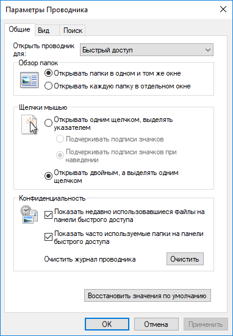
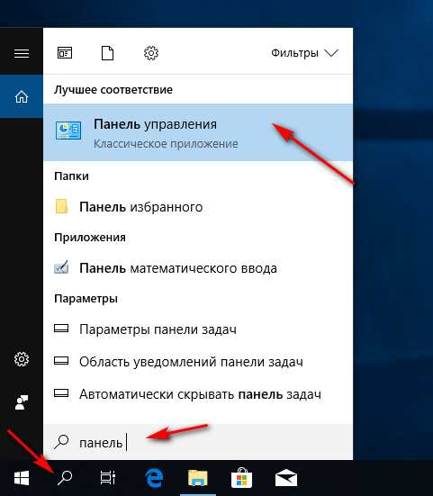
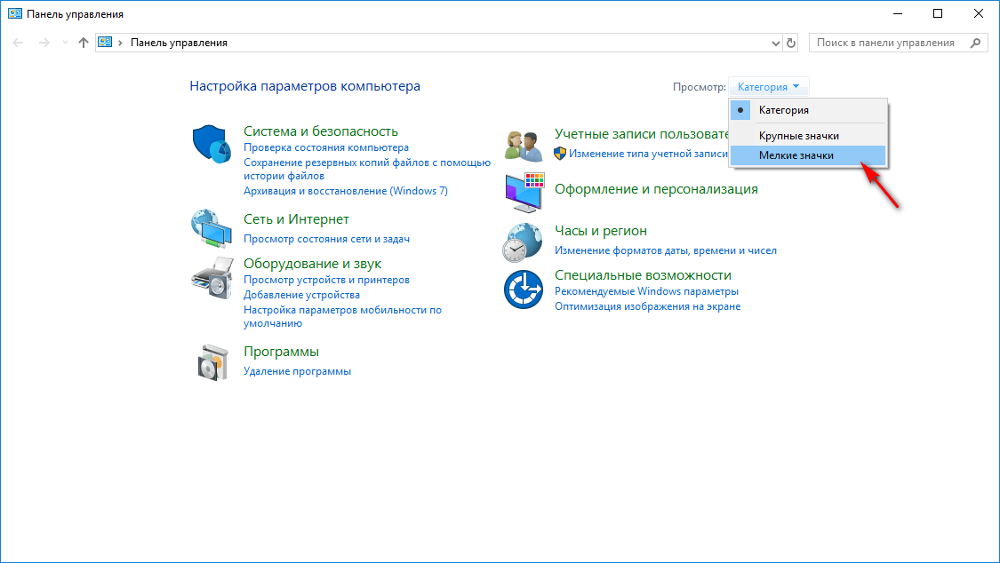
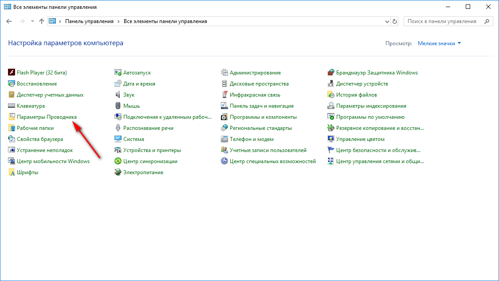
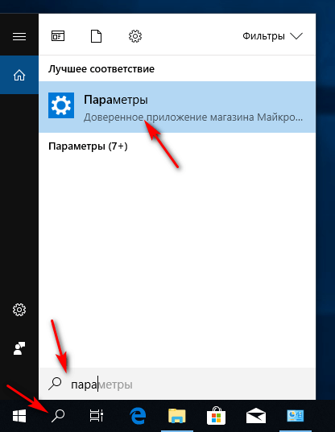
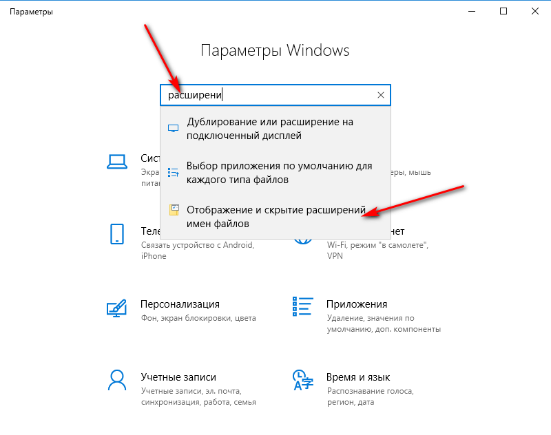
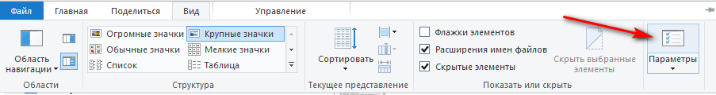
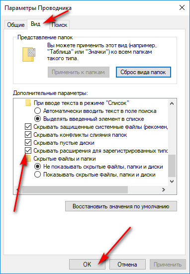

# Как сделать видимыми расширения файлов в Windows

При установке Windows первоначально расширения у зарегистрированных типов файлов не показываются. В статье показывается, как это исправить на примере Windows 10.

## Параметры Проводника

Первоначально нужно попасть в `Параметры Проводника`:

_Рисунок 1 — Параметры Проводника_

### I способ

Заходим в классическую `Панель управления`, и там заходим в `Параметры Проводника`:

_Рисунок 2 — Шаг 1_

_Рисунок 3 — Шаг 2_

_Рисунок 4 — Шаг 3_

### II способ

В новом приложении `Параметры` вводим `расширений` и открываем `Параметры Проводника`:

_Рисунок 5 — Шаг 1_

_Рисунок 6 — Шаг 2_

### III способ

Просто в проводнике идём `Вид` → `Параметры`:

_Рисунок 7 — Шаг 1_

## Настройка

Теперь в вкладке `Вид` находим `Скрывать расширения для зарегистрированных типов файлов` и снимаем галочку:

_Рисунок 8 — Снятие галочки_

Всё. Теперь все файлы в проводнике будут иметь свои расширения.

Было:

_Рисунок 9 — Состояние «Было»_

Стало:

_Рисунок 10 — Состояние «Стало»_
