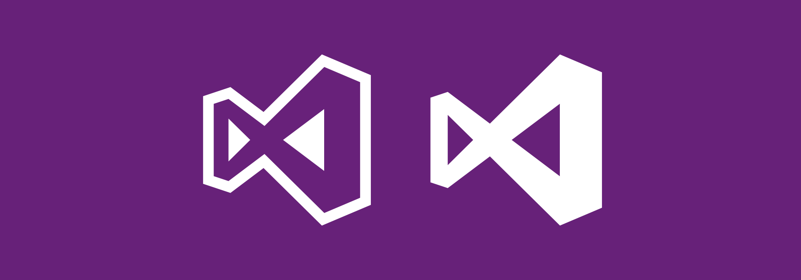
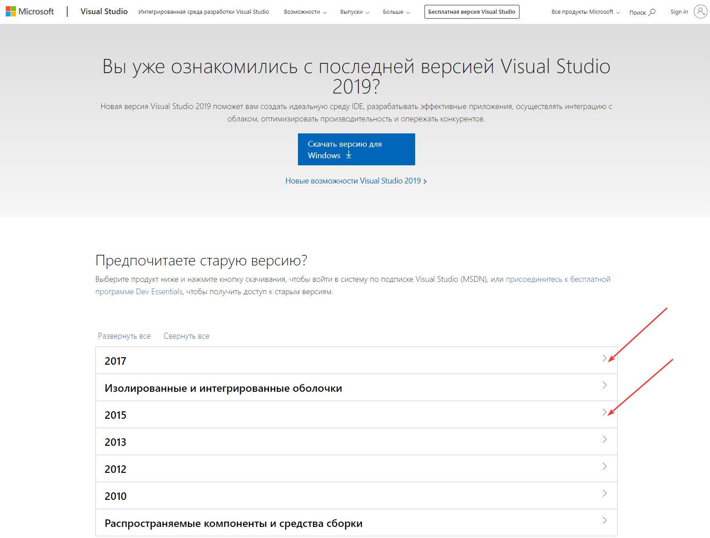
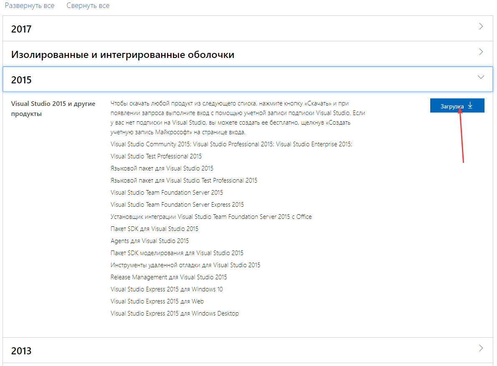
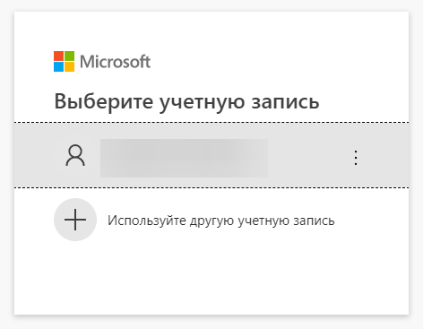
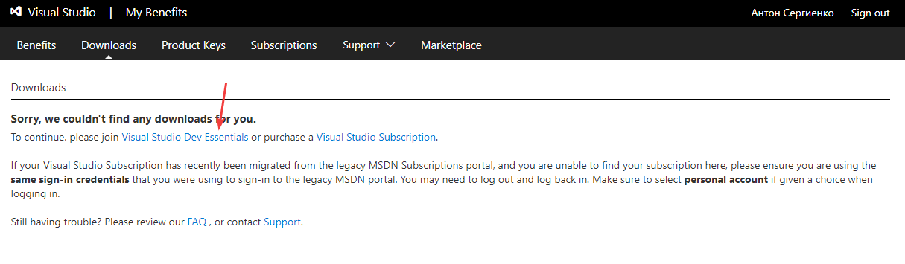
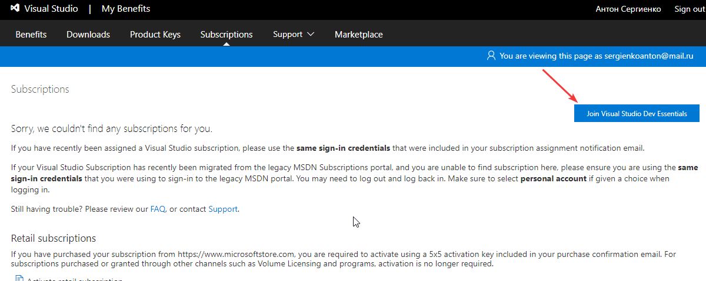
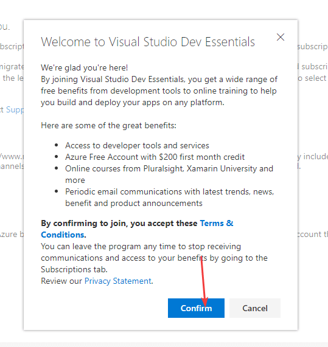
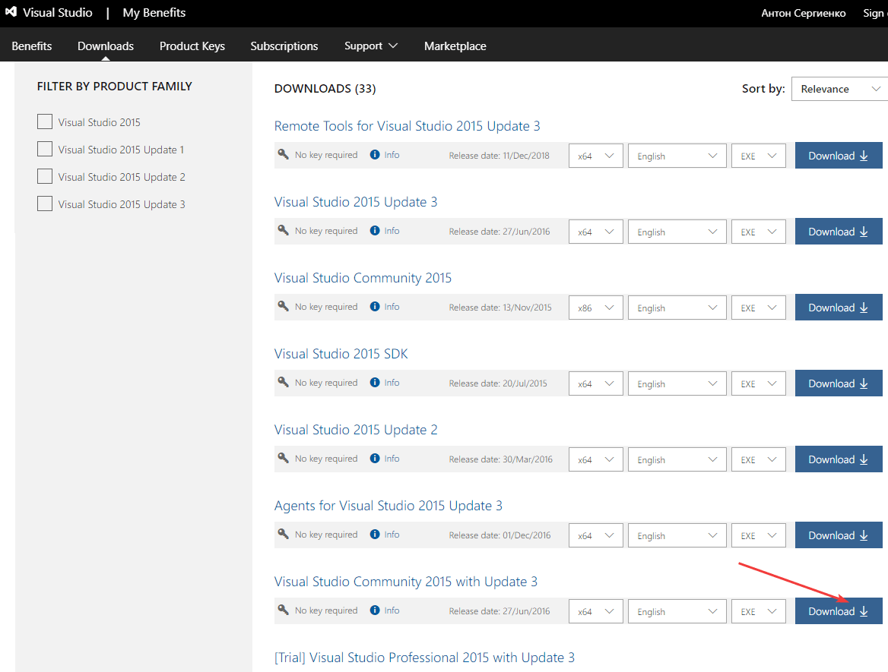

# Скачивание старых версий Visual Studio

В статье рассказывается, как официально скачать старые версии Visual Studio.

Рекомендуется использовать новые версии Visual Studio, но иногда вам по тем или иным причинам нужно будет использовать старые версии.

Переходим по ссылке <https://visualstudio.microsoft.com/ru/vs/older-downloads/>:

_Рисунок 1 — Страница со старыми версиями Visual Studio_

Там вы выбираете нужную вам версию Visual Studio:

_Рисунок 2 — Кнопка для скачивания старой версии Visual Studio_

Вам нужно будет зайти под своей учеткой Microsoft:

_Рисунок 3 — Вход в учетную запись Microsoft_

Но, когда вы зайдете, то ничего не увидите, ибо вам старые сборки скорее всего недоступны. Но мы вступаем в клуб разработчиков:

_Рисунок 4 — Ссылка для вступления в клуб_

_Рисунок 5 — Соглашаемся на вступление в клуб_

_Рисунок 6 — Подтверждаем наше вступление_

После этого повторите свои действия по скачиванию Visual Studio по ссылке <https://visualstudio.microsoft.com/ru/vs/older-downloads/>. И теперь вам будут доступны старые версии Visual Studio:

_Рисунок 7 — Старые версии Visual Studio_
