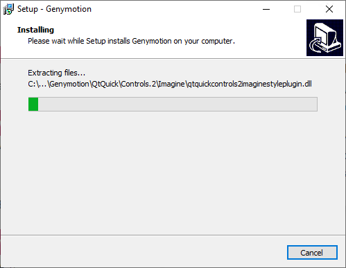

# Эмулятор Genymotion для Android Studio

В статье рассказывается, как подключить Genymotion эмулятор к Android Studio для запуска своих разрабатываемых приложений.

## Содержание

- [Скачивание](#скачивание)
- [Установка](#установка)
- [Настройка эмулятора](#настройка-эмулятора)

Стандартный эмулятор в Android Studio довольно прожорливое и капризное существо. И нормально работает на хороших компьютерах с Intel процессорами. Так что обладателям AMD процессоров вкупе со слабыми машинами приходится плохо. На помощь приходят сторонние эмуляторы. Genymotion — один из них.

Главное отличие Genymotion от других альтернативных эмуляторов в том, что он предназначен для тестирования программ, и в нем можно поднимать образы разных версий Android.

## Скачивание

На сайте <https://www.genymotion.com/download/> скачиваем установщик. Если вдруг у вас стоит на компьютере VirtualBox, то скачивайте версию без него. Но если нет, или вы даже не понимаете, про какую программу идет речь, то скачивайте версию Genymotion with VirtualBox:

_Рисунок 1 — Скачивание установщика_

## Установка

Установка проста:

_Рисунок 2 — Первоначальное окно установщика_

_Рисунок 3 — Выбор названия в меню_

_Рисунок 4 — Выбор необходимости создания иконки на рабочем столе_

_Рисунок 5 — Детали установки_

_Рисунок 6 — Процесс установки_

Теперь будет устанавливаться VirtualBox:

_Рисунок 7 — Первоначальное окно установки_

_Рисунок 8 — Выбор компонентов для установки_

_Рисунок 9 — Настройки установки_

_Рисунок 10 — Предупреждение об установке виртуальных подключений_

_Рисунок 11 — Окно с кнопкой начала установки_

Так как VirtualBox создает виртуальные подключения, то для этого нужно будет разрешить установить некоторые компоненты:

_Рисунок 12 — Разрешение установки дополнительных компонентов_

Запускать VirtualBox после установки нам не нужно:

_Рисунок 13 — Окончание установки VirtualBox_

И конец установки Genymotion:

_Рисунок 14 — Конец установки_

## Настройка эмулятора

При запуске эмулятора нужно будет ввести свой логин и пароль, но так как аккаунта у вас скорее всего нет, то создаем новый аккаунт:

_Рисунок 15 — Запуск эмулятора_

Вас перекинут на сайт, где надо зарегистрироваться:

_Рисунок 16 — Необходимость регистрации_

После этого на почту вам придет письмо с подтверждением учетки, что вы и делаете. Потом можно вернуться в Genymotion, где вводим свои данные:

_Рисунок 17 — Ввод данных_

Выбираем режим использования для персональных нужд `Personal Use` (вы же использовать будете только в личных целях эмулятор?):

_Рисунок 18 — Выбор «Personal Use»_

Соглашаемся на условия:

_Рисунок 19 — Соглашение с условиями_

Эмулятор запустился, но он видит, что виртуальные устройства не созданы. Поэтому создаем новое через кнопку с плюсом:

_Рисунок 20 — Создание нового виртуального устройства_

Выбираем какое устройство с какой версией Android будем создавать:

_Рисунок 21 — Выбор создаваемого устройства_

_Рисунок 22 — Настройка параметров виртуального устройства_

Скачиваем и устанавливаем образ Android:

_Рисунок 23 — Установка образа_

**Перезагрузите** компьютер и откройте Genymotion.

Теперь наше виртуальное устройство можно запустить двойным кликом:

_Рисунок 24 — Запуск устройства_

Вот и загрузился наш эмулятор:

_Рисунок 25 — Эмулятор готов к работе_

Теперь в Android Studio появится новое устройство (эмулятор должен быть запущен):

_Рисунок 26 — Выбор устройства в Android Studio_

_Рисунок 27 — Запущенное простейшее приложение_
