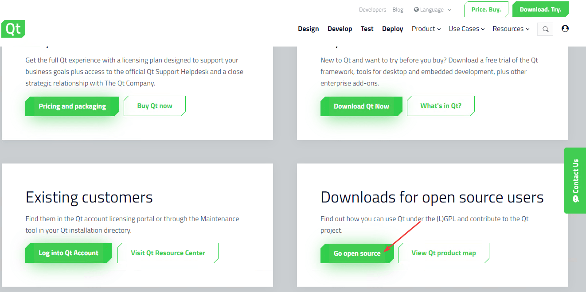
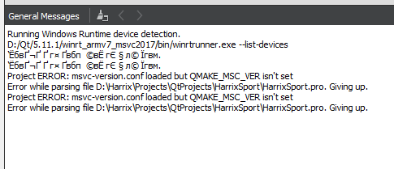
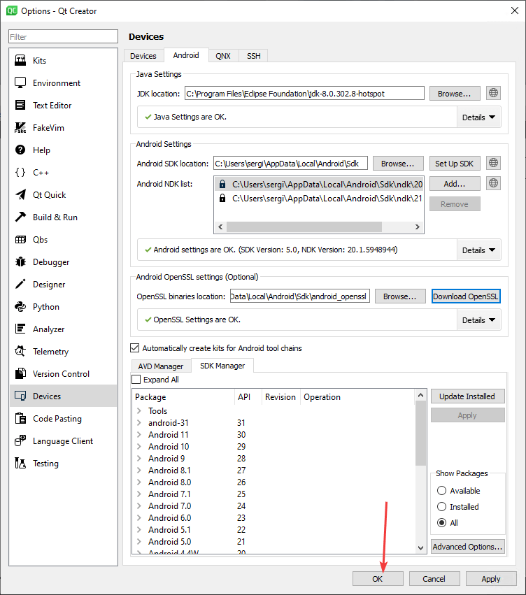

# Установка Qt под Visual Studio, MinGW и для разработки под Android

Инструкция по установке Qt с компилятором Visual Studio, MinGW и возможностью программировать под Android на примере Windows 10.

Если вы хотите установить Qt просто, чтобы программировать на C++ под Windows с стандартным компилятором, то вам подойдет упрощенная установка, описанная тут: [Установка Qt](https://github.com/Harrix/harrix.dev-blog-2018/blob/main/install-qt-mingw/install-qt-mingw.md).

Если вы хотите установить Qt под Windows XP, то данная статья вам не подойдет, так что вам сюда: [Установка Qt 4.8.4 на Windows XP](https://github.com/Harrix/harrix.dev-blog-2014/blob/main/install-qt-on-windows-xp/install-qt-on-windows-xp.md).

## Подготовка для работы с компилятором Visual Studio

Если вы хотите использовать компилятор под Visual Studio, то вам нужно установить **Visual Studio**. В статье [Установка Visual Studio 2019 Community](https://github.com/Harrix/harrix.dev-blog-2021/blob/main/install-visual-studio-2019/install-visual-studio-2019.md) рассказывается, как это сделать.

Решите до установки Qt, какой язык интерфейса будет у Visual Studio. От этого зависит язык сообщений об ошибках, которые будут приходит при компилировании проектов в Qt.

В установщике `Visual Studio Installer` можно удалить русский пакет и установить английский, чтобы русский язык вообще нигде не вылазил:


UWP приложения в Qt больше [не поддерживаются](https://www.qt.io/blog/qt6-development-hosts-and-targets): «Additionally, it will no longer be possible to create UWP applications on Windows 10».

## Подготовка для программирования под Android

Если вы хотите писать приложения под Android, то вам нужно установить **JDK**. Об этом можно узнать из статьи [Установка Open JDK в Windows](https://github.com/Harrix/harrix.dev-blog-2021/blob/main/install-open-jdk-on-windows/install-open-jdk-on-windows.md). Обратите внимание, что на август 2021 рекомендую устанавливать Java 8, хотя уже вышла Java 16, так как Qt с ними еще [не умеет нормально работать](https://doc.qt.io/qt-6/android-getting-started.html): «Note: JDK 11 or earlier must be used when using Qt for Android». Да, тут написано про 11 версию, а я советую 8. Почему? А у меня с JDK 11 Qt отказался работать в 2021-08.

Также вам будет нужен **Android SDK** и **Android NDK**. Статья об установке: [Установка Android Studio в Windows](https://github.com/Harrix/harrix.dev-blog-2019/blob/main/install-android-studio/install-android-studio.md). Особое внимание уделите на установку пакетов SDK из статьи.

На [этой же странице](https://doc.qt.io/qt-6/android-getting-started.html) можете посмотреть на версии SDK и NDK, которые требуются для Qt.

Устанавливает SDK и NDK через Android Studio. На скриншоте ниже у меня установлена SDK 31 и 22 версии:


А NDK должен быть на август 2021 года версии 20 или 21. Берем 20 во избежания проблем:


Поэтому в SDK Manager в Android Studio во складке SDK Tools щелкаем по `Show Package Details` и выбираем версию NDK нужной нам версии:


Разумеется, что, когда вы читаете эту инструкцию, версия NDK будет скорее всего другой.

Только **после установки необходимых вам программ** можно приступать к установке Qt.

## Скачивание Qt

Практика нескольких лет наблюдений показывает, что Qt регулярно меняет алгоритм нахождения open source версии установщика, так что учтите это.

Перейдите на страницу: <https://www.qt.io/download>.

Там вам нужно спуститься почти в самый низ:


И там находите `Go open source`:



Нам рекомендуют скачать online установщик. Раньше я ставил через offline установщик, но для установки версий MinGW, Visual Studio, Android приходилось устанавливать через несколько инсталляторов, и обновляются такие сборки реже. Так что скачиваем online установщик через кнопку `Download`, ссылка на который находится в самом низу страницы (на 2021-08-09):


Если же вам нужен всё-таки offline установщик, то спуститесь в самый низ и увидите ссылку на них:


## Установка

Запускаем скаченный файл. К сожалению, вам нужно иметь учетную запись Qt. Если её нет, то щелкаете на `Sign up`:


Вводите данные новой учетки, если перешли по `Sign up`:


После этого вы должны будете подтвердить учетку через письмо, которое придет на электронную почту, о чем говорит выделенная фраза:


Там, перейдя по ссылке, вам попросят ввести информацию о вас. Если вы используете Qt в личных целях, то укажите это, что позволит пользоваться Qt бесплатно:


После этого вы сможете в установщике пройти дальше, где еще раз укажите, что пользуетесь лично Qt, а не в компании:


Выбираем `Custom installation` для выбора устанавливаемых компонентов:


В последней (не preview) версии Qt выбираем пакеты с нужными компиляторами.

- `MSVC` — это компилятор под Visual Studio. Например, `MSVC 2019 64 bit` означает версию компилятора по Visual Studio 2019 в виде 64-битной версии. Выбирайте пакеты согласно вашей версии Visual Studio и битности операционной системы.
- `MinGW` — компилятор MinGW для написания десктопных приложений. Для работы с ним не нужно ничего дополнительного устанавливать, как с другими пакетами.
- `Android` — позволят компилировать приложения под Android на разных семействах процессоров.
- `Sources` — если вам нужны исходники классов Qt библиотек, то выбирайте этот пункт.

Лично мне у меня 64-битная Windows 10 с Visual Studio 2019 Community, и мне нужно проверять программы как на компиляторе Visual Studio, так и на MinGW. А также нужно программировать под Android. Рекомендую установить все дополнительные библиотеки (Qt Charts и другие), чтобы они были у вас под рукой:


Если вам интересен [Qt Installer Framework](https://doc.qt.io/qtinstallerframework/), то можно его отметить. Если будете работать с сетью, то выберите OpenSSL:


Соглашаемся с условиями:


Вы можете увидеть требуемое место для установки программы:


## Настройка

Если Qt Creator запустился с русским интерфейсом, то настоятельно рекомендую поменять его на английский:


Потом перезапустите Qt Creator:


Если вы создадите какой-нибудь проект в Qt и скомпилируете его под разными режимами (Release, Debug), то у вас в папке, где находится папка с проектом появятся еще папки с скомпилированным проектом:


На мой взгляд это крайне неудобно и засоряет папку, где у вас могут находится другие проекты. Лучше было бы, чтобы эти скомпилированные файлы располагались в специальной папке в папке проекта. Поэтому я меняю в настройках путь. Вы можете не менять — это не принципиально.

Первоначальное значение параметра `Default build directory`:

```text
../%{JS: Util.asciify("build-%{Project:Name}-%{Kit:FileSystemName}-%{BuildConfig:Name}")}
```


Новое значение параметра `Default build directory`:

```text
_build/%{JS: Util.asciify("build-%{Project:Name}-%{Kit:FileSystemName}-%{BuildConfig:Name}")}
```


И да. Для тех, кто использует Git. В файле `.gitignore` я добавляю следующую строчку:

```text
*_build*
```

Поменяйте путь к директории со своими проектами:


У меня это папка `C:\Users\sergi\OneDrive\Projects\Qt`.

## Настройка для работы с компилятором Visual Studio

Если у вас Visual Studio с русским интерфейсом, то в сообщениях об ошибках при компилировании в Qt вы будете видеть крякозябры. В статье [Крякозябры в Qt под Visual Studio](https://github.com/Harrix/harrix.dev-blog-2016/blob/main/fix-qt-under-visual-studio/fix-qt-under-visual-studio.md) рассказывается как от них избавиться.

Можно поменять язык интерфейса Visual Studio на английский, но лучше это сделать до установки Qt, как говорилось выше. Но если вы все-таки это сделали после установки Qt, и новые проекты хорошо компилируются под компилятором Visual Studio, то со старыми проектами могут возникнуть проблемы:

```console
Project ERROR: msvc-version.conf loaded but QMAKE_MSC_VER isn't set
```

```console
:-1: error: msvc-version.conf loaded but QMAKE_MSC_VER isn't set
```




Эти ошибки можно исправить либо удалив полностью **build** папку с собранным проектом, либо удалив оттуда файл с расширением `.qmake.stash`. Про предварительное удаление файла `*.pro.user` тоже не забывайте.

## Настройка для программирования под Android

Перейдем в настройки Qt:


Находим вкладку `Devices`, а там вкладку `Android`. В разделе `JDK Location` месторасположение JDK должно определиться автоматически. Если не так, то найдите этот путь и укажите тут в настройках:


Также может возникнуть проблема, если в системе установлено несколько версий JDK на компьютере. Например, у меня стоит JDK 16, OpenJDK 8, JDK 11 от Android Studio. И Qt нашел JDK 16, как на скриншоте выше, тогда как нужна версия 8. Так что мне пришлось путь поменять на `C:\Program Files\Eclipse Foundation\jdk-8.0.302.8-hotspot`.

В разделе `Android SDK Location` выбираем папку, где установлено SDK библиотеки, если она не определилась автоматически (должна на самом деле сама определиться). У меня это папка `C:\Users\sergi\AppData\Local\Android\Sdk`:


В разделе `Android NDK Location` выбираем папку, где установлено NDK библиотеки, если не определилась автоматически:


У меня это папка `C:\Users\sergi\AppData\Local\Android\Sdk\ndk\20.1.5948944`.

Как видно на скриншоте выше почти все параметры Qt пометила зелеными галочками, но пункт `All essential packages installed for all installed Qt versions.` горит красным. То есть что-то не установлено. Нажмите на кнопку `OK` и войдите повторно в эти же настройки. И Qt должен предложить доустановить пакеты:


Теперь почти всё установлено. Остался только пакет с OpenSSL, который лучше установить, если вы планируете работать, например, с сетью:


Вот теперь все настройки под Android сделаны:



Если у вас проблемы с эмулятором, то помните, что в конце статьи [Установка Android Studio в Windows](https://github.com/Harrix/harrix.dev-blog-2019/blob/main/install-android-studio/install-android-studio.md) есть описание того, как создать виртуальные устройства в стандартном эмуляторе, а также рассмотрены несколько других сторонних эмуляторов.

## Пример программы

В статье [Базовое приложение в Qt Widgets](https://github.com/Harrix/harrix.dev-blog-2014/blob/main/basic-app-qt-widgets/basic-app-qt-widgets.md) рассказано как создать стандартное Windows приложение со стандартными контролами. Теперь же попробуем создать шаблонное приложение на основе Qt Quick, где логика пишется на C++, а интерфейс на QML:


Выбираем вариант **Qt Quick Application — Swipe**:


Выберем для теста все возможные компиляторы для сборки проекта:


Вначале скомпилируем проект под стандартный MinGW, который мы никак выше не настраивали (это и не нужно):


Теперь попробуем скомпилировать через компилятор Visual Studio:


Может возникнуть такая ошибка:


Если у вас возникнет такая ошибка, то закройте Qt Creator, удалите папку со сборкой проекта (у меня это папка `_build`), а в папке с проектом удалите файл `*.pro.user`. Потом откройте заново Qt Creator, откройте в нем проект и заново скомпилируйте проект и запустите его:


Теперь попробуем запустить под Android на эмуляторе:


## Дополнительные настройки

В этом разделе опишу свои собственные настройки Qt, которые не обязательны, но могут вам пригодиться.

### Вертикальная линия для ограничения длины строк

Рекомендую поставить вертикальную линию в редакторе кода, чтобы следить за длиной строчек кода в параметре `Display right margin at column`. Я использую значение равное `120`:


## Два пробела для отступов вместо четырех

Мне не нравится использовать 4 пробела в отступах: 2 пробела достаточно:


## Дублирование строки

Во многих редакторах команда `Ctrl` + `D` дублирует строчку, тогда как в Qt Creator данная команда выполняется через `Ctrl` + `Alt` + `Down`. Неудобно, поэтому поменяем. В настройках горячих клавишах находим команду `CopyLineDown`:


Меняем сочетание клавиш на `Ctrl` + `D`. Но мы увидим конфликт, так как на эту комбинацию клавиш назначена другая команда:


Найдем эту команду `DeleteSelectedElements` и удаляем сочетание горячих клавиш или меняем на другое:


Теперь конфликта нет, и комбинация `Ctrl` + `D` будет дублировать строку:


## Шрифты

Мне нравится шрифт `JetBrains Mono`.

Скачать можно его можно тут: <https://www.jetbrains.com/ru-ru/lp/mono/>.

После установки шрифтов в настройках Qt можно поменять шрифт:


Было:


Стало:


Обидно, что расстояние между строчками немного уменьшилось.

## Автосохранение

Также выставляю автосохранение файлов на минимальное время в одну минуту:


