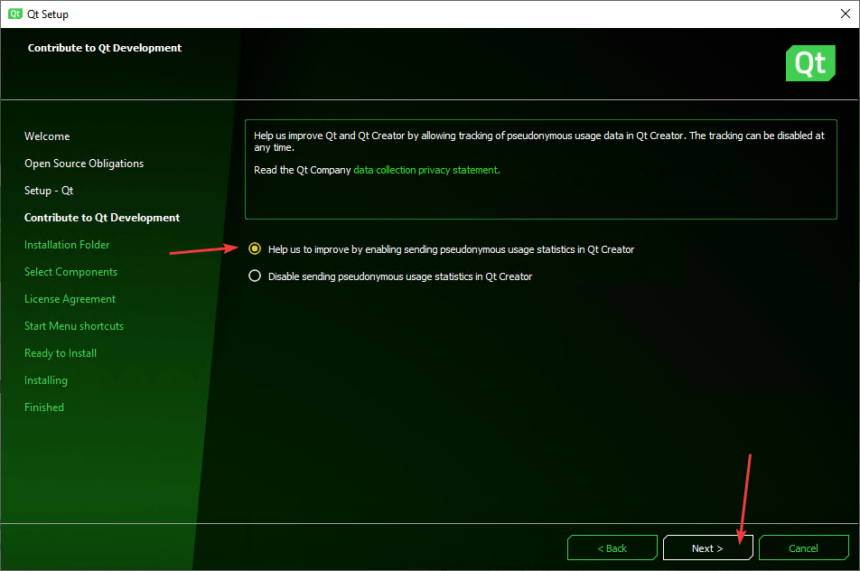

# Установка Qt

Инструкция по установке Qt с компилятором MinGW на Windows 10.

Если вы хотите установить Qt с поддержкой компилятора Visual Studio или для разработки под Android, то данная статья не подойдет, так что вам сюда: [Установка Qt под Visual Studio, MinGW и для разработки под Android](https://github.com/Harrix/harrix.dev-blog-2018/blob/main/install-qt-advanced/install-qt-advanced.md) <!-- https://harrix.dev/ru/blog/2018/install-qt-advanced/ -->.

Если вы хотите установить Qt под Windows XP, то данная статья не подойдет, так что вам сюда: [Установка Qt 4.8.4 на Windows XP](https://github.com/Harrix/harrix.dev-blog-2014/blob/main/install-qt-on-windows-xp/install-qt-on-windows-xp.md) <!-- https://harrix.dev/ru/blog/2014/install-qt-on-windows-xp/ -->.

## Скачивание Qt

Практика нескольких лет наблюдений показывает, что Qt регулярно меняет алгоритм нахождения open source версии установщика, так что учтите это.

Перейдите на страницу: <https://www.qt.io/download>.

Там вам нужно спуститься почти в самый низ:

_Рисунок 1 — Страница скачивания Qt_

И там находите `Go open source`:

_Рисунок 2 — Страница скачивания Qt_

Нам рекомендуют скачать online установщик. Раньше я ставил через offline установщик, но для установки версий MinGW, Visual Studio, Android приходилось устанавливать через несколько инсталляторов, и обновляются такие сборки реже. Так что скачиваем online установщик через кнопку `Download`, ссылка на который находится в самом низу страницы (на 2021-08-09):

_Рисунок 3 — Скачивание online установщика_

_Рисунок 4 — Скачивание online установщика (второе окно)_

Если же вам нужен всё-таки offline установщик, то спуститесь в самый низ и увидите ссылку на них:

_Рисунок 5 — Скачивание offline установщика_

## Установка

Запускаем скаченный файл. К сожалению, вам нужно иметь учетную запись Qt. Если её нет, то щелкаете на `Sign up`:

_Рисунок 6 — Начальное окно установки_

Вводите данные новой учетки, если перешли по `Sign up`:

_Рисунок 7 — Создание учетки_

После этого вы должны будете подтвердить учетку через письмо, которое придет на электронную почту, о чем говорит выделенная фраза:

_Рисунок 8 — Ввод информации о пользователе_

Там, перейдя по ссылке, вам попросят ввести информацию о вас. Если вы используете Qt в личных целях, то укажите это, что позволит пользоваться Qt бесплатно:

_Рисунок 9 — Процесс сбора информации о сборках_

После этого вы сможете в установщике пройти дальше, где еще раз укажите, что пользуетесь лично Qt, а не в компании:

_Рисунок 10 — Соглашение с лицензиями_

_Рисунок 11 — Приветственное окно_

_Рисунок 12 — Согласие с отправкой статистики в Qt_

В последней версии Qt выбираем пакет с компилятором MinGW:

_Рисунок 13 — Выбор компонентов для установки_

Соглашаемся с условиями:

_Рисунок 14 — Соглашение с условиями_

_Рисунок 15 — Выбор названия в меню Пуск_

_Рисунок 16 — Окно перед установкой_

_Рисунок 17 — Процесс установки_

_Рисунок 18 — Окончание установки_

## Настройка

Если Qt Creator запустился с русским интерфейсом, то настоятельно рекомендую поменять его на английский:

_Рисунок 19 — Выбор пункта меню Параметры_

_Рисунок 20 — Выбор английского языка для интерфейса_

Потом перезапустите Qt Creator.

## Создание первого приложения

Для проверки, что всё установилось хорошо, создадим пустое приложение и его запустим:

_Рисунок 21 — Пункт меню для создания нового приложения_

_Рисунок 22 — Выбор Qt Widgets Application_

_Рисунок 23 — Выбор названия проекта и его расположение_

_Рисунок 24 — Выбор системы сборки проекта_

_Рисунок 25 — Выбор названия классов проекта_

_Рисунок 26 — Выбор настроек перевода приложения_

_Рисунок 27 — Выбор компилятора_

_Рисунок 28 — Окончание создания нового проекта_

_Рисунок 29 — Кнопка запуска приложения_

_Рисунок 30 — Запущенное приложение_

Если у вас запустилось приложение, то всё хорошо.
