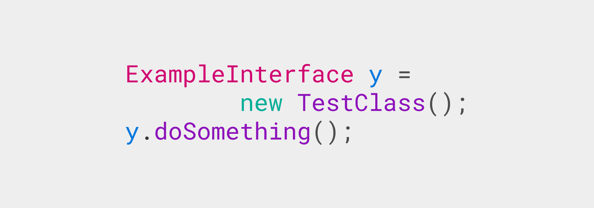

# «Экземпляр» интерфейса в Java



Можно ли создать экземпляры интерфейса в Java? По идеи это сделать нельзя, но в коде могут встретиться строчки, которые якобы опровергают это.

<details>
<summary>📖 Содержание</summary>

## Содержание

- [Взаимоотношения родительского и дочернего класса](#взаимоотношения-родительского-и-дочернего-класса)
- [Взаимоотношения класс и интерфейса](#взаимоотношения-класс-и-интерфейса)
- [Дополнительные ситуации](#дополнительные-ситуации)

Например, такой код валидный:

```java
interface TestInterface {
    void doSomething();
}
TestInterface e;
```

</details>

## Взаимоотношения родительского и дочернего класса

Допустим у нас есть родительский и дочерний классы:

```java
class ParentClass {
    public void doSomething() {
        System.out.println("doSomething");
    }
}

class TestClass extends ParentClass {
    int variable;

    public void methodInClass() {
        System.out.println("methodInClass");
    }
}
```

Мы можем объявить переменную родительского класса, но проинициализировать переменную экземпляром дочернего класса:

```java
ParentClass x = new TestClass();
```

У нас создался экземпляр дочернего класса, но он как бы замаскировался под экземпляр родительского класса. И мы будем иметь прямой доступ только к методам и переменным, которые есть у родительского класса:

```java
ParentClass x = new TestClass();
x.doSomething(); // Так можно
x.methodInClass(); // Так нельзя
```

Но переменные и методы дочернего класса всё равно присутствуют в экземпляре класса, поэтому мы можем получить доступ к ним через приведение типов:

```java
ParentClass x = new TestClass();
x.doSomething(); // Так можно
((TestClass) x).methodInClass(); // Так можно
```

Также мы можем создать обычный экземпляр дочернего класса, а потом создать переменную родительского класса, которая будет приведена к родительскому:

```java
TestClass x = new TestClass();

ParentClass y = (ParentClass)x;
y.doSomething();
```

И напрямую в переменной `y` будет доступ только к родительским переменным и методам. Но напоминаю, что `y` ссылается на тот же экземпляр, что и переменная `x`. Так что обратное преобразование типов «вернет» доступ к дочерним методам:

```java
TestClass x = new TestClass();
x.variable = 5;

ParentClass y = (ParentClass)x;
y.doSomething();
((TestClass)y).methodInClass();
((TestClass)y).variable = 6;
System.out.println(x.variable); // Вывод: 6
```

Такая маскировка экземпляров дочерних классов под родительские бывает крайне удобной. Например, можно создавать массивы, в которых будут храниться экземпляры разных дочерних классов:

```java
abstract class Animal {
    abstract void say();
}

class Dog extends Animal {
    @Override
    void say() {
        System.out.println("Гав");
    }
}

class Cat extends Animal {
    @Override
    void say() {
        System.out.println("Мяу");
    }
}

public class Main {
    public static void main(String[] args) {
        Animal [] x = new Animal[2];
        x[0] = new Dog();
        x[1] = new Cat();

        x[0].say(); // Выведет "Гав"
        x[1].say(); // Выведет "Мяу"
    }
}
```

## Взаимоотношения класс и интерфейса

Когда речь идет об интерфейсе и классе, то тут будут такие же взаимодействия, как и при описании родительского и дочернего класса. Например, у нас есть интерфейс и класс:

```java
interface ExampleInterface {
    void doSomething();
}

class TestClass implements ExampleInterface {
    int variable;

    @Override
    public void doSomething() {
        System.out.println("doSomething");
    }

    public void methodInClass() {
        System.out.println("methodInClass");
    }
}
```

И мы также можем объявить переменную интерфейса, но проинициализировать экземпляром класса:

```java
// Обычное применение класса
TestClass x = new TestClass();
x.methodInClass();
x.doSomething();

// Переменная объявлена как «экземпляр» интерфейса, но создается через
// нормальный экземпляр класса
ExampleInterface y = new TestClass();
y.doSomething();
```

И в переменной `y` мы будем иметь доступ только к методам, которые доступны в интерфейсе:

```java
ExampleInterface y = new TestClass();
y.doSomething();  // Так работает
y.methodInClass(); // Так не работает
```

Но мы не создавали экземпляр интерфейса (это не сработает: `ExampleInterface z = new ExampleInterface();`). Переменная `y` ссылается на экземпляр класса `TestClass`, но маскируется под «экземпляр» интерфейса. Поэтому через приведение типа можем получить доступ к «скрытым» методам и переменным:

```java
ExampleInterface y = new TestClass();
y.doSomething();
//y.methodInClass(); // Так не работает
((TestClass) y).methodInClass(); // А через приведение типов работает
```

Аналогичным способом мы можем объявить переменную интерфейса и преобразовать к интерфейсу экземпляр класса:

```java
TestClass x = new TestClass();

ExampleInterface z = (ExampleInterface) x;
z.doSomething(); // Так работает
z.methodInClass(); // Так не работает

((TestClass)z).methodInClass(); // А так работает
```

То есть полноценного экземпляра интерфейса не создается: он всё равно ссылается на экземпляр обычного класса.

Еще можно проверить наличие интерфейса у экземпляра класса:

```java
TestClass x = new TestClass();

if (x instanceof ExampleInterface) {
    System.out.println("x является экземпляром класса с интерфейсом ExampleInterface");
}
```

## Дополнительные ситуации

Выше отмечалось, что создать экземпляр интерфейса нельзя. Такой код не сработает:

```java
ExampleInterface x = new ExampleInterface();
```

Но такой код будет работать и запускаться:

```java
ExampleInterface x = new ExampleInterface() {
    @Override
    public void doSomething() {
        System.out.println("doSomething");
    }
};

x.doSomething();
```

Но вы должны понимать, что тут не создается экземпляр интерфейса, а экземпляр анонимного класса с интерфейсом `ExampleInterface`.

Еще можно привести пример из рефлексии, когда вы можете проверить какой-то класс (не экземпляр): является он интерфейсом или нет:

```java
Class classOfInterface = ExampleInterface.class;
if (classOfInterface.isInterface()) {
    System.out.println("Это интерфейс");
}
```
