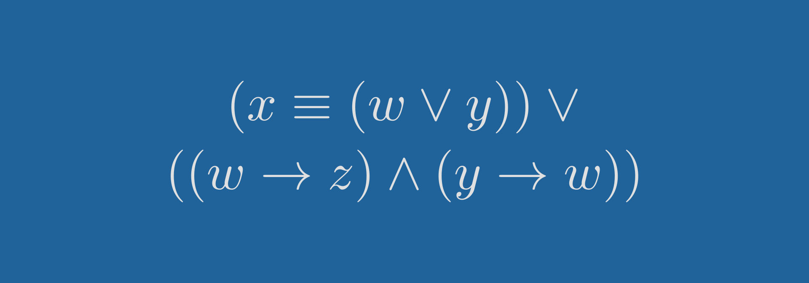

# Задача из раздела «Частично заполненные таблицы истинности логических выражений»

В статье показано решение одной [задачи](https://inf-ege.sdamgia.ru/problem?id=15814), которую меня попросили посмотреть.

📖 Содержание ⬇️

## Содержание

- [Постановка задачи](#постановка-задачи)
- [Решение](#решение)
  - [Разбор выражения](#разбор-выражения)
    - [Первый случай](#первый-случай)
    - [Второй случай](#второй-случай)
  - [Разбор таблицы истинности](#разбор-таблицы-истинности)
    - [Первый столбец](#первый-столбец)
    - [Второй столбец](#второй-столбец)
    - [Третий столбец](#третий-столбец)
    - [Четвертый столбец](#четвертый-столбец)
- [Ответ](#ответ)

## Постановка задачи

Логическая функция $F$ задаётся выражением $(x \equiv (w \lor y)) \lor ((w \rightarrow z ) \land (y \rightarrow w))$.

Дан частично заполненный фрагмент, содержащий неповторяющиеся строки таблицы истинности функции $F$.

Определите, какому столбцу таблицы истинности соответствует каждая из переменных $x$, $y$, $z$, $w$.

| Переменная 1 | Переменная 2 | Переменная 3 | Переменная 4 | Функция |
| ------------ | ------------ | ------------ | ------------ | ------- |
| $?$          | $?$          | $?$          | $?$          | $F$     |
| 1            |              |              | 1            | 0       |
|              |              |              | 1            | 0       |
| 1            |              | 1            |              | 0       |

В ответе напишите буквы $w$, $x$, $y$, $z$ в том порядке, в котором идут соответствующие им столбцы (сначала — буква, соответствующая первому столбцу; затем — буква, соответствующая второму столбцу, и т. д.). Буквы в ответе пишите подряд, никаких разделителей между буквами ставить не нужно.

## Решение

### Разбор выражения

Выражение $(x \equiv (w \lor y)) \lor ((w \rightarrow z) \land (y \rightarrow w))$ состоит из двух частей, соединенных операцией дизъюнкцией (логическое «ИЛИ»).

Так как в таблице все строки таблицы истинности равны $0$ (последний столбец), то, значит, обе части выражения $x \equiv (w \lor y)$ и $(w \rightarrow z) \land (y \rightarrow w)$ должны быть равные $0$, так как, если бы кто-то них был равен $1$, то выражение стало бы равным $F = 1$.

Чаще всего в выражениях используется переменная $w$, поэтому её и будем анализировать.

#### Первый случай

Пусть $w = 0$.

Тогда выражение $x \equiv (w \lor y)$ примет вид: $x \equiv (0 \lor y)$. Тут возможно два варианта:

Пусть $y = 0$.

Тогда $0 \lor y = 0 \lor 0 = 0$. Значит, чтобы $x \equiv 0$ было ложным, нужно, чтобы $x = 1$.

Пусть $y = 1$.

Тогда $0 \lor y = 0 \lor 1 = 1$. Значит, чтобы $x \equiv 1$ было ложным, нужно, чтобы $x = 0$.

Рассмотрим вторую часть выражения $(w \rightarrow z) \land (y \rightarrow w)$, которое также должно быть ложным. Так как мы считаем, что $w = 0$, то оно превращается в $(0 \rightarrow z) \land (y \rightarrow 0)$.

Так как две импликации соединены конъюнкцией, то для того, чтобы выражение было ложным, достаточно ложности хотя бы одной импликации.

Надо помнить, что импликация бывает ложной только в одном случае: $1 \rightarrow 0 = 0$.

Отсюда следует, что $(0 \rightarrow z)$ не может быть ложным ни при каких значениях $z$. Значит ложным должна быть импликация $y \rightarrow 0$. А это возможно только в случае, если $y = 1$.

Выше при рассматривании выражения $x \equiv (w \lor y)$ мы рассматривали два случая: когда $y = 0$ и когда $y = 1$. Но после рассмотрения выражения $(w \rightarrow z) \land (y \rightarrow w)$ вариант $y = 0$ можно исключить.

Из этих размышлений можно формулировать следующий вывод.

> [!IMPORTANT]
> Вывод 1
> Если $w = 0$, то $y = 1$, $x = 0$.

#### Второй случай

Пусть $w = 1$.

Тогда выражение $x \equiv (w \lor y)$ пр имеет вид: $x \equiv (1 \lor y)$. Так как в правой части используется дизъюнкция, то правая часть всегда будет истинной при любых значениях $y$. Значит, чтобы выражение было ложным, левая часть должна быть ложной, то есть $x = 0$.

Рассмотрим выражение $(w \rightarrow z) \land (y \rightarrow w)$, которое также должно быть ложным. Так как мы считаем, что $w = 1$, то оно превращается в $(1 \rightarrow z) \land (y \rightarrow 1)$.

Из свойств импликации следует, что вторая импликация никогда не может быть ложной. Следовательно, для ложности выражения необходима ложность первой импликации $1 \rightarrow z$, а это возможно только в случае $z = 0$.

Из вышесказанного можно сформулировать следующий вывод:

> [!IMPORTANT]
> Вывод 2
> Если $w = 1$, то $x = 0$, $z = 0$.

Эти два вывода будем использовать для анализа таблицы истинности.

### Разбор таблицы истинности

В предыдущей части мы взяли за основу переменную $w$. Её и возьмём для анализа таблицы истинности.

#### Первый столбец

Пусть $w$ располагается в первом столбце таблицы истинности:

| Переменная 1 | Переменная 2 | Переменная 3 | Переменная 4 | Функция |
| ------------ | ------------ | ------------ | ------------ | ------- |
| $w$          | $?$          | $?$          | $?$          | $F$     |
| 1            |              |              | 1            | 0       |
|              |              |              | 1            | 0       |
| 1            |              | 1            |              | 0       |

По второму выводу следует, что, если $w = 1$, то минимум две переменных должно быть равно $0$ ($x = 0$, $z = 0$).

Так как в первой строке $w = 1$, а четвертый столбец занят $1$, то, значит, второй и третий столбец должны быть равны $0$. И какой-то из этих столбцов будет содержать переменную $x$, а какой-то $z$. То есть, из первой строки следует, что, если, первый столбец равен $1$, то второй и третий равны $0$.

Но третья строка также содержит значение $w = 1$, а третий столбец содержит значение, равное $1$. А согласно первой строке, там должен находится $0$.

Мы пришли к противоречию. Значит, $w$ не может располагаться в первом столбце.

#### Второй столбец

Пусть $w$ располагается во втором столбце таблицы истинности:

| Переменная 1 | Переменная 2 | Переменная 3 | Переменная 4 | Функция |
| ------------ | ------------ | ------------ | ------------ | ------- |
| $?$          | $w$          | $?$          | $?$          | $F$     |
| 1            |              |              | 1            | 0       |
|              |              |              | 1            | 0       |
| 1            |              | 1            |              | 0       |

Пусть в первой строке $w = 1$:

| Переменная 1 | Переменная 2 | Переменная 3 | Переменная 4 | Функция |
| ------------ | ------------ | ------------ | ------------ | ------- |
| $?$          | $w$          | $?$          | $?$          | $F$     |
| 1            | **1**        |              | 1            | 0       |
|              |              |              | 1            | 0       |
| 1            |              | 1            |              | 0       |

Но это невозможно, так как для этого случая нам нужно два столбца, равных $0$, а такой может быть только один.

Пусть в первой строке $w = 0$:

| Переменная 1 | Переменная 2 | Переменная 3 | Переменная 4 | Функция |
| ------------ | ------------ | ------------ | ------------ | ------- |
| $?$          | $w$          | $?$          | $?$          | $F$     |
| 1            | **0**        |              | 1            | 0       |
|              |              |              | 1            | 0       |
| 1            |              | 1            |              | 0       |

Если $w = 0$, то по первому выводу $y = 1$, $x = 0$. Так как у нас в первой строчке все заполненные столбцы равны $1$, то $x$ может располагаться только в третьем столбце, и там будет значение $0$:

| Переменная 1 | Переменная 2 | Переменная 3 | Переменная 4 | Функция |
| ------------ | ------------ | ------------ | ------------ | ------- |
| $?$          | $w$          | $x$          | $?$          | $F$     |
| 1            | **0**        | **0**        | 1            | 0       |
|              |              |              | 1            | 0       |
| 1            |              | 1            |              | 0       |

Но согласно первому и второму выводу $x$ всегда равен $0$, а в третьей строчке мы видим, что в третьем столбце $1$.

Мы пришли к противоречию. Значит, $w$ не может располагаться во втором столбце.

#### Третий столбец

Пусть $w$ располагается в третьем столбце таблицы истинности:

| Переменная 1 | Переменная 2 | Переменная 3 | Переменная 4 | Функция |
| ------------ | ------------ | ------------ | ------------ | ------- |
| $?$          | $?$          | $w$          | $?$          | $F$     |
| 1            |              |              | 1            | 0       |
|              |              |              | 1            | 0       |
| 1            |              | 1            |              | 0       |

Так как согласно обоим выводам $x = 0$, то только во втором столбце может располагаться $x$, так как во всех остальных есть хотя бы одна $1$:

| Переменная 1 | Переменная 2 | Переменная 3 | Переменная 4 | Функция |
| ------------ | ------------ | ------------ | ------------ | ------- |
| $?$          | $x$          | $w$          | $?$          | $F$     |
| 1            | **0**        |              | 1            | 0       |
|              | **0**        |              | 1            | 0       |
| 1            | **0**        | 1            |              | 0       |

Рассмотрим последнюю строчку. В ней $w = 1$, следовательно, нужно два столбца, равных $0$. Второй занят для $x$, первый содержит $1$. Значит, $z = 0$ может располагаться только в четвертом столбце. А первый столбец тогда будет закреплен за оставшейся переменной $y$:

| Переменная 1 | Переменная 2 | Переменная 3 | Переменная 4 | Функция |
| ------------ | ------------ | ------------ | ------------ | ------- |
| $y$          | $x$          | $w$          | $z$          | $F$     |
| 1            | **0**        |              | 1            | 0       |
|              | **0**        |              | 1            | 0       |
| 1            | **0**        | 1            | **0**        | 0       |

Так как в первой строке только одно значение $0$, то $w$ может быть равен только $0$, так как при $w = 1$ нужно два нулевых значения:

| Переменная 1 | Переменная 2 | Переменная 3 | Переменная 4 | Функция |
| ------------ | ------------ | ------------ | ------------ | ------- |
| $y$          | $x$          | $w$          | $z$          | $F$     |
| 1            | **0**        | **0**        | 1            | 0       |
|              | **0**        |              | 1            | 0       |
| 1            | **0**        | 1            | **0**        | 0       |

Во второй строчке $z = 1$, следовательно, w может быть равен только $0$:

| Переменная 1 | Переменная 2 | Переменная 3 | Переменная 4 | Функция |
| ------------ | ------------ | ------------ | ------------ | ------- |
| $y$          | $x$          | $w$          | $z$          | $F$     |
| 1            | **0**        | **0**        | 1            | 0       |
|              | **0**        | **0**        | 1            | 0       |
| 1            | **0**        | 1            | **0**        | 0       |

А из первого вывода следует, что $y = 1$ в таком случае:

| Переменная 1 | Переменная 2 | Переменная 3 | Переменная 4 | Функция |
| ------------ | ------------ | ------------ | ------------ | ------- |
| $y$          | $x$          | $w$          | $z$          | $F$     |
| 1            | **0**        | **0**        | 1            | 0       |
| **1**        | **0**        | **0**        | 1            | 0       |
| 1            | **0**        | 1            | **0**        | 0       |

Мы получили таблицу истинности с двумя одинаковыми строчками, что невозможно.

Мы пришли к противоречию. Значит, $w$ не может располагаться в третьем столбце.

#### Четвертый столбец

Пусть $w$ располагается в четвертом столбце таблицы истинности:

| Переменная 1 | Переменная 2 | Переменная 3 | Переменная 4 | Функция |
| ------------ | ------------ | ------------ | ------------ | ------- |
| $?$          | $?$          | $?$          | $w$          | $F$     |
| 1            |              |              | 1            | 0       |
|              |              |              | 1            | 0       |
| 1            |              | 1            |              | 0       |

Так как из двух выводов следует, что $x = 0$, то для этого есть только второй столбец, как мы выяснили выше. Следовательно, таблица истинности примет вид:

| Переменная 1 | Переменная 2 | Переменная 3 | Переменная 4 | Функция |
| ------------ | ------------ | ------------ | ------------ | ------- |
| $?$          | $x$          | $?$          | $w$          | $F$     |
| 1            | **0**        |              | 1            | 0       |
|              | **0**        |              | 1            | 0       |
| 1            | **0**        | 1            |              | 0       |

Из второго вывода следует, что если $w = 1$, то $z = 0$. В первой строчке в первом столбце стоит $1$, во втором столбце находится $x$. Следовательно, для $z$ остается только третий столбец, а $y$ следом уходит в первый столбец:

| Переменная 1 | Переменная 2 | Переменная 3 | Переменная 4 | Функция |
| ------------ | ------------ | ------------ | ------------ | ------- |
| $y$          | $x$          | $z$          | $w$          | $F$     |
| 1            | **0**        | **0**        | 1            | 0       |
|              | **0**        |              | 1            | 0       |
| 1            | **0**        | 1            |              | 0       |

Можно на этом остановиться, то разберем все строчки таблицы истинности на всякий случай.

Во второй строке $w = 1$. Значит, по второму выводу $z = 0$:

| Переменная 1 | Переменная 2 | Переменная 3 | Переменная 4 | Функция |
| ------------ | ------------ | ------------ | ------------ | ------- |
| $y$          | $x$          | $z$          | $w$          | $F$     |
| 1            | **0**        | **0**        | 1            | 0       |
|              | **0**        | **0**        | 1            | 0       |
| 1            | **0**        | 1            |              | 0       |

Если во второй строке $y = 1$, то получим две одинаковые строчки в таблице истинности, что допустить нельзя. Проверим наше главное выражение $(x \equiv ( w \lor y)) \lor ((w \rightarrow z ) \land (y \rightarrow w))$ для второй строчки при $y = 0$: $(0 \equiv ( 1 \lor 0)) \lor ((1 \rightarrow 0 ) \land (0 \rightarrow 1)) = (0 \equiv 1) \lor (0 \land 1) = 0 \lor 0 = 0$. То есть получаем ложное выражение, как нам и нужно. Следовательно, мы можем вот так заполнить вторую строчку:

| Переменная 1 | Переменная 2 | Переменная 3 | Переменная 4 | Функция |
| ------------ | ------------ | ------------ | ------------ | ------- |
| $y$          | $x$          | $z$          | $w$          | $F$     |
| 1            | **0**        | **0**        | 1            | 0       |
| **0**        | **0**        | **0**        | 1            | 0       |
| 1            | **0**        | 1            |              | 0       |

Осталась последняя строка.

Пусть $w = 0$.

Тогда $(x \equiv ( w \lor y)) \lor ((w \rightarrow z ) \land (y \rightarrow w)) = (0 \equiv ( 0 \lor 1)) \lor ((0 \rightarrow 1 ) \land (1 \rightarrow 0)) = (0 \equiv 1) \lor (1 \land 0) = 0 \lor 0 = 0$.

Пусть $w = 1$.

Тогда $(x \equiv ( w \lor y)) \lor ((w \rightarrow z ) \land (y \rightarrow w)) = (0 \equiv ( 1 \lor 1)) \lor ((1 \rightarrow 1 ) \land (1 \rightarrow 1)) = (0 \equiv 1) \lor (1 \land 1) = 0 \lor 1 = 1$.

Получается, что при $w = 1$ мы получаем истину, хотя должны были получить ложь. А при $w = 0$ получаем ожидаемую ложь. Следовательно, $w = 0$:

| Переменная 1 | Переменная 2 | Переменная 3 | Переменная 4 | Функция |
| ------------ | ------------ | ------------ | ------------ | ------- |
| $y$          | $x$          | $z$          | $w$          | $F$     |
| 1            | **0**        | **0**        | 1            | 0       |
| **0**        | **0**        | **0**        | 1            | 0       |
| 1            | **0**        | 1            | **0**        | 0       |

То есть мы смогли расставить все переменные по столбцам и получить однозначную заполненную таблицу истинности.

## Ответ

$yxzw$
