# Графики MPAndroidChart в Android Studio

Для рисования графиков будем использовать библиотеку [MPAndroidChart](https://github.com/PhilJay/MPAndroidChart) с 25 тысячами звезд на GitHub.

## Справочная информация

У компонента хорошая документация и хороший тестовый пример, откуда можно почерпнуть много полезной информации:

Документация: <https://github.com/PhilJay/MPAndroidChart/wiki>.

Пример приложения: <https://github.com/PhilJay/MPAndroidChart/tree/master/MPChartExample>.

## Создание болванки

Создадим для примера пустое приложение в Android Studio с LinearLayout и кнопкой, для которой подготовим слушателя клика.

Файл `activity_main.xml`:

```xml
<?xml version="1.0" encoding="utf-8"?>
<LinearLayout xmlns:android="http://schemas.android.com/apk/res/android"
    android:layout_width="match_parent"
    android:layout_height="match_parent"
    android:paddingLeft="16dp"
    android:paddingRight="16dp"
    android:orientation="vertical" >

    <Button
        android:id="@+id/button"
        android:layout_width="match_parent"
        android:layout_height="wrap_content"
        android:text="Button" />
</LinearLayout>
```

Файл `MainActivity.java` (без строки `package`):

```java
import androidx.appcompat.app.AppCompatActivity;
import android.os.Bundle;
import android.view.View;
import android.widget.Button;

public class MainActivity extends AppCompatActivity {

    private Button button;

    @Override
    protected void onCreate(Bundle savedInstanceState) {
        super.onCreate(savedInstanceState);
        setContentView(R.layout.activity_main);

        button = findViewById(R.id.button);
        button.setOnClickListener(new View.OnClickListener() {
            @Override
            public void onClick(View v) {

            }
        });
    }
}
```

## Подключение библиотеки

На [странице](https://github.com/PhilJay/MPAndroidChart) библиотеки посмотрите текущее описание подключения библиотеки:

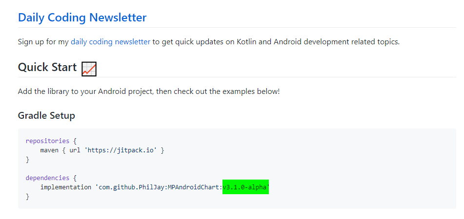

И в файле настроек Gradle скопируйте два куска кода в указанные ниже ан рисунке места и синхронизируйте проект:

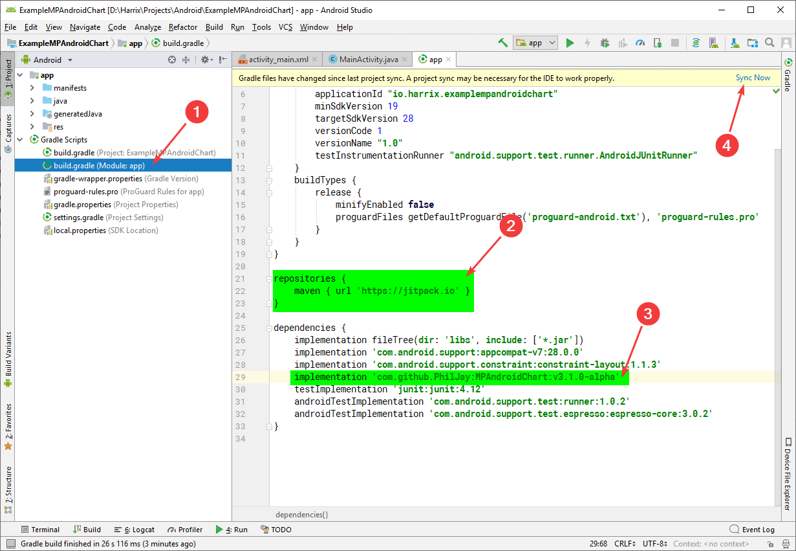

Попробуйте запустить проект на эмуляторе или физическом устройстве:

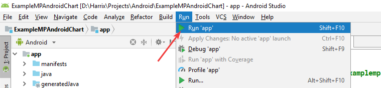

Если всё запустилось хорошо, то всё отлично. Но у меня вылетает такая ошибка:

```console
More than one file was found with OS independent path 'META-INF/proguard/androidx-annotations.pro'
```

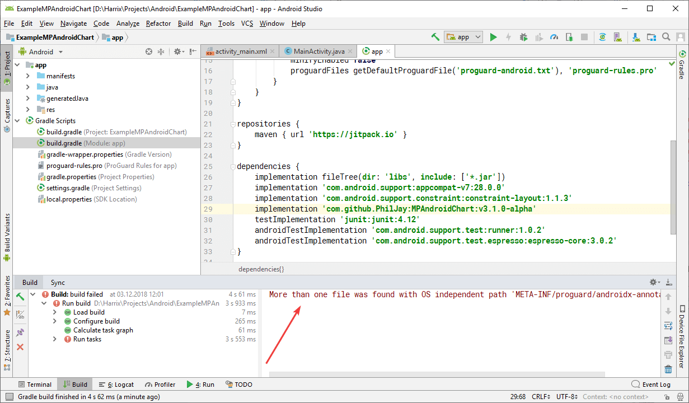

Для этого в том же файле Gradle нужно прописать еще такие строки в разделе `android`:

```gradle
packagingOptions {
    exclude 'META-INF/proguard/androidx-annotations.pro'
}
```

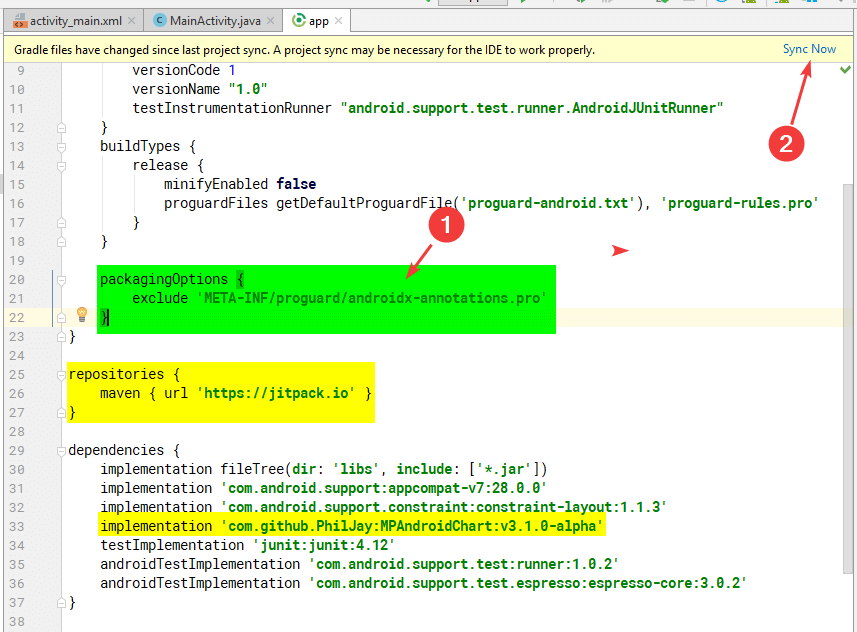

Добавьте их именно в раздел `android`:

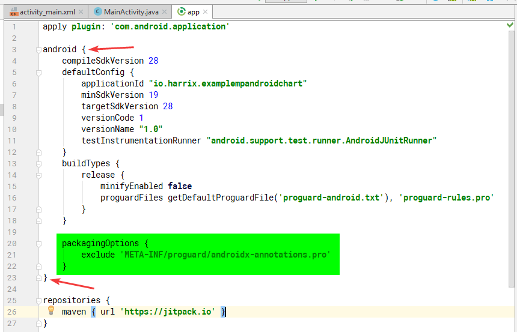

После этого синхронизируйте Gradle и запустите проект. Если вы видите пустое приложение с кнопкой, то всё хорошо:

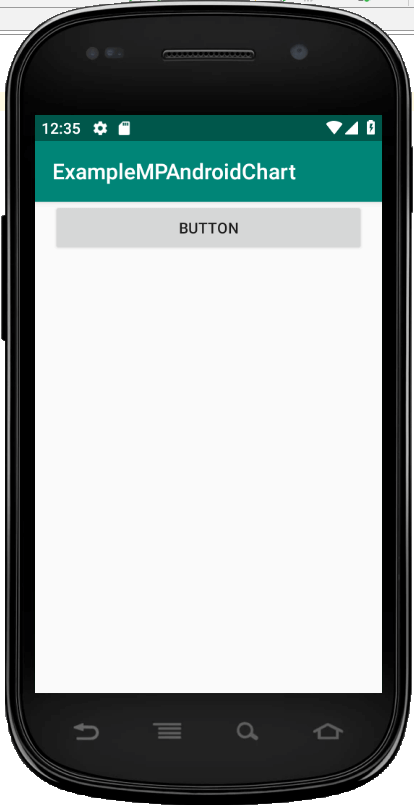

Если вылетит ошибка с подобным сообщением, то просто перезапустите Android Studio, откройте проект и запустите заново приложение:

```console
D:\Harrix\Projects\Android\ExampleMPAndroidChart\app\build\intermediates\transforms\mergeJavaRes\debug\0.jar: Процесс не может получить доступ к файлу, так как этот файл занят другим процессом.
```

## Создание компонента графика

Для разных видов графиков существуют свои компоненты, которые описаны в документации. Мы хотим написать приложение, в которых выводятся обычные линейные графики в виде линий. Поэтому добавим в `activity_main.xml` компонент `com.github.mikephil.charting.charts.LineChart`:

```xml
<com.github.mikephil.charting.charts.LineChart
    android:id="@+id/chart"
    android:layout_width="match_parent"
    android:layout_height="350dp" />
```

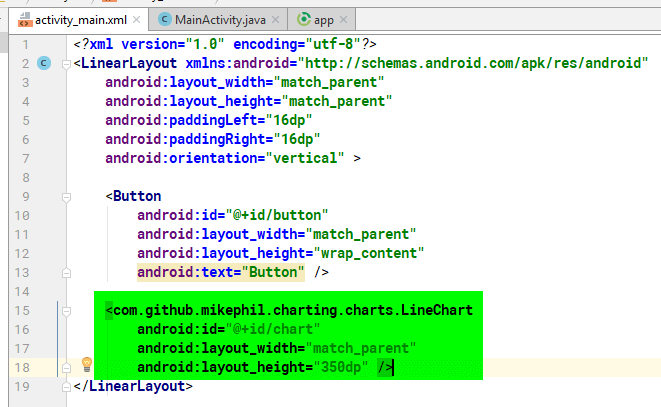

Как всегда, в коде активности создадим переменную для добавленного компонента и свяжем с XML элементом через `findViewByID()`:

```java
public class MainActivity extends AppCompatActivity {
    ...
    private LineChart chart;

    @Override
    protected void onCreate(Bundle savedInstanceState) {
        super.onCreate(savedInstanceState);
        setContentView(R.layout.activity_main);

        ...
        chart = findViewById(R.id.chart);
        ...
    }
}
```

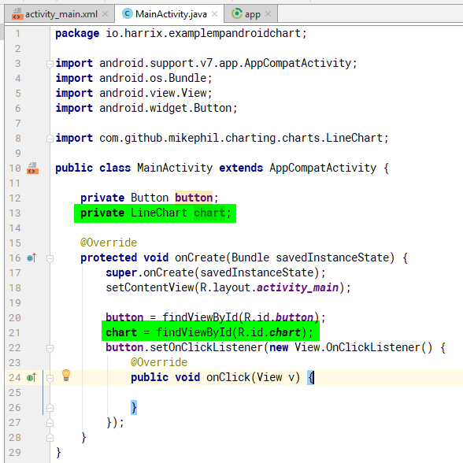

## Добавление графика с данными

Теперь в коде клика кнопки пропишем код добавления данных:

```java
// Массив координат точек
ArrayList<Entry> entries = new ArrayList<>();
entries.add(new Entry(1f, 5f));
entries.add(new Entry(2f, 2f));
entries.add(new Entry(3f, 1f));
entries.add(new Entry(4f, -3f));
entries.add(new Entry(5f, 4f));
entries.add(new Entry(6f, 1f));

// На основании массива точек создадим первую линию с названием
LineDataSet dataset = new LineDataSet(entries, "График первый");

// Создадим переменную данных для графика
LineData data = new LineData(dataset);
// Передадим данные для графика в сам график
chart.setData(data);

// Не забудем отправить команду на перерисовку кадра, иначе график не отобразится
chart.invalidate();
```

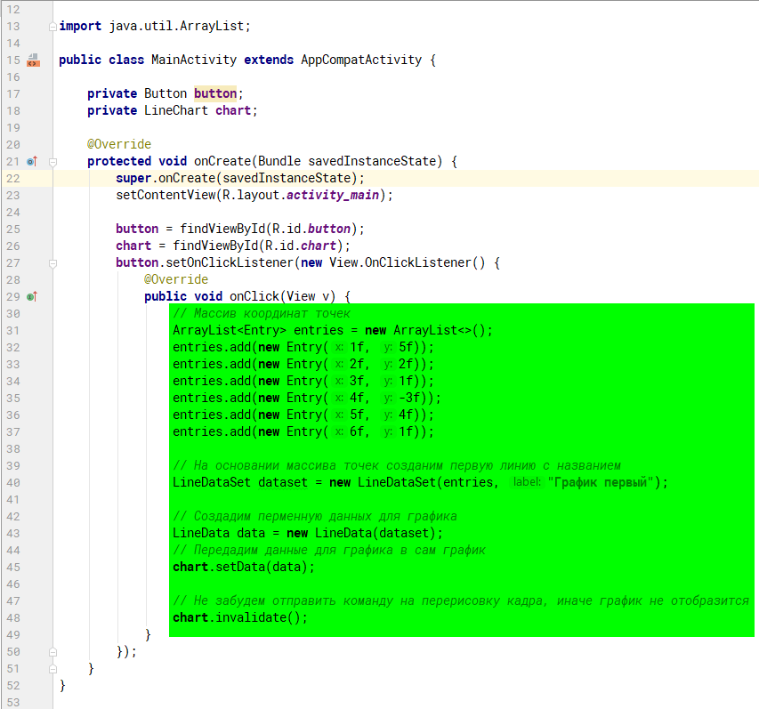

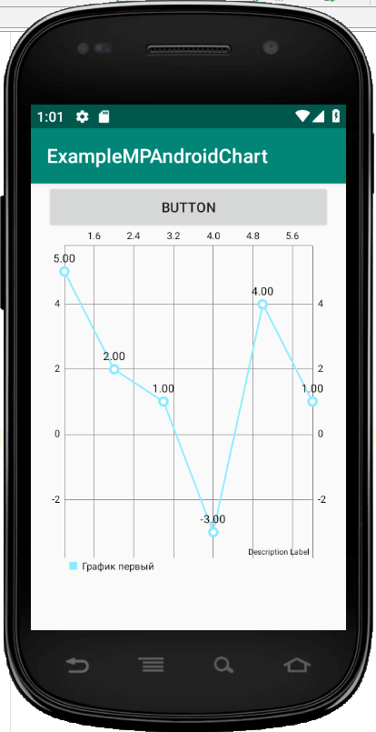

## Две линии на графике

Если нам нужно несколько линий, то подготавливаем два набора данных, которые отправляем в график:

```java
// Массив координат точек
ArrayList<Entry> entriesFirst = new ArrayList<>();
entriesFirst.add(new Entry(1f, 5f));
entriesFirst.add(new Entry(2f, 2f));
entriesFirst.add(new Entry(3f, 1f));
entriesFirst.add(new Entry(4f, -3f));
entriesFirst.add(new Entry(5f, 4f));
entriesFirst.add(new Entry(6f, 1f));

// На основании массива точек создаем первую линию с названием
LineDataSet datasetFirst = new LineDataSet(entriesFirst, "График первый");

// Массив координат точек второй линии
ArrayList<Entry> entriesSecond = new ArrayList<>();
entriesSecond.add(new Entry(0.5f, 0f));
entriesSecond.add(new Entry(2.5f, 2f));
entriesSecond.add(new Entry(3.5f, 1f));
entriesSecond.add(new Entry(3.6f, 2f));
entriesSecond.add(new Entry(4f, 0.5f));
entriesSecond.add(new Entry(5.1f, -0.5f));

// На основании массива точек создаем вторую линию с названием
LineDataSet datasetSecond = new LineDataSet(entriesSecond, "График второй");

// Линии графиков соберем в один массив
ArrayList<ILineDataSet> dataSets = new ArrayList();
dataSets.add(datasetFirst);
dataSets.add(datasetSecond);

// Создадим переменную  данных для графика
LineData data = new LineData(dataSets);
// Передадим данные для графика в сам график
chart.setData(data);

// Не забудем отправить команду на перерисовку кадра, иначе график не отобразится
chart.invalidate();
```

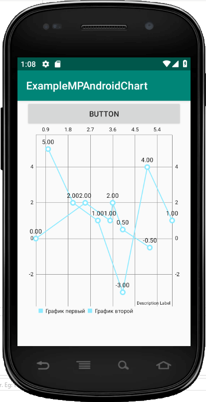

## Настройка графиков

Например, я хочу, чтобы первая линия отображалась с заполнением, а вторая была зеленой и плавной. И также хочу, чтобы график при отрисовке анимировался.

Это можно сделать следующим кодом:

```java
// График будет заполненным
datasetFirst.setDrawFilled(true);

// График будет зеленого цвета
datasetSecond.setColor(Color.GREEN);
// График будет плавным
datasetSecond.setMode(LineDataSet.Mode.CUBIC_BEZIER);

// График будет анимироваться 0.5 секунды
chart.animateY(500);
```

Полный вариант кода клика кнопки:

```java
// Массив координат точек
ArrayList<Entry> entriesFirst = new ArrayList<>();
entriesFirst.add(new Entry(1f, 5f));
entriesFirst.add(new Entry(2f, 2f));
entriesFirst.add(new Entry(3f, 1f));
entriesFirst.add(new Entry(4f, -3f));
entriesFirst.add(new Entry(5f, 4f));
entriesFirst.add(new Entry(6f, 1f));

// На основании массива точек создаем первую линию с названием
LineDataSet datasetFirst = new LineDataSet(entriesFirst, "График первый");
// График будет заполненным
datasetFirst.setDrawFilled(true);

// Массив координат точек второй линии
ArrayList<Entry> entriesSecond = new ArrayList<>();
entriesSecond.add(new Entry(0.5f, 0f));
entriesSecond.add(new Entry(2.5f, 2f));
entriesSecond.add(new Entry(3.5f, 1f));
entriesSecond.add(new Entry(3.6f, 2f));
entriesSecond.add(new Entry(4f, 0.5f));
entriesSecond.add(new Entry(5.1f, -0.5f));

// На основании массива точек создаем вторую линию с названием
LineDataSet datasetSecond = new LineDataSet(entriesSecond, "График второй");
// График будет зеленого цвета
datasetSecond.setColor(Color.GREEN);
// График будет плавным
datasetSecond.setMode(LineDataSet.Mode.CUBIC_BEZIER);

// Линии графиков соберем в один массив
ArrayList<ILineDataSet> dataSets = new ArrayList();
dataSets.add(datasetFirst);
dataSets.add(datasetSecond);

// Создадим переменную  данных для графика
LineData data = new LineData(dataSets);
// Передадим данные для графика в сам график
chart.setData(data);

// График будет анимироваться 0.5 секунды
chart.animateY(500);


// Не забудем отправить команду на перерисовку кадра, иначе график не отобразится
// Но если график анимируется, то он отрисуется самостоятельно, так что
// команда ниже не обязательна
//chart.invalidate();
```

[Запущенное приложение с анимацией](img/run_04.mp4)

## Полные коды активности

---

**Полные коды** <!-- !details -->

Файл `activity_main.xml`:

```xml
<?xml version="1.0" encoding="utf-8"?>
<LinearLayout xmlns:android="http://schemas.android.com/apk/res/android"
    android:layout_width="match_parent"
    android:layout_height="match_parent"
    android:paddingLeft="16dp"
    android:paddingRight="16dp"
    android:orientation="vertical" >

    <Button
        android:id="@+id/button"
        android:layout_width="match_parent"
        android:layout_height="wrap_content"
        android:text="Button" />

    <com.github.mikephil.charting.charts.LineChart
        android:id="@+id/chart"
        android:layout_width="match_parent"
        android:layout_height="350dp" />
</LinearLayout>
```

Файл `MainActivity.java` (без строки `package`):

```java
package io.harrix.examplempandroidchart;

import android.graphics.Color;
import androidx.appcompat.app.AppCompatActivity;
import android.os.Bundle;
import android.view.View;
import android.widget.Button;

import com.github.mikephil.charting.charts.LineChart;
import com.github.mikephil.charting.data.Entry;
import com.github.mikephil.charting.data.LineData;
import com.github.mikephil.charting.data.LineDataSet;
import com.github.mikephil.charting.interfaces.datasets.ILineDataSet;

import java.util.ArrayList;

public class MainActivity extends AppCompatActivity {

    private Button button;
    private LineChart chart;

    @Override
    protected void onCreate(Bundle savedInstanceState) {
        super.onCreate(savedInstanceState);
        setContentView(R.layout.activity_main);

        button = findViewById(R.id.button);
        chart = findViewById(R.id.chart);
        button.setOnClickListener(new View.OnClickListener() {
            @Override
            public void onClick(View v) {
                // Массив координат точек
                ArrayList<Entry> entriesFirst = new ArrayList<>();
                entriesFirst.add(new Entry(1f, 5f));
                entriesFirst.add(new Entry(2f, 2f));
                entriesFirst.add(new Entry(3f, 1f));
                entriesFirst.add(new Entry(4f, -3f));
                entriesFirst.add(new Entry(5f, 4f));
                entriesFirst.add(new Entry(6f, 1f));

                // На основании массива точек создадим первую линию с названием
                LineDataSet datasetFirst = new LineDataSet(entriesFirst, "График первый");
                // График будет заполненным
                datasetFirst.setDrawFilled(true);

                // Массив координат точек второй линии
                ArrayList<Entry> entriesSecond = new ArrayList<>();
                entriesSecond.add(new Entry(0.5f, 0f));
                entriesSecond.add(new Entry(2.5f, 2f));
                entriesSecond.add(new Entry(3.5f, 1f));
                entriesSecond.add(new Entry(3.6f, 2f));
                entriesSecond.add(new Entry(4f, 0.5f));
                entriesSecond.add(new Entry(5.1f, -0.5f));

                // На основании массива точек создаем вторую линию с названием
                LineDataSet datasetSecond = new LineDataSet(entriesSecond, "График второй");
                // График будет зеленого цвета
                datasetSecond.setColor(Color.GREEN);
                // График будет плавным
                datasetSecond.setMode(LineDataSet.Mode.CUBIC_BEZIER);

                // Линии графиков соберем в один массив
                ArrayList<ILineDataSet> dataSets = new ArrayList();
                dataSets.add(datasetFirst);
                dataSets.add(datasetSecond);

                // Создадим переменную  данных для графика
                LineData data = new LineData(dataSets);
                // Передадим данные для графика в сам график
                chart.setData(data);

                // График будет анимироваться 0.5 секунды
                chart.animateY(500);


                // Не забудем отправить команду на перерисовку кадра, иначе график не отобразится
                // Но если график анимируется, то он отрисуется самостоятельно, так что
                // команда ниже не обязательна
                //chart.invalidate();
            }
        });
    }
}
```
