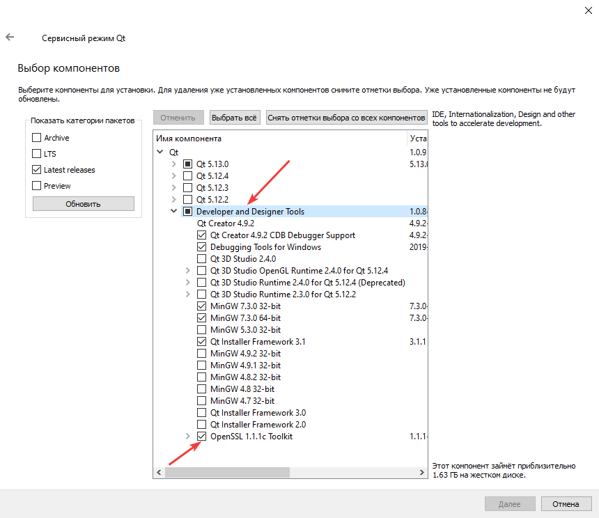
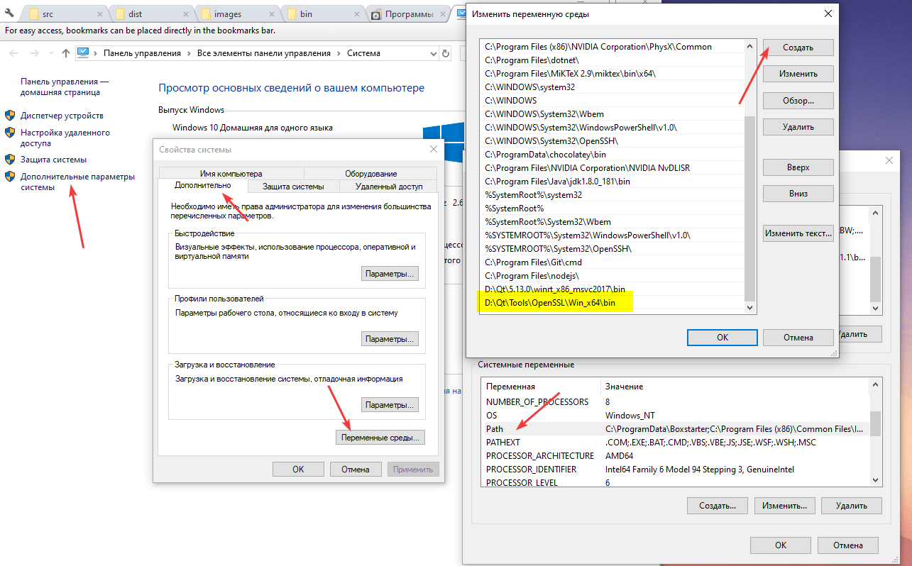
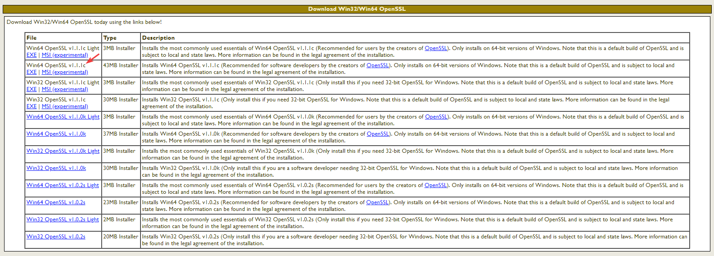
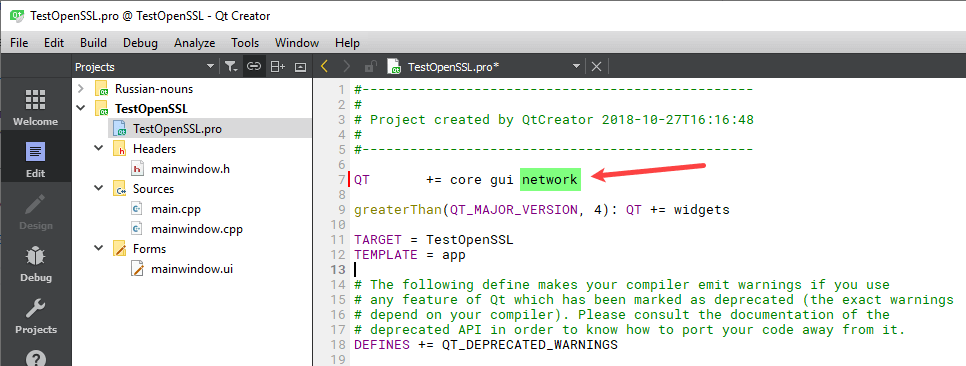
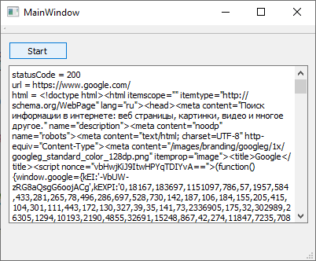

# Открытие HTTPS в Qt


В статье рассказывается как с помощью `QNetworkAccessManager` открывать HTTPS ссылки.

<details>
<summary>📖 Содержание</summary>

## Содержание

- [Установка OpenSSL (новый способ)](#установка-openssl-новый-способ)
- [Установка OpenSSL (старый способ)](#установка-openssl-старый-способ)
- [HTTPS запрос в Qt](#https-запрос-в-qt)
- [Развертывание программы в Windows](#развертывание-программы-в-windows)
- [Развертывание программы в Android](#развертывание-программы-в-android)

Те или иные сборки OpenSSL под Windows можно посмотреть [тут](https://wiki.openssl.org/index.php/Binaries).

</details>

## Установка OpenSSL (новый способ)

Теперь OpenSSL включен в состав установки Qt. Либо при установке, либо после установки через Qt Maintenance Tool можно его добавить:



_Рисунок 1 — Компонент OpenSSL_

После этого нужно добавить путь к папку с OpenSSL в системную переменную `PATH` в Windows. При этом добавляйте путь к x86 или к x64 в зависимости от битности компилятора, которым собираете свой проект. Например, я собирал тестовый вариант компилятором MinGW 64bit, поэтому я добавил путь `D:\Qt\Tools\OpenSSL\Win_x64\bin` (у вас он может быть другим):



_Рисунок 2 — Добавление пути к OpenSSL_

Если вы не добавите путь к OpenSSL, то получите ошибку `QSslSocket::connectToHostEncrypted: TLS initialization failed "TLS initialization failed"` при осуществлении HTTPS запроса.

## Установка OpenSSL (старый способ)

~~Почему-то в Qt из коробки работа с HTTPS не включена по умолчанию.~~ Поэтому необходимо для разработки себе установить OpenSSL. Так как я работаю под Windows, то установил OpenSSL через обычный установщик, скаченный с сайта <http://slproweb.com/products/Win32OpenSSL.html>:



_Рисунок 3 — Бинарник OpenSSL_

Для Qt 5.13.0 я скачивал файл `Win64 OpenSSL v1.1.1c`. Установка производится по умолчанию.

## HTTPS запрос в Qt

Обязательно в `.pro` файле проекта подключаем `network`:



_Рисунок 4 — Подключение модуля network_

Теперь в нужном `.cpp` или `.h` файле подключаем заголовочный файл:

```cpp
#include <QtNetwork>
```

Ниже приведен простой код приложения с комментариями, в котором производится запрос к заглавной странице [Google](https://www.google.com/).

Файл `mainwindow.h`:

```cpp
#ifndef MAINWINDOW_H
#define MAINWINDOW_H

#include <QMainWindow>
#include <QDebug>
#include <QtNetwork>

namespace Ui {
class MainWindow;
}

class MainWindow : public QMainWindow
{
  Q_OBJECT

public:
  explicit MainWindow(QWidget *parent = nullptr);
  ~MainWindow();

private slots:
  void on_pushButton_clicked();
  void replyFinished(QNetworkReply* reply);

private:
  Ui::MainWindow *ui;
};

#endif // MAINWINDOW_H
```

Файл `mainwindow.cpp`:

```cpp
#include "mainwindow.h"
#include "ui_mainwindow.h"

MainWindow::MainWindow(QWidget *parent) :
  QMainWindow(parent),
  ui(new Ui::MainWindow)
{
  ui->setupUi(this);
}

MainWindow::~MainWindow()
{
  delete ui;
}

void MainWindow::on_pushButton_clicked()
{
  QNetworkAccessManager *manager; // Менеджер по запросам к сети
  QNetworkRequest request; // Запрос
  QSslConfiguration sSlConfig; // SSL настройки

  // Задаем параметры для SSL
  sSlConfig.setDefaultConfiguration(QSslConfiguration::defaultConfiguration());
  sSlConfig.setProtocol(QSsl::TlsV1_2);
  request.setSslConfiguration(sSlConfig);

  // Если нужно, то разрешаем переходить по редиректам
  request.setAttribute(QNetworkRequest::FollowRedirectsAttribute, true);

  // Создаем экземпляр менеджера и связываем сигнал прихода ответа к какому-нибудь слоту
  manager = new QNetworkAccessManager(this);
  connect(manager, SIGNAL(finished(QNetworkReply*)),
          this, SLOT(replyFinished(QNetworkReply*)));

  // Задаем адрес нужной страницы
  request.setUrl(QUrl("https://www.google.com/"));

  // Отправляем запрос
  manager->get(request);
}

void MainWindow::replyFinished(QNetworkReply* reply) {
  if (reply->error() == QNetworkReply::NoError) {
    //Ответ от сервера приводим к строке
    QByteArray bytes = reply->readAll();
    QString html = QString::fromUtf8(bytes.data(), bytes.size());

    // Код ответа от сервера: 200, 404 и др.
    int statusCode = reply->attribute(QNetworkRequest::HttpStatusCodeAttribute).toInt();

    // С какого url нам пришел ответ
    QString url = reply->url().toString();

    // Используем полученные данные по своему усмотрению
    ui->textEdit->insertPlainText("statusCode = " + QString::number(statusCode) + "\n");
    ui->textEdit->insertPlainText("url = " + url + "\n");
    ui->textEdit->insertPlainText("html = " + html + "\n");
  } else {
    // Если что-то пошло не так, то обрабатываем ошибку как нам это нужно
    qDebug() << reply->errorString();
  }

  // Удаляем ответ от сервера
  reply->deleteLater();
}
```

При запуске приложения получим следующее:



_Рисунок 5 — Результат выполнения программы_

## Развертывание программы в Windows

Когда вы будете распространять своё приложение, то кроме DLL файлов от Qt вам будут нужны DLL файлы от OpenSSL. Для OpenSSL 1.1.1 вам нужно два файла (для x64):

- `libcrypto-1_1-x64.dll`;
- `libssl-1_1-x64.dll`.

Эти файлы есть в папке Qt из нового способа (у меня это `D:\Qt\Tools\OpenSSL\Win_x64\bin`). Вот только с ними ничего не работает на чистой Windows 10. Как бы я не выкручивался. Что делать?

Вспоминаем второй старый способ. Установил я `Win64 OpenSSL v1.1.1c` с сайта <https://slproweb.com/products/Win32OpenSSL.html>. И там нашел папку `C:\Program Files\OpenSSL-Win64\bin`. И оттуда скопировал эти два DLL файла, приведенные выше. И пока работать тоже не будет. Нужно установить еще распространяемый компонент Microsoft Visual C++ для Visual Studio 2015, 2017 и 2019, так как версия OpenSSL от компилируется компилятором Visual Studio. Прямая ссылка от Microsoft: <https://aka.ms/vs/16/release/vc_redist.x64.exe>. То есть, даже если ваше приложение под MinGW, но используете OpenSSL, то вам нужно с проектом распространять этот злополучный компонент Microsoft Visual C++. Вот после этого, на чистой Windows 10 всё заработает. Итого нужно:

1. Установить распространяемый компонент Microsoft Visual C++ для Visual Studio 2015, 2017 и 2019.
2. В папку с EXE файлом скопировать нужные DLL файлы от Qt.
3. Скопировать две библиотеки из OpenSSL.

## Развертывание программы в Android

Для запуска в Android находил инструкцию <http://doc.qt.io/qt-5/opensslsupport.html>, но ею не пользовался.
