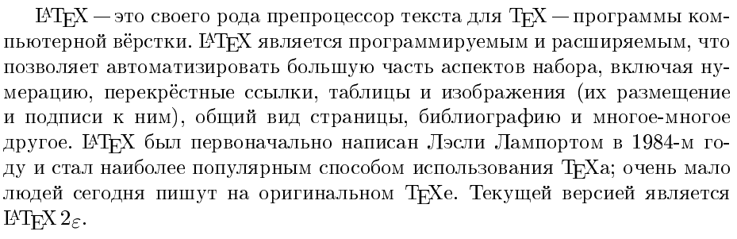

# Установка PSCyr для LaTeX


Использую связку TeXstudio 2.12.10 и MiKTeX 2.9.6753 для редактирования $\LaTeX$ файлов. Установка стандартная и вопросов не должна вызывать, но столкнулся с проблемой установки пакета PSCyr для отображения русских шрифтов. Плюс сервер с самим пакетом уже недоступен (как никак всё со времен 2005 года идет).

Статья обновлена и переписана в 2018 со статьи 2013 года.

Статья полезна тем, кто у себя получает ошибку вида: `` File `pscyr.sty' not found ``.

На всякий случай [ссылка](https://github.com/Harrix/harrix.dev-articles-2018/blob/main/install-latex/install-latex.md)<!-- https://harrix.dev/ru/articles/2018/install-latex/ --> на статью «Установка и настройка программ для редактирования LaTeX файлов».

## Пакеты

Скачиваем дистрибутивы пакета: [pscyr-0.4-beta9exp2-type1.tar](files/pscyr-0.4-beta9exp2-type1.tar.gz) и [pscyr-0.4-beta9exp2-tex.tar](files/pscyr-0.4-beta9exp2-tex.tar.gz).

Распаковываем их в одну папку. В итоге получаем папку `PSCyr`. Можно даже и не скачивать те два файла, а скачать сразу вот этот сборный файл: [PSCyr.zip](files/PSCyr.zip).

## Установка

Копируем в папку `MiKTeX`. У меня это `C:\Program Files\MiKTeX` (`C:\Program Files (x86)\MiKTeX` для 32 битной версии). Копируем не папку `PSCyr`, а ее содержимое. И заменяем все файлы, если спросит:


_Рисунок 1 — Папка MiKTeX 2.9_

На скриншотах папка называется `C:\Program Files\MiKTeX 2.9`, так как еще в 2018 года папка называлась с номером.

Нажимаем `Пуск` и `Выполнить`. Если используете стандартное меню `Пуск` в Windows 10, то просто в меню `Пуск` или поиске начните писать `Выполнить`.

Вводим там следующее:

```console
initexmf --edit-config-file dvips
```


_Рисунок 2 — Выполнение первой команды_

После нажатия на `OK` мелькнет черное окно и откроется пустой файл `config.ps`.

Вводим следующий текст и сохраняем:

```console
p +pscyr.map
```


_Рисунок 3 — Ввод текста в блокнот_

Комментарии, которые будут обозначены `%%` в файлах можно не трогать.

Аналогично вводим команду:

```console
initexmf --edit-config-file pdftex
```

В блокноте вводим и сохраняем текст:

```console
+pscyr.map
```


_Рисунок 4 — Ввод команды_


_Рисунок 5 — Ввод текста в блокнот_

Аналогично вводим команду:

```console
initexmf --edit-config-file updmap
```

В блокноте вводим и сохраняем текст:

```console
Map pscyr.map
```


_Рисунок 6 — Ввод команды_


_Рисунок 7 — Ввод текста в блокнот_

Вводим команду:

```console
updmap
```

Появится черное окно, и ждем, когда оно само закроется. В 2013 году процесс шел несколько минут, сейчас за секунду прошел:


_Рисунок 8 — Ввод команды_


_Рисунок 9 — Черное окно консоли_

Вводим команду:

```console
initexmf --edit-config-file dvipdfm
```

В блокноте вводим и сохраняем текст:

```console
f pscyr2.map
```


_Рисунок 10 — Ввод команды_


_Рисунок 11 — Ввод текста в блокнот_

Вводим команду:

```console
initexmf -u
```

Появится черное окно, и ждем, когда оно закроется. У меня прошло где-то полминуты:


_Рисунок 12 — Ввод команды_


_Рисунок 13 — Черное окно консоли_

Теперь нужно обновить базы данных в `MiKTeX`.

Раньше для этого использовался следующий способ.

Идем `Пуск` → `Все программы` → `MiKTeX 2.9` → `Maintenance(Admin)` → `Setting(Admin)`. Там в разделе `General` жмем `Refresh FNDB`.

Сейчас же в MiKTeX все настройки перешли в `MiKTeX Console`. [Dmitr](https://disqus.com/by/disqus_jfiMmRRSvq/) нашел как повторить нужные действия в новом варианте настроек.

Итак, `Пуск` → `MiKTeX 2.9` → `MiKTeX Console`:


_Рисунок 14 — MiKTeX Console_

Перезапускаем под администратором эту программу:


_Рисунок 15 — MiKTeX Console_

В главном меню идем `Tasks` → `Refresh file name database`. И ждем, когда всё обновиться:


_Рисунок 16 — MiKTeX Console_


_Рисунок 17 — MiKTeX Console_

Выполняем команду:

```console
mkfntmap
```

Появится черное окно, которое само через пару секунд исчезнет:


_Рисунок 18 — MiKTeX Console_

## Итог

Теперь можно будет использовать нормальные русские шрифты при добавлении пакета в `tex` файл:

```console
\usepackage{pscyr} % Нормальные шрифты
```

Было:



_Рисунок 19 — Состояние «Было»_

Стало:


_Рисунок 20 — Состояние «Стало»_

Пример тестового документа:

```tex
\documentclass{article}
\usepackage[utf8]{inputenc}
\usepackage[english, russian]{babel}
\usepackage{pscyr}
\begin{document}
Привет, мир!
\end{document}
```

Пример со скриншота:

```tex
\documentclass{article}
\usepackage[utf8]{inputenc}
\usepackage[english, russian]{babel}
\usepackage{pscyr}
\begin{document}
\LaTeX{} "--- это своего рода препроцессор текста для \TeX{} "---
программы компьютерной вёрстки. \LaTeX{} является программируемым и
расширяемым, что позволяет автоматизировать большую часть аспектов
набора, включая нумерацию, перекрёстные ссылки, таблицы и изображения
(их размещение и подписи к ним), общий вид страницы, библиографию и
многое-многое другое. \LaTeX{} был первоначально написан Лэсли Лампортом
в 1984-м году и стал наиболее популярным способом использования \TeX{}а;
очень мало людей сегодня пишут на оригинальном \TeX{}е. Текущей
версией является \LaTeXe.
\end{document}
```
