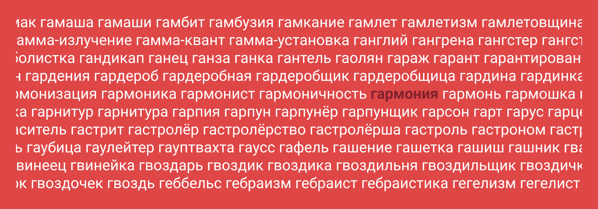

# Список существительных русского языка



Сделал список существительных по словарю Ефремовой. Есть вариант в виде TXT, JSON файла, с определением и без.

## Файлы

В списке **51301** слов.

Проект **Russian Nouns** на GitHub: <https://github.com/Harrix/Russian-Nouns>

Все варианты файлов с GitHub: [russian_nouns_v2.0.zip](https://github.com/Harrix/Russian-Nouns/releases/download/v2.0/russian_nouns_v2.0.zip)

Просто список существительных: [russian_nouns.zip](files/russian_nouns.zip)

В файле `russian_nouns.txt` присутствует просто список существительных:

```text
…
лбище
лганьё
лгун
лгунишка
лгунище
лгунья
лебеда
лебедёнок
…
```

В файле `russian_nouns_with_definition.txt` все слова приведены с определением из словаря Ефремовой:

```text
…
абордаж: м. 1) Сближение и сцепление атакующего судна с неприятельским для ведения рукопашного боя (в эпоху гребного и парусного флота). 2) Сражение в таких условиях.
абориген: 1. м. см. аборигены (1*). 2. м. см. аборигены (2*). 3. м. см. аборигены (3*).
аборигенка: ж. см. аборигены (1*).
…
```

В файле `russian_nouns_with_definition.json` также есть и слова с определениями, но в формате JSON:

```text
…
"китёнок": {
    "definition": "м. Детеныш кита."
},
"китобоец": {
    "definition": "м. разг. Судно для китобойного промысла."
},
"китобой": {
    "definition": "м. 1) Тот, кто занимается промыслом китов. 2) устар. То же, что: китобоец."
},
…
```

В папке `dist` проекта есть аналогичные файлы, из которых не удалены нижеописанные слова, а оставлены все слова, определенные в словаре Ефремовой, как существительные.

## О прежнем списке и проблемах

Раньше (в 2015 году) я выкладывал [список](https://github.com/Harrix/Russian-Nouns/releases/download/v1.0/russian_nouns_v1.0.zip), но он был низкого качества.

Во-первых, я много существительных пропустил при первоначальном анализе: `жена`, `еж`, `машина` и др. И в списке было всего лишь 34010 существительных, а на самом деле в словаре существительными обозначены 55871 слов.

Во-вторых, в словаре Ефремовой есть несколько особенностей, которые стоило проработать.

В словаре встречаются имена собственные: `Пасха`, `Прометей`, `Пьеро`, `Сибилла`, `Тартар`, `Филипповки`, `Шива`, `Эльдорадо` и др. Всего нашлось 254 таких слов.

Много существительных во множественном числе, для которых есть форма единственного числа: `браслеты`, `братья`, `быки`, `мигранты`, `мозги`, `морепродукты`, `ящеры` и др. Всего нашлось таких 2482 штук. Причем нужно отличить такие слова от существительных, которые употребляются только во множественном числе: `алименты`, `аэросани`, `галифе`, `гусли`, `дрожжи`, `каникулы`, `ножницы` и др. Таких слов нашлось 302 штуки.

И, наконец, в словаре много субстантивированных слов, то есть слов, которые переведены в разряд существительных. Например, для первой версии списка мне говорили, что в списке есть слово `ясноокая`. На первый взгляд, это прилагательное, но в каких-то случаях оно может выступать как существительное. Или, например, слово `два`. Это числительное, но когда речь идет об оценке, то это слово выступает в роли существительного.

Но на мой взгляд, в словаре Ефремовой слишком много слов переведено в этот разряд (по итогу я исключил 2131 слов). При этом другие словари могут одни слова тоже субъектировать, а другие нет. И как понять, что нужно оставить, а что нет?

## Алгоритм решения

Был написан [python скрипт](https://github.com/Harrix/Russian-Nouns/blob/master/src/program_efremova.py), который есть в репозитории в папке `src`, который каждую описанную проблему как-то решает. Вначале поговорим о самом сложном: об субстантивированных словах.

Вначале вычленил все слова, оканчивающиеся на `ая`, `ее`, `ие`, `ий`, `ое`, `ой`, `ые`, `ый`, `ье`, `ьи`, `ья`, `яя`. Это слова-кандидаты на вычеркивание.

Проверяем слова на сайте <https://ru.wiktionary.org/wiki/>. Если слово определено как существительное, то оставляем. Ибо если в двух разных словарях слово объявляется существительным, то пусть оно таким и будет. Если же слово определено как другая часть речи, то вычеркиваем слово.

Не все слова есть на Викисловаре, или в слове не обозначена часть речи. Поэтому оставшиеся слова проверяем на <https://dic.academic.ru/>. Там в словаре синонимов присутствует отметка о части речи. Если слово обозначено как существительное, то оставляем.

Оставшиеся слова проверяем на <https://goldlit.ru/> и <http://www.morfologija.ru>.

После этих четырех сайтов остались вот эти слова, которые я включил вручную:

```text
низкопоклонничание
односеменодольные
передрессировывание
перекомпостирование
переконопачивание
перекрахмаливание
перестраховывание
перештемпелёвывание
подсортировывание
пятидесятирублёвая
славянофильствование
славянофобствование
трансформаторостроение
трахеотомированная
трахеотомированный
```

Похожий подход осуществлялся для поиска слов, которые могут использоваться только во множественном числе.

Вначале все слова во множественном числе проверялись по словарю Зализняка. Если слово встречается как форма какого-то любого другого слова, то такое слово исключалось.

Оставшиеся слова проверялись на <https://ru.wiktionary.org/wiki/>. Если есть статья с таким словом, где указывается, что слово используется только во множественном числе, то слово оставалось.

Затем остатки проверялись на <https://goldlit.ru/>.

В итоге остался такой список:

```text
бракосочетавшиеся
красно-коричневые
односеменодольные
папоротниковидные
папоротникообразные
пластинчатожаберные
сабеи
гидроэнергоресурсы
казаки-разбойники
```

Из него я оставил слова `сабеи` и `казаки-разбойники`. Остальные исключил.

И, наконец, все существительные с большой буквы я исключил из итогового списка.

Итого, из **55871** слов было исключено **4570** слов.

## Недостатки полученного списка

Несмотря на большую проделанную работу, я понимаю, что список не идеальный.

Есть субстантивированные слова, которые я оставил, но которые остались только в мужском роде. Например, слово `репрессированный` есть, а слова `репрессированная` нет.

В словаре Ефремовой среди субстантивированных слов было много названий отрядов, семейств, родов живых существ. Какие-то остались в списке, а какие-то были удалены.

Есть слова, которые хоть несколькими словарями определены как существительные, но всё равно для нас это выглядит странно. Например, слово `сегодняшнее` есть в списке.

Есть слова, которые не употребляются в единственном числе, но которые для другого слова являются некоторой формой. Например, `друзы` — арабы, живущие в Ливане и Сирии и являющиеся приверженцами мусульманской шиитской секты. Но это слово было удалено из-за слова `друза` — группа кристаллов, наросших на общее основание — стенку полости или открытой трещины в горной породе.

Например, слово `автогонки` есть в списке, хотя и есть слово `автогонка`, так как `автогонки` используется не в смысле множественного числа слова `автогонка`.

А есть в русском языке слово `аплодисмент`? Какие-то словари говорят, что есть, но словарь Ефремовой и словарь Зализняка говорят, что нет, и `аплодисменты` используются только во множественном числе.

Слово `экскременты` было удалено из списка, но слова `экскремент` в словаре Ефремовой нет, поэтому оба этих слова отсутствуют в словаре.

Слово `гамма-лучи` было удалено, а слово `альфа-лучи` оставлено.

Думаю, что таких моментов еще много.

И, конечно, словарь Ефремовой далеко не полный, поэтому много слов там нет: `интернет`, `мем` и многих других.
