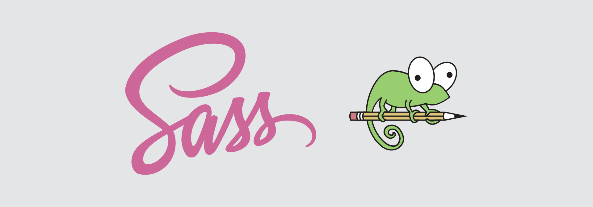
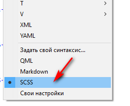
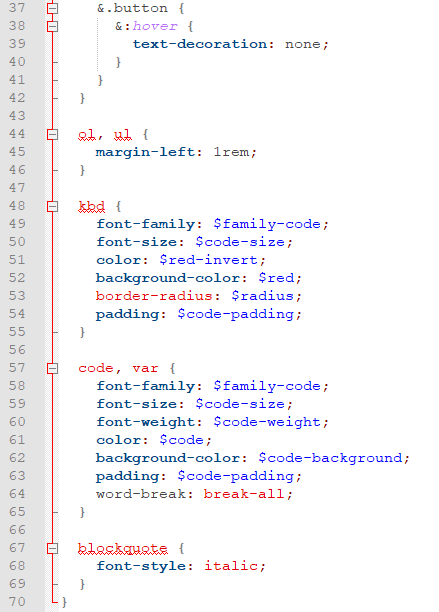

# SCSS в Notepad++



Как открыть SCSS файл в Notepad++ с подсветкой синтаксиса?

Стили подсветки синтаксиса:

```xml
<UserLang name="SCSS" ext="scss">
    <Settings>
        <Global caseIgnored="yes" />
        <TreatAsSymbol comment="no" commentLine="no" />
        <Prefix words1="no" words2="no" words3="yes" words4="yes" />
    </Settings>
    <KeywordLists>
        <Keywords name="Delimiters">&apos;&quot;0&apos;&quot;0</Keywords>
        <Keywords name="Folder+">{</Keywords>
        <Keywords name="Folder-">}</Keywords>
        <Keywords name="Operators">&apos; % ( ) , : ;</Keywords>
        <Keywords name="Comment"> 1/* 1/*! 2*/ 2*/ 0//</Keywords>
        <Keywords name="Words1">azimuth background background-attachment background-color background-image background-position background-repeat background-size border border-bottom border-bottom-color border-bottom-style border-bottom-width border-collapse border-color border-left border-left-color border-left-style border-left-width border-right border-right-color border-right-style border-right-width border-spacing border-style border-top border-top-color border-top-style border-top-width border-width bottom caption-side clear clip color content counter-increment counter-reset cue cue-after cue-before cursor direction display elevation empty-cells float font font-family font-size font-size-adjust font-stretch font-style font-variant font-weight height left letter-spacing line-height list-style list-style-image list-style-position list-style-type margin margin-bottom margin-left margin-right margin-top marker-offset marks max-height max-width min-height min-width orphans outline outline-color outline-style outline-width overflow padding padding-bottom padding-left padding-right padding-top page page-break-after page-break-before page-break-inside pause pause-after pause-before pitch pitch-range play-during position quotes richness right size speak speak-header speak-numeral speak-punctuation speech-rate stress table-layout text-align text-decoration text-indent text-shadow text-transform top unicode-bidi vertical-align visibility voice-family volume white-space widows width word-spacing z-index image repeat size family top right bottom left indent decoration</Keywords>
        <Keywords name="Words2">active after before checked disabled empty enabled first first-child first-letter first-line first-of-type focus hover lang last-child last-of-type left link not only-child only-of-type nth-child right root target visited</Keywords>
        <Keywords name="Words3"># . a abbr acronym address applet area article aside audio b base basefont bdo bdi big blockquote body br button canvas caption center cite code col colgroup command datalist dd del details dfn dir div dl dt em embed fieldset figcaption figure font footer form frame frameset h1 h2 h3 h4 h5 h6 head header hgroup hr html i iframe img input ins keygen kbd abel legend li link map mark menu meta meter nav noframes noscript object ol optgroup option output p param pre progress q rp rt ruby s samp script section select small source span strike strong style sub summary sup table tbody td textarea tfoot th thead time title tr track tt u ul var video wbr xmp label</Keywords>
        <Keywords name="Words4">@ $</Keywords>
    </KeywordLists>
    <Styles>
        <WordsStyle name="DEFAULT" styleID="11" fgColor="454545" bgColor="FFFFFF" fontName="" fontStyle="0" />
        <WordsStyle name="FOLDEROPEN" styleID="12" fgColor="808080" bgColor="FFFFFF" fontName="" fontStyle="1" />
        <WordsStyle name="FOLDERCLOSE" styleID="13" fgColor="004080" bgColor="FFFFFF" fontName="" fontStyle="0" />
        <WordsStyle name="KEYWORD1" styleID="5" fgColor="004680" bgColor="FFFFFF" fontName="" fontStyle="1" />
        <WordsStyle name="KEYWORD2" styleID="6" fgColor="B66CFF" bgColor="FFFFFF" fontName="" fontStyle="2" />
        <WordsStyle name="KEYWORD3" styleID="7" fgColor="E10000" bgColor="FFFFFF" fontName="" fontStyle="0" />
        <WordsStyle name="KEYWORD4" styleID="8" fgColor="0000FF" bgColor="FFFFFF" fontName="" fontStyle="0" />
        <WordsStyle name="COMMENT" styleID="1" fgColor="00AA00" bgColor="FFFFFF" fontName="" fontStyle="0" />
        <WordsStyle name="COMMENT LINE" styleID="2" fgColor="00AA00" bgColor="FFFFFF" fontName="" fontStyle="0" />
        <WordsStyle name="NUMBER" styleID="4" fgColor="008000" bgColor="FFFFFF" fontName="" fontStyle="0" />
        <WordsStyle name="OPERATOR" styleID="10" fgColor="800000" bgColor="FFFFFF" fontName="" fontStyle="1" />
        <WordsStyle name="DELIMINER1" styleID="14" fgColor="0080FF" bgColor="FFFFFF" fontName="" fontStyle="2" />
        <WordsStyle name="DELIMINER2" styleID="15" fgColor="0080FF" bgColor="FFFFFF" fontName="" fontStyle="2" />
        <WordsStyle name="DELIMINER3" styleID="16" fgColor="000000" bgColor="FFFFFF" fontName="" fontStyle="0" />
    </Styles>
</UserLang>
```

Идем сюда `%appdata%/Notepad++`.

Если там есть файл `userDefineLang.xml`, то копируем код XML из начала статьи в файл `userDefineLang.xml` перед последней строчкой:

```xml
</NotepadPlus>
```

Если там нет файла `userDefineLang.xml`, то создаем текстовой документ в этой папке и называем `userDefineLang.xml`. Открываем файл и добавляем в него строки:

```xml
<NotepadPlus>

</NotepadPlus>
```

И между тэгами `<NotepadPlus>` вставляем код XML из начала статьи.

Сохраняем, перезапускам Notepad++.

Теперь откройте какой-нибудь SCSS файл. Если подсветка синтаксиса не появилась, то идем `Синтаксис` → `SCSS`:



_Рисунок 1 — Выбор подсветки синтаксиса_

Теперь все scss файлы будут с подсветкой синтаксиса:



_Рисунок 2 — Подсветка Markdown синтаксиса_
