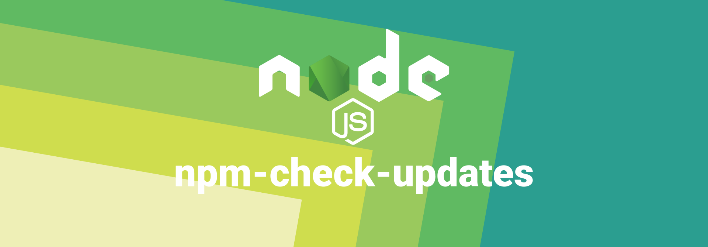
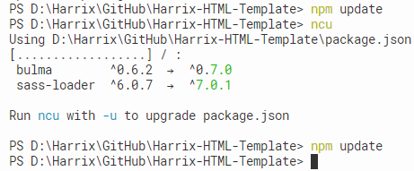

# Зачем нужен npm-check-updates



Для работы с Node.js использую утилиту [npm-check-updates](https://www.npmjs.com/package/npm-check-updates). Она предназначена для поиска новых версий пакетов вашего проекта.

Зачем она нужна, если есть команда `npm update`, которая обновляет пакеты проекта? Дело в том, что не всегда данная команда видит недавно обновившиеся пакеты (или я что-то делаю не так).

Вот яркий пример для чего нужна данная утилита:



_Рисунок 1 — Результат выполнения утилиты ncu_

Команда `npm update` ничего не обновила, но `ncu` увидела, что есть два новых пакета.

Итак, вначале проверяем наличие новых версий пакетов:

```console
ncu
```

После этого принудительно обновляем файл `package.json` и обновляем пакеты уже согласно изменившемуся пакету:

```console
ncu -u
npm i
```
